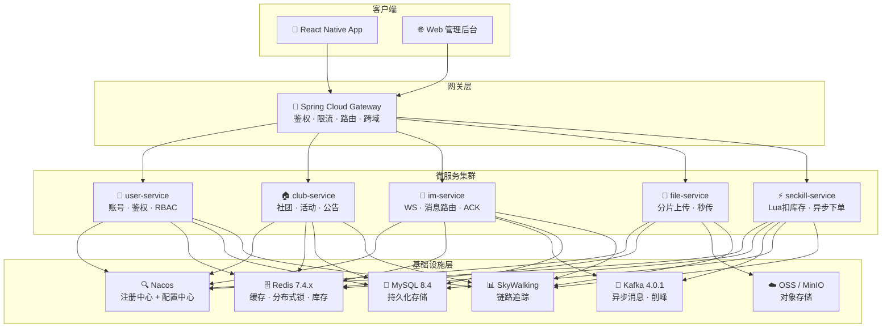
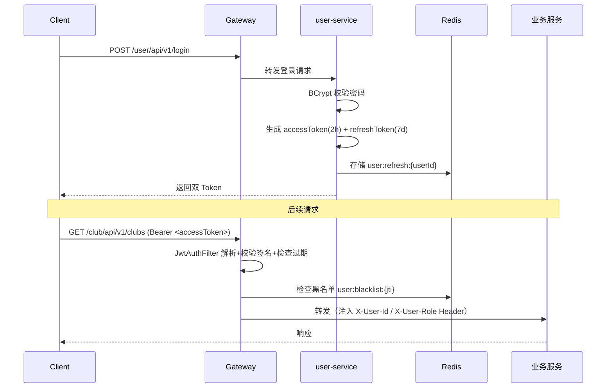
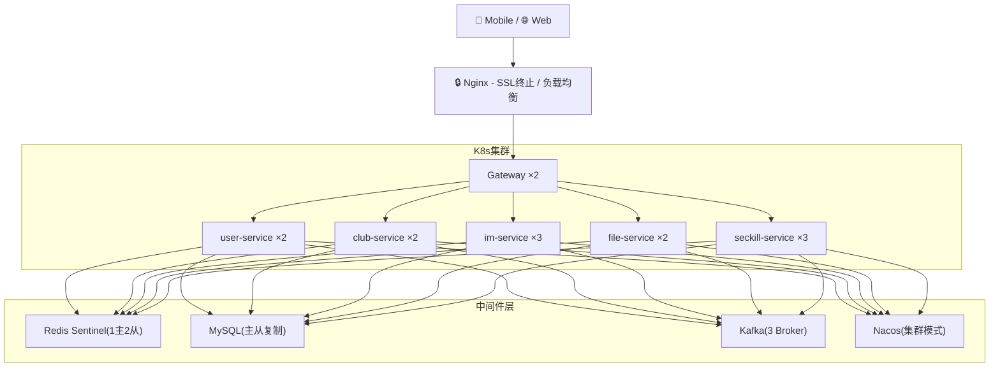
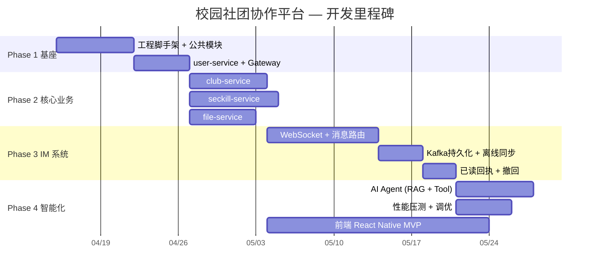

# 系统架构总览 (ARCHITECTURE.md)

> 本文档是架构决策的参考文档。完整实现细节（DDL、Lua脚本、底层算法）见[技术白皮书](./docs/校园社团协作平台%20——%20技术架构与项目白皮书.md)，接口规范见 [docs/API.md](./docs/API.md)。

---

## 1. 项目定位

高校社团数字化协作平台，解决 5 个核心痛点：

| 痛点 | 解决方案 | 关键技术 |
|------|---------|---------|
| 沟通分散 | 以社团→会话为单位的结构化消息系统 | WebSocket, Kafka |
| 高并发崩溃 | Redis Lua 原子扣库存 + Kafka 异步削峰三级漏斗 | Redis Lua, Sentinel |
| 大文件传输脆弱 | 分片上传 + 断点续传 + MD5 秒传 + OSS 直传 | 分片上传, OSS |
| 权限混乱 | RBAC 三级权限（学生/社长/管理员）+ 操作审计 | Spring Security, JWT |
| 信息孤岛 | AI Agent 自动推送摘要 + 未读提醒聚合 | RAG, LLM |

**用户角色：**

| 角色 | `role` 值 | 核心权限 |
|------|----------|---------|
| 学生 | `0` | 浏览社团、申请加入、报名活动、IM 聊天、上传文件 |
| 社长 | `1` | + 创建/编辑活动、审批入团申请、管理成员、发布公告 |
| 管理员 | `2` | + 审核社团创建申请、全局用户管理、系统配置 |

---

## 2. 微服务拓扑

### 2.1 整体架构图



### 2.2 服务路由与职责矩阵

| 路由前缀 | 服务名 | 端口 | 核心职责 | 依赖中间件 | 有状态 |
|---------|--------|------|---------|----------|--------|
| `/user/**` | user-service | 8081 | 注册/登录/JWT/RBAC | Redis, MySQL | 无 |
| `/club/**` | club-service | 8082 | 社团CRUD/成员/活动/公告 | Redis, MySQL | 无 |
| `/im/**` | im-service | 8083 | WebSocket/消息路由/ACK/离线同步 | Redis, Kafka, MySQL | **有**（WS连接） |
| `/file/**` | file-service | 8084 | 分片上传/断点续传/MD5秒传 | Redis, OSS | 无 |
| `/seckill/**` | seckill-service | 8085 | 库存预热/Lua扣减/防刷/异步下单 | Redis, Kafka, MySQL | 无 |
| — | campus-gateway | 9000 | 统一入口/JWT鉴权/Sentinel限流/路由 | Redis, Nacos | 无 |

### 2.3 公共模块

| 模块 | 职责 |
|------|------|
| `campus-common` | 统一异常/响应 `Result<T>`/JWT工具/雪花算法/分页DTO |
| `campus-api` | Feign Client 接口定义 + 跨服务 DTO（UserBasicDTO 等） |

---

## 3. 技术选型

| 组件 | 版本 | 关键说明 |
|------|------|---------|
| JDK | **21 LTS** | 虚拟线程 GA，生态工具链全面支持 |
| Spring Boot | **3.5.3** | 内置虚拟线程一等公民支持 |
| Spring Cloud | **2024.0.2** | 与 Boot 3.5.x 兼容矩阵对齐 |
| Spring Cloud Alibaba | **2025.1.0.0** | Nacos 2.5 / Sentinel 2.0 / Seata 2.x |
| MyBatis-Plus | **3.5.10** | Lambda 查询、分页、逻辑删除 |
| Redisson | **3.41.0** | JDK 21 虚拟线程协作完善 |
| Kafka | **4.0.1** | KRaft 模式（无 ZooKeeper），部署简化 |
| MySQL | **8.4 LTS** | Oracle 长期支持分支 |
| Redis | **7.4.x** | AOF MP-AOF 优化持久化性能 |
| Nacos | **2.5.x** | gRPC 长连接 GA + 配置加密原生支持 |
| Sentinel | **2.0.x** | 适配 Spring Boot 3.x / JDK 21 |
| SkyWalking | **10.x** | eBPF 探针 + OpenTelemetry 集成 |
| React Native | **0.79+** | New Architecture（Fabric + TurboModules）默认启用 |

### JDK 21 虚拟线程使用策略

1. **Gateway**：保持 Reactive（WebFlux + Netty），**禁止**开启虚拟线程，避免破坏 Reactor 事件循环
2. **业务微服务**（user/club/im/seckill/file）：全面启用 `spring.threads.virtual.enabled=true`
3. **IM WebSocket**：基于 Spring WebSocket（Tomcat）实现，配合虚拟线程满足 ≥5000 连接目标
4. **数据库驱动**：统一使用 MySQL Connector/J 9.x，压测时监控 **Thread Pinning** 频率

---

## 4. 数据库设计

### 4.1 核心领域模型（ER 图）

```mermaid
erDiagram
    SYS_USER ||--o{ CLUB_MEMBER : "加入"
    CLUB ||--o{ CLUB_MEMBER : "拥有成员"
    SYS_USER ||--o{ SECKILL_ORDER : "报名"
    CLUB ||--o{ SECKILL_ACTIVITY : "发布"
    SECKILL_ACTIVITY ||--o{ SECKILL_ORDER : "产生订单"
    SYS_USER ||--o{ IM_CONVERSATION_MEMBER : "参与会话"
    IM_CONVERSATION ||--o{ IM_CONVERSATION_MEMBER : "包含成员"
    IM_CONVERSATION ||--o{ IM_MESSAGE : "包含消息"
    SYS_USER ||--o{ IM_MESSAGE : "发送"

    SYS_USER { bigint id PK; varchar username UK; varchar password; tinyint role }
    CLUB { bigint id PK; varchar name UK; bigint leader_id FK; tinyint status }
    CLUB_MEMBER { bigint id PK; bigint user_id FK; bigint club_id FK; tinyint member_role }
    SECKILL_ACTIVITY { bigint id PK; bigint club_id FK; int total_stock; datetime start_time; datetime end_time }
    SECKILL_ORDER { bigint id PK; bigint user_id FK; bigint activity_id FK; tinyint status }
    IM_CONVERSATION { varchar conversation_id PK; tinyint type; varchar name }
    IM_CONVERSATION_MEMBER { bigint id PK; varchar conversation_id FK; bigint user_id FK; varchar read_msg_id }
    IM_MESSAGE { varchar msg_id PK; varchar conversation_id FK; bigint sender_id FK; tinyint msg_type; text content }
    FILE_META { varchar file_id PK; varchar file_name; bigint file_size; varchar file_url; tinyint upload_status }
```

> 完整 DDL 见[白皮书 §3.2](./docs/校园社团协作平台%20——%20技术架构与项目白皮书.md) 或 `docs/sql/V1.0__init.sql`

### 4.2 公共字段约定

所有表包含 4 个公共字段，由 MyBatis-Plus `MetaObjectHandler` 自动填充：

| 字段 | 类型 | 说明 |
|------|------|------|
| `id` | bigint | 雪花算法主键 |
| `create_time` | datetime | 创建时间 |
| `update_time` | datetime | 更新时间（ON UPDATE） |
| `is_deleted` | tinyint | 逻辑删除（0-正常/1-已删除） |

### 4.3 分库策略（预规划）

| 表 | 策略 | 触发条件 |
|----|------|---------|
| `im_message` | 按 `conversation_id` hash 分 4 表 | 单表 > 500w 行 |
| `seckill_order` | 按 `activity_id` 范围分表 | 单表 > 200w 行 |
| 其他 | 暂不分表 | — |

---

## 5. 安全体系

### 5.1 认证鉴权流程



### 5.2 JWT Payload 结构

```json
{
  "sub": "1780001234567890",
  "username": "zhangsan",
  "role": 0,
  "jti": "uuid-xxxx",
  "iat": 1680000000,
  "exp": 1680007200
}
```

### 5.3 安全策略矩阵

| 安全维度 | 策略 | 实现方式 |
|---------|------|---------|
| 密码存储 | BCrypt 加密（cost=12） | `PasswordEncoder` |
| 传输安全 | HTTPS + WSS | Nginx SSL 终止 |
| JWT 签名 | HMAC-SHA256 | secret key 通过 Nacos 配置中心管理 |
| Token 注销 | Redis 黑名单（TTL = Token 剩余有效期） | 注销/改密时加入黑名单 |
| SQL 注入 | MyBatis-Plus 参数绑定 | `#{param}` 预编译 |
| XSS | 输入过滤 + 输出编码 | `HtmlUtils.htmlEscape()` |
| 限流防刷 | Sentinel 令牌桶 + 用户维度滑动窗口 | Gateway Filter |
| 文件安全 | MIME 类型白名单 + 文件大小限制 | file-service 校验 |
| 越权防护 | `@PreAuthorize` + 数据级所有权校验 | Spring Security |

### 5.4 Gateway 鉴权白名单（无需 Token）

```
POST /user/api/v1/register
POST /user/api/v1/login
POST /user/api/v1/token/refresh
GET  /seckill/api/v1/activities    # 活动列表（公开浏览）
GET  /club/api/v1/clubs            # 社团列表（公开浏览）
```

---

## 6. 部署架构

### 6.1 生产架构图



> 本地开发环境：`make dev`（启动 `docker/docker-compose.yml`）

### 6.2 各服务实例建议

| 服务 | 最少 | 推荐 | 说明 |
|------|-----|------|------|
| campus-gateway | 2 | 2 | 无状态，Nginx 负载均衡 |
| user-service | 1 | 2 | 登录高峰可弹性扩容 |
| club-service | 1 | 2 | 常规 CRUD，压力较小 |
| im-service | 2 | 3 | **有状态**（WS连接），需更多实例分摊 |
| file-service | 1 | 2 | I/O 密集，视上传量弹性 |
| seckill-service | 2 | 3 | 高并发核心，秒杀时段弹性扩容 |

---

## 7. 可观测性

### 7.1 三大支柱

| 支柱 | 工具 | 说明 |
|------|------|------|
| 📊 Metrics（指标） | Prometheus + Grafana | JVM/业务指标采集与可视化 |
| 🔍 Tracing（追踪） | SkyWalking 10.x | 分布式链路追踪（含虚拟线程支持） |
| 📝 Logging（日志） | ELK Stack | Elasticsearch + Logstash + Kibana |

> **虚拟线程注意**：SkyWalking Java Agent 版本须 ≥ 10.x 支持 Virtual Threads Context Snapshot，避免跨线程 TraceID 丢失。

### 7.2 关键告警指标

| 分类 | 指标 | 告警阈值 |
|------|------|---------|
| JVM | Heap 使用率 | > 85% 持续 5min |
| JVM | GC 暂停时间 | > 500ms |
| HTTP | 接口 P99 延迟 | > 2s |
| HTTP | 5xx 错误率 | > 1% / min |
| Redis | 连接数 | > 90% maxconn |
| Kafka | Consumer Lag | > 10000 |
| MySQL | 慢查询数 | > 10 / min |
| WebSocket | 单节点活跃连接数 | > 5000（需扩容 im-service） |
| 秒杀 | Redis 库存 ≠ DB 订单数 | 对账异常告警 |

### 7.3 日志规范（JSON 结构化）

```json
{
  "timestamp": "2026-04-12T15:00:01.234+08:00",
  "level": "INFO",
  "traceId": "T-a1b2c3d4e5f6",
  "service": "seckill-service",
  "class": "SeckillService",
  "method": "deductStock",
  "userId": 1780001234567890,
  "activityId": 500001,
  "message": "库存扣减成功，剩余库存: 123",
  "duration": 3
}
```

| 级别 | 使用场景 |
|------|---------|
| `ERROR` | 系统异常、需人工介入的故障 |
| `WARN` | 业务预警（库存不足、重复报名） |
| `INFO` | 关键业务节点（登录/下单/库存变动） |
| `DEBUG` | 开发调试（生产环境默认关闭） |

---

## 8. 性能目标（SLA）

| 场景 | 指标 | 目标值 |
|------|------|--------|
| 常规接口 | P99 延迟 | ≤ 200ms |
| 秒杀报名 | P99 延迟 | ≤ 500ms |
| 秒杀报名 | 峰值 QPS | ≥ 5000 |
| IM 消息 | 投递延迟 | ≤ 300ms |
| IM 连接 | 单节点承载 | ≥ 5000 连接 |
| 文件上传 | 100MB 耗时 | ≤ 60s（100Mbps 网络，并发3片） |
| 系统可用性 | 年度可用率 | ≥ 99.9% |

---

## 9. 项目里程碑



| 阶段 | 核心交付物 | 验收标准 |
|------|-----------|---------|
| Phase 1 基座 | 工程骨架、公共模块、用户服务、Gateway | 可注册/登录/鉴权；中间件一键启动 |
| Phase 2 核心业务 | 社团管理、秒杀报名、文件上传 | 秒杀不超卖；100MB 文件可断点续传 |
| Phase 3 IM 系统 | WebSocket 收发、消息持久化、离线同步 | 实时聊天 < 300ms；离线消息不丢失 |
| Phase 4 智能化 | AI Agent、压测报告、前端 MVP | 秒杀 QPS ≥ 5000；前端核心流程走通 |

---

## 10. 工程规范速查

### 编码规范

| 规范 | 要求 |
|------|------|
| 包命名 | `com.campus.{服务名}.{层名}` |
| 类命名 | UpperCamelCase，Service 层用 Interface + Impl |
| 方法命名 | lowerCamelCase，CRUD 统一 `create/get/update/delete` |
| REST 路径 | 全小写复数名词，`/api/v1/resources/{id}` |
| 数据库字段 | snake_case |
| 常量 | `UPPER_SNAKE_CASE` |
| 返回值 | 统一使用 `Result<T>` 包装，禁止返回裸对象 |

### Nacos 配置命名规范

```
{service-name}-{profile}.yml
campus-user-service-dev.yml
campus-gateway-prod.yml
campus-common.yml    # 公共配置（Redis/MySQL 连接等）
```

### Git 分支策略

| 分支 | 用途 |
|------|------|
| `main` | 生产分支，仅 MR 合入，需 1 人 Review |
| `develop` | 开发集成分支 |
| `feature/{module}-{desc}` | 功能分支 |
| `hotfix/{desc}` | 紧急修复，从 main 拉出，修复后合回 main + develop |

---

## 11. 延伸阅读

- **接口规范**：[docs/API.md](./docs/API.md) — 完整 REST API + WebSocket 协议
- **完整白皮书**：[docs/校园社团协作平台-技术架构与项目白皮书.md](./docs/校园社团协作平台-技术架构与项目白皮书.md) — 包含完整 DDL、Lua 脚本、底层设计细节
- **数据库脚本**：`docs/sql/V1.0__init.sql`
- **本地中间件配置**：`docker/docker-compose.yml`
