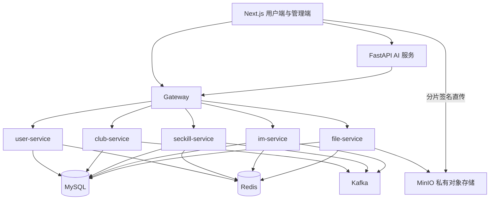

# 系统架构总览

> 修订日期：2026-09-05。本文说明目标架构与关键决策；当前实现和验收状态见 [tasks.md](tasks.md)，详细设计见 [技术白皮书](docs/校园社团协作平台-技术架构与项目白皮书.md)，接口现状与 v2 目标契约见 [API.md](docs/API.md)。

## 1. 项目定位与范围

高校社团协作平台，以社团组织、活动报名、群聊与资料共享为核心，用户侧和管理侧使用 Next.js Web 前端，AI 服务提供业务信息查询。首期交付完整社团使用流程，再按测量结果扩展容量和 AI 能力。

| 模块 | 职责 | 目标边界 |
|---|---|---|
| user-service | 用户、登录、平台身份 | 平台管理员与社团内角色分别维护 |
| club-service | 社团、审批、成员角色、公告 | 权威成员关系；Outbox 发布关系变化 |
| seckill-service | 活动 CRUD、名额、报名订单 | 一个服务拥有活动数据与报名状态 |
| im-service | 主会话、消息、投递与同步 | 社团群成员从社团事件同步；消息保存后 ACK |
| file-service | 上传任务、物理文件与业务引用 | 私有存储，按业务引用签发访问 URL |
| campus-gateway | 路由、认证、限流、请求追踪 | 方法级白名单、可信身份传播、入口流量保护 |
| ai-bot | 只读工具、后续规则问答和群聊摘要 | 用户权限上下文、可追溯来源、请求预算 |

## 2. 服务拓扑

```mermaid
graph TB
    Web[Next.js 用户端与管理端] --> GW[Gateway]
    Web --> AI[FastAPI AI 服务]
    AI --> GW
    GW --> US[user-service]
    GW --> CS[club-service]
    GW --> SS[seckill-service]
    GW --> IM[im-service]
    GW --> FS[file-service]
    US & CS & SS & IM & FS --> DB[(MySQL)]
    US & SS & IM & FS --> R[(Redis)]
    CS & SS & IM --> K[Kafka]
    FS --> OSS[MinIO 私有对象存储]
    Web -->|分片签名直传| OSS
```

图中 AI 为独立入口的目标接入方式，必须补齐自身端点鉴权和限额；若接入 Gateway，需同步定义委托身份传播，避免网关移除 Authorization 后工具失去用户身份。Nacos、配置、日志和 Metrics 作为基础设施使用，服务注册和业务事务分开维护。

服务端口：Gateway 9000，user/club/im/file/seckill 分别为 8081/8082/8083/8084/8085。初期单数据库，表按服务归属访问；跨服务采用 API 或事件。campus-common 提供基础类型与工具，campus-api 维护跨服务契约。

## 3. 当前技术栈

| 组件 | 当前仓库声明 | 依据 |
|---|---|---|
| JDK | 21 | 后端父 POM |
| Spring Boot / Cloud / Alibaba | 3.3.13 / 2023.0.3 / 2023.0.3.4 | 后端父 POM |
| MyBatis-Plus / Redisson | 3.5.12 / 3.41.0 | 后端父 POM |
| MySQL / Redis / Kafka | 8.4 / 7.4.8 / 4.0.1 | Docker Compose 镜像声明 |
| Nacos | 2.5.2 | Docker Compose 镜像声明 |
| MinIO | 当前使用 `latest`，待锁定版本或 digest | Docker Compose 镜像声明 |
| 前端 | Next.js 16.2.5 / React 19.2.6 | 前端 package.json |
| AI 服务 | Python + FastAPI + Anthropic SDK | ai-bot 源码与 requirements.txt |

版本表描述仓库配置，运行兼容性须由构建和集成测试确认。Spring Cloud 官方矩阵将 2023.0.x 对应 Boot 3.2/3.3、2024.0.x 对应 Boot 3.4、2025.0.x 对应 Boot 3.5；依赖升级应整体校验 BOM，并检查当前手动固定的 `spring-cloud-starter-bootstrap:4.2.2` 是否偏离所选 release train。[官方兼容矩阵](https://spring.io/projects/spring-cloud/)

业务服务当前配置了 `spring.threads.virtual.enabled=true`；Gateway 使用 WebFlux。并发承载需同时测量连接池、队列等待、线程 pinning 和内存，开启虚拟线程本身不能作为容量验收依据。

## 4. 当前决策与待实施边界

| 决策 | 具体行为 | 代价与验收 |
|---|---|---|
| 报名同步终态（当前工作区） | MySQL 事务内执行 `available_stock > 0` 条件扣减并插入唯一 SUCCESS 订单，提交成功后返回 200 | 路径短且不产生 Redis/DB 双写窗口；真实 MySQL 并发与回滚仍待集成验证 |
| IM 保存后 ACK（当前工作区） | 单条消息写入完成后成功 ACK；`(sender_id,client_msg_id)` 唯一约束返回原消息 ID | 单测已通过；会话 seq/cursor、重复内容冲突和真实 DB 故障仍待完成 |
| 文件任务独立（待实施） | upload_task 保存每次上传；file_object 记录已验证内容；file_reference 绑定业务范围 | 当前只完成签名、同 owner 续传和基础幂等，任务恢复与权限未闭环 |
| 成员关系同步（待实施） | club-service 可重试事件 → IM 幂等投影，敏感操作再验证有效成员关系 | 退社后新访问即时拒绝；需要重放和对账入口 |
| 稳定游标（待实施） | 消息按会话 seq、变更按事件 cursor；REST 和实时流去重合并 | 增加会话计数与事件记录；分页和离线撤回均可恢复 |

报名当前事务边界见白皮书 §5.3；异步受理仅作为 O04 容量门槛后的候选。IM 提交、投递和重连目标见 §5.2；文件完整状态机见 §5.4。准确完成状态以 tasks.md 为准。

## 5. 安全与权限

平台 ADMIN 判断全局管理权限，社团内 LEADER/DEPUTY/MEMBER 根据已通过审批的成员关系判断。Gateway 从 JWT claims 写入身份上下文；客户端同名 Header 是否被唯一覆盖仍需回归验证。业务服务通过受控内部入口接收，前端管理页跳转只提供界面导航，授权仍由后端执行。

私有文件依据 referenceId 检查业务读取资格，授权后签发 5 分钟 GET URL。即时撤权通过新请求拒绝实现，已签名 URL 存在剩余有效期窗口，需要即时失效时使用鉴权代理。生产使用 HTTPS/WSS，身份凭据与签名 URL 脱敏，封禁和成员移除关联 WebSocket 会话处理。

## 6. 部署与可观测性

本地使用 [Docker Compose](docker/docker-compose.yml) 启动中间件和单实例业务服务。实际部署先验证资源预算、备份恢复与健康检查，再按故障恢复要求配置多副本；K8s、完整 ELK 与大规模集群作为容量增长后的选项。

| 业务 | 关键指标 |
|---|---|
| 报名 | 入站/成功/业务拒绝 QPS、同步事务 P95/P99、锁与连接池等待、成功订单与 DB 库存差异 |
| IM | ACK/设备确认延迟、Outbox 最老待发时间、重投数、发送队列长度、补拉缺口与连接租约 |
| 文件 | 初始化/PUT/合并失败率、过期任务、待校验时长、孤立对象与配额使用 |
| AI | 工具成功率、来源正确率、P95 延迟、单请求 token/费用、并发量 |
| 基础设施 | 连接池等待、慢 SQL、Redis/Kafka 延迟、内存/GC、依赖错误率 |

目前 Gateway/日志关联 ID 与 Prometheus 配置存在；完整端到端追踪、业务指标与告警需运行验证。告警同时定义阈值、持续时间和处理入口。

## 7. 性能与交付

白皮书 §11 记录待验证口径：常规接口 P99 200ms、报名同步事务 P99 500ms、IM 在线端到端 P99 300ms、单节点 5000 活跃连接均不是当前已达指标。报名入口、成功提交、售罄和重复拒绝分别统计，并记录专用压测限流配置。

执行按 [tasks.md](tasks.md) 的 P0–P6 垂直工作包推进：先完成单实例正确性，再补最小业务闭环和总体验收。容量、AI 和多实例分别满足 [优化与演进](docs/优化与演进.md) 的启动门槛后另立方案。

每项完成记录实现 commit、执行命令、测试环境和结果，历史功能记录由 [CHANGELOG.md](CHANGELOG.md) 保留。
