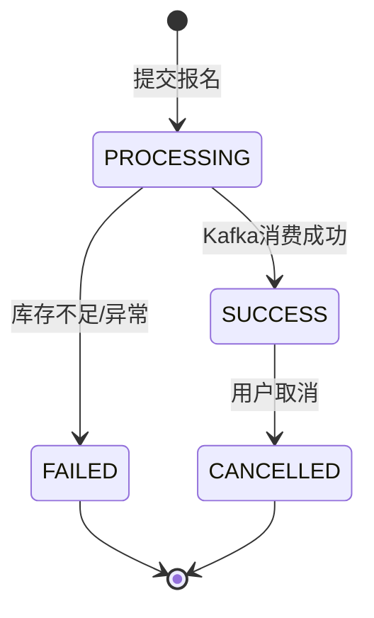
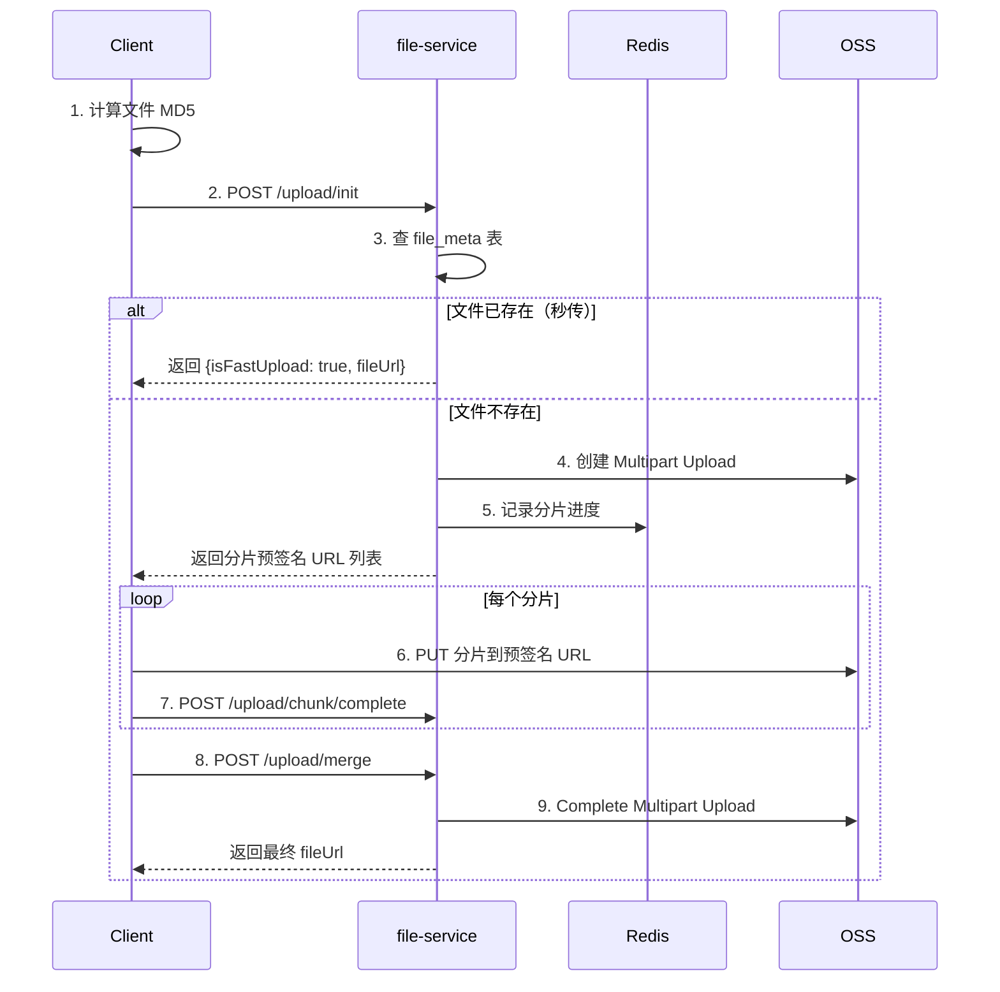
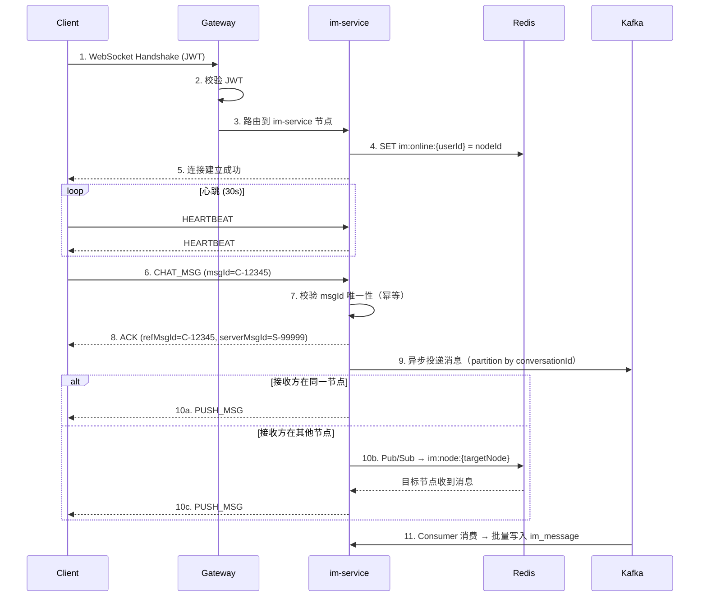

# 接口规范 (API.md)

> 所有接口通过 **Gateway（端口 9000）** 统一访问，无需直连各业务服务。

---

## 1. 全局约定

### 1.1 基础 URL 格式

```
http(s)://gateway:9000/{service-prefix}/api/v1/{resource}
```

### 1.2 统一响应结构

```java
// campus-common: Result<T>
public class Result<T> {
    private int code;       // 业务状态码
    private String msg;     // 提示信息
    private T data;         // 业务数据载荷
    private String traceId; // SkyWalking 链路追踪 ID
}
```

**响应示例：**
```json
{
  "code": 200,
  "msg": "Success",
  "data": { "...": "..." },
  "traceId": "T-a1b2c3d4e5f6"
}
```

### 1.3 认证方式

需要登录的接口在 Header 中携带：
```
Authorization: Bearer <accessToken>
```

### 1.4 业务状态码

| 状态码 | 含义 | HTTP Status |
|-------|------|------------|
| `200` | 请求成功 | 200 |
| `400` | 参数校验失败 | 400 |
| `401` | 未登录或 Token 过期 | 401 |
| `403` | 无操作权限 | 403 |
| `404` | 资源不存在 | 404 |
| `429` | 请求频率超限 | 429 |
| `500` | 系统内部异常 | 500 |
| `5001` | 库存不足（活动已满） | 200 |
| `5002` | 重复报名 | 200 |
| `5003` | 活动未开始 | 200 |
| `5004` | 活动已结束 | 200 |
| `5005` | 文件上传失败 | 200 |

### 1.5 分页约定

分页响应 `data` 格式：
```json
{
  "total": 42,
  "pages": 3,
  "current": 1,
  "records": [ "..." ]
}
```

分页请求 Query 参数：`?page=1&size=20`

---

## 2. 用户服务 API（`/user/api/v1/...`）

### A1. 用户注册

**`POST /user/api/v1/register`** — 无需鉴权

**Request Body：**
```json
{
  "username": "zhangsan",
  "password": "Abc@123456",
  "email": "zhangsan@campus.edu",
  "nickname": "张三"
}
```

**参数校验：**

| 字段 | 规则 |
|------|------|
| `username` | 必填，4-64字符，字母数字下划线 |
| `password` | 必填，8-128字符，含大小写+数字+特殊字符 |
| `email` | `@Email`，可选 |
| `nickname` | 2-64字符，可选 |

**Response (201)：**
```json
{
  "code": 200,
  "msg": "注册成功",
  "data": {
    "userId": "1780001234567890",
    "username": "zhangsan"
  }
}
```

---

### A2. 用户登录

**`POST /user/api/v1/login`** — 无需鉴权

**Request Body：**
```json
{
  "username": "zhangsan",
  "password": "Abc@123456"
}
```

**Response：**
```json
{
  "code": 200,
  "msg": "登录成功",
  "data": {
    "accessToken": "eyJhbGciOiJIUzI1Ni...",
    "refreshToken": "eyJhbGciOiJIUzI1Ni...",
    "expiresIn": 7200,
    "userInfo": {
      "userId": "1780001234567890",
      "username": "zhangsan",
      "nickname": "张三",
      "role": 0,
      "avatarUrl": "https://oss.example.com/avatar/default.png"
    }
  }
}
```

**Token 策略：**

| Token 类型 | 有效期 | 存储位置 |
|-----------|--------|---------|
| `accessToken` | 2 小时 | 客户端内存 / SecureStorage |
| `refreshToken` | 7 天 | Redis + 客户端 SecureStorage |

---

### A3. 刷新 Token

**`POST /user/api/v1/token/refresh`** — 无需鉴权

**Request Body：**
```json
{
  "refreshToken": "eyJhbGciOiJIUzI1Ni..."
}
```

**Response：**
```json
{
  "code": 200,
  "data": {
    "accessToken": "eyJhbGciOiJIUzI1Ni...(new)",
    "expiresIn": 7200
  }
}
```

---

### A4. 获取当前用户信息

**`GET /user/api/v1/me`** — 需鉴权

**Response：**
```json
{
  "code": 200,
  "data": {
    "userId": "1780001234567890",
    "username": "zhangsan",
    "nickname": "张三",
    "email": "zhangsan@campus.edu",
    "role": 0,
    "avatarUrl": "https://oss.example.com/avatar/xxx.png",
    "clubs": [
      { "clubId": "100001", "clubName": "编程社", "memberRole": 0 },
      { "clubId": "100002", "clubName": "摄影社", "memberRole": 2 }
    ]
  }
}
```

---

## 3. 社团服务 API（`/club/api/v1/...`）

### B1. 创建社团

**`POST /club/api/v1/clubs`** — 需鉴权

**Request Body：**
```json
{
  "name": "AI 技术研究社",
  "description": "探索人工智能前沿技术，定期举办技术分享会。",
  "category": "学术",
  "logoFileId": "a1b2c3d4..."
}
```

**Response：**
```json
{
  "code": 200,
  "msg": "社团创建申请已提交，等待管理员审核",
  "data": {
    "clubId": "200001",
    "status": 0
  }
}
```

---

### B2. 社团列表

**`GET /club/api/v1/clubs`** — 无需鉴权

**Query：** `?keyword=编程&category=学术&page=1&size=20`

**Response：**
```json
{
  "code": 200,
  "data": {
    "total": 42,
    "pages": 3,
    "current": 1,
    "records": [
      {
        "clubId": "100001",
        "name": "编程社",
        "description": "热爱代码的同学聚集地",
        "category": "学术",
        "logoUrl": "https://oss.example.com/club/logo1.png",
        "memberCount": 156,
        "leaderName": "李四"
      }
    ]
  }
}
```

---

### B3. 申请加入社团

**`POST /club/api/v1/clubs/{clubId}/join`** — 需鉴权

**Request Body：**
```json
{
  "reason": "对编程非常感兴趣，想学习更多技术"
}
```

**Response：**
```json
{
  "code": 200,
  "msg": "申请已提交，等待社长审批"
}
```

---

### B4. 发布公告

**`POST /club/api/v1/clubs/{clubId}/announcements`** — 需鉴权（社长/副社长）

**Request Body：**
```json
{
  "title": "本周六技术分享会",
  "content": "## 主题\nSpring Cloud 微服务实战\n\n## 时间\n4月15日 14:00-16:00",
  "isPinned": true
}
```

**Response：**
```json
{
  "code": 200,
  "data": {
    "announcementId": "300001",
    "title": "本周六技术分享会"
  }
}
```

---

## 4. 秒杀系统 API（`/seckill/api/v1/...`）

### C1. 秒杀报名 ⚡ 核心高频接口

**`POST /seckill/api/v1/activities/{id}/book`** — 需鉴权

**处理流程：**
```
Client → Gateway(Sentinel限流) → 防刷拦截 → Redis Lua(原子扣减) → Kafka(异步发送) → 返回"排队中"
```

**限流策略：**

| 层级 | 策略 | 配置 |
|------|------|------|
| Gateway | Sentinel 令牌桶 | 单接口 QPS ≤ 1000 |
| 用户维度 | 滑动窗口 | 同一用户 5 秒内 ≤ 1 次 |
| IP 维度 | 滑动窗口 | 同一 IP 1 秒内 ≤ 10 次 |

**Response（正常排队）：**
```json
{
  "code": 200,
  "data": {
    "orderId": "987654321098765432",
    "status": "PROCESSING",
    "message": "报名请求已提交，请稍后查询结果"
  }
}
```

**Response（库存不足）：**
```json
{ "code": 5001, "msg": "活动名额已满", "data": null }
```

**Response（重复报名）：**
```json
{ "code": 5002, "msg": "您已报名该活动，请勿重复操作", "data": null }
```

---

### C2. 查询订单结果

**`GET /seckill/api/v1/orders/{orderId}`** — 需鉴权

**Response（成功）：**
```json
{
  "code": 200,
  "data": {
    "orderId": "987654321098765432",
    "activityId": "500001",
    "activityTitle": "2026校园音乐节",
    "status": "SUCCESS",
    "bookTime": "2026-04-12T15:00:01"
  }
}
```

**订单状态机：**



---

### C3. 活动列表

**`GET /seckill/api/v1/activities`** — 无需鉴权

**Query：** `?clubId=100001&status=1&page=1&size=10`

**Response：**
```json
{
  "code": 200,
  "data": {
    "total": 5,
    "records": [
      {
        "activityId": "500001",
        "clubId": "100001",
        "clubName": "编程社",
        "title": "2026校园音乐节",
        "coverUrl": "https://oss.example.com/activity/music.png",
        "location": "大礼堂",
        "activityTime": "2026-04-20T19:00:00",
        "totalStock": 500,
        "availableStock": 123,
        "startTime": "2026-04-15T12:00:00",
        "endTime": "2026-04-18T23:59:59",
        "status": 1
      }
    ]
  }
}
```

---

## 5. 文件系统 API（`/file/api/v1/...`）

### D1. 初始化分片上传

**`POST /file/api/v1/upload/init`** — 需鉴权

**Request Body：**
```json
{
  "fileName": "社团宣传片.mp4",
  "fileSize": 104857600,
  "md5": "a1b2c3d4e5f6a7b8c9d0e1f2a3b4c5d6",
  "chunkSize": 5242880
}
```

**Response（需要上传）：**
```json
{
  "code": 200,
  "data": {
    "isFastUpload": false,
    "uploadId": "UP-556677889900",
    "chunkCount": 20,
    "chunkUrls": [
      { "partNumber": 1, "uploadUrl": "https://oss.example.com/upload/part1?sign=xxx" },
      { "partNumber": 2, "uploadUrl": "https://oss.example.com/upload/part2?sign=xxx" }
    ]
  }
}
```

**Response（秒传命中）：**
```json
{
  "code": 200,
  "data": {
    "isFastUpload": true,
    "fileUrl": "https://oss.example.com/files/a1b2c3d4.mp4"
  }
}
```

**上传流程：**


**文件上传限制：**

| 配置 | 值 |
|------|-----|
| 单文件最大 | 2 GB |
| 分片大小 | 5 MB（弱网建议 2 MB） |
| 客户端并发分片数 | 3 |
| 预签名 URL 有效期 | 1 小时 |
| 分片记录 TTL | 24 小时 |

---

### D2. 上报分片完成

**`POST /file/api/v1/upload/chunk/complete`** — 需鉴权

**Request Body：**
```json
{
  "uploadId": "UP-556677889900",
  "partNumber": 3,
  "etag": "\"d41d8cd98f00b204e9800998ecf8427e\""
}
```

**Response：**
```json
{
  "code": 200,
  "data": {
    "completedParts": 3,
    "totalParts": 20,
    "progress": 15
  }
}
```

---

### D3. 合并文件

**`POST /file/api/v1/upload/merge`** — 需鉴权

**Request Body：**
```json
{
  "uploadId": "UP-556677889900"
}
```

**Response：**
```json
{
  "code": 200,
  "data": {
    "fileId": "a1b2c3d4e5f6a7b8c9d0e1f2a3b4c5d6",
    "fileUrl": "https://oss.example.com/files/a1b2c3d4.mp4",
    "fileSize": 104857600
  }
}
```

---

## 6. IM 系统 REST API（`/im/api/v1/...`）

### E1. 离线消息拉取

**`GET /im/api/v1/messages/sync`** — 需鉴权

**Query 参数：**

| 参数 | 类型 | 必填 | 说明 |
|------|------|------|------|
| `conversationId` | String | 是 | 会话 ID |
| `lastAckMsgId` | String | 否 | 最后已确认的消息 ID（首次传空） |
| `limit` | Int | 否 | 每次拉取条数，默认 50，最大 200 |
| `direction` | String | 否 | `FORWARD`（默认，新消息）/ `BACKWARD`（历史消息） |

**Response：**
```json
{
  "code": 200,
  "data": {
    "hasMore": true,
    "messages": [
      {
        "msgId": "S-888889",
        "conversationId": "CONV_G_100001",
        "senderId": 1780001234567890,
        "senderName": "张三",
        "senderAvatar": "https://oss.example.com/avatar/xxx.png",
        "msgType": 1,
        "content": "{\"text\": \"明天几点集合？\"}",
        "replyMsgId": null,
        "isRecalled": false,
        "createTime": "2026-04-12T14:30:00"
      }
    ]
  }
}
```

---

### E2. 获取会话列表

**`GET /im/api/v1/conversations`** — 需鉴权

**Response：**
```json
{
  "code": 200,
  "data": [
    {
      "conversationId": "CONV_G_100001",
      "type": 2,
      "name": "编程社群聊",
      "avatarUrl": "https://oss.example.com/club/logo1.png",
      "lastMessage": {
        "msgId": "S-888890",
        "senderName": "李四",
        "content": "[图片]",
        "createTime": "2026-04-12T14:30:15"
      },
      "unreadCount": 12,
      "muted": false,
      "pinned": true
    },
    {
      "conversationId": "CONV_P_1001_1002",
      "type": 1,
      "name": null,
      "peerUser": {
        "userId": "1002",
        "nickname": "王五",
        "avatarUrl": "https://oss.example.com/avatar/zzz.png",
        "online": true
      },
      "lastMessage": {
        "msgId": "S-777777",
        "senderName": "王五",
        "content": "收到，明天见！",
        "createTime": "2026-04-12T10:00:00"
      },
      "unreadCount": 0,
      "muted": false,
      "pinned": false
    }
  ]
}
```

---

## 7. WebSocket 协议

### 7.1 连接建立

```
ws://gateway:9000/im/ws?token=<JWT>
```

> Gateway 在 WebSocket 握手阶段校验 JWT，合法后路由到 im-service 节点。

### 7.2 指令集定义

| 指令（`cmd`） | 方向 | 说明 | 触发时机 |
|-------------|------|------|---------|
| `CHAT_MSG` | Client → Server | 发送聊天消息 | 用户发消息 |
| `ACK` | Server → Client | 消息接收确认 | 服务端处理完成 |
| `PUSH_MSG` | Server → Client | 推送新消息 | 有新消息到达 |
| `HEARTBEAT` | 双向 | 心跳保活 | 每 30s |
| `RECALL` | Client → Server | 撤回消息 | 2 分钟内可撤回 |
| `READ_REPORT` | Client → Server | 已读回执上报 | 用户阅读消息后 |
| `TYPING` | Client → Server | 正在输入状态 | 用户输入中 |
| `KICK_OFF` | Server → Client | 强制下线 | 其他设备登录/封号 |

### 7.3 消息格式

```json
// 客户端发送消息
{
  "cmd": "CHAT_MSG",
  "msgId": "C-12345",
  "payload": {
    "conversationId": "CONV_G_100001",
    "type": 1,
    "content": "{\"text\": \"明天几点集合？\"}",
    "atUserIds": [],
    "replyMsgId": null
  }
}

// 服务端确认回执
{
  "cmd": "ACK",
  "refMsgId": "C-12345",
  "payload": {
    "serverMsgId": "S-99999",
    "timestamp": 1680000000000,
    "status": "OK"
  }
}

// 服务端推送新消息
{
  "cmd": "PUSH_MSG",
  "payload": {
    "msgId": "S-99999",
    "conversationId": "CONV_G_100001",
    "senderId": 1780001234567890,
    "senderName": "张三",
    "senderAvatar": "https://oss.example.com/avatar/xxx.png",
    "type": 1,
    "content": "{\"text\": \"明天几点集合？\"}",
    "timestamp": 1680000000000
  }
}

// 心跳（双向）
{
  "cmd": "HEARTBEAT",
  "timestamp": 1680000030000
}

// 撤回消息
{
  "cmd": "RECALL",
  "payload": {
    "conversationId": "CONV_G_100001",
    "msgId": "S-99999"
  }
}

// 已读回执
{
  "cmd": "READ_REPORT",
  "payload": {
    "conversationId": "CONV_G_100001",
    "lastReadMsgId": "S-99999"
  }
}
```

### 7.4 WebSocket 生命周期时序图



---

## 附录：全局异常码速查表

| 码段 | 范围 | 所属服务 |
|------|------|---------|
| `200` | 成功 | 全局 |
| `400-499` | 客户端错误 | 全局 |
| `500` | 系统内部错误 | 全局 |
| `5001-5010` | 秒杀业务错误 | seckill-service |
| `5011-5020` | 文件业务错误 | file-service |
| `5021-5030` | IM 业务错误 | im-service |
| `5031-5040` | 社团业务错误 | club-service |
