# 校园社团协作平台 —— 技术架构与项目白皮书 (AI-Ready)

> **文档版本**：v2.0 &nbsp;|&nbsp; **最后更新**：2026-04-12 &nbsp;|&nbsp; **状态**：细化定稿

---

## 目录

1. [项目定位与核心升级](#1-项目定位与核心升级)
2. [微服务架构设计](#2-微服务架构设计)
3. [数据库设计](#3-数据库设计-database-design)
4. [接口规范](#4-接口规范-api-specification)
5. [核心系统底层设计](#5-核心系统底层设计)
6. [工程脚手架与目录规范](#6-工程脚手架与目录规范)
7. [安全体系设计](#7-安全体系设计)
8. [部署与 DevOps](#8-部署与-devops)
9. [可观测性与监控告警](#9-可观测性与监控告警)
10. [AI Agent 赋能层](#10-ai-agent-赋能层)
11. [性能指标与压测基准](#11-性能指标与压测基准)
12. [项目里程碑与分期计划](#12-项目里程碑与分期计划)

---

## 1. 项目定位与核心升级

### 1.1 项目愿景

构建一个面向高校场景的 **一站式社团数字化协作平台**，覆盖从社团组织管理、实时即时通讯、热门活动抢报到大文件协作共享的全链路需求，最终通过 AI Agent 实现智能化运营辅助。

### 1.2 解决痛点

| # | 痛点 | 现状问题描述 | 本平台解决方案 | 技术关键词 |
|---|------|-------------|---------------|-----------|
| 1 | **沟通分散** | 微信/QQ 群消息无结构化归属，通知易被刷屏淹没，历史记录搜索困难 | 以**社团 → 会话**为组织单位，消息归属明确；支持消息类型分类（通知/讨论/文件）；全文检索 | WebSocket, Kafka, Elasticsearch |
| 2 | **高并发崩溃** | 热门活动（如校级晚会、热门讲座）抢报瞬间，传统系统因库存超卖、数据库锁竞争导致宕机 | Redis Lua 原子预扣库存 → Kafka 异步削峰 → DB 最终落盘，三级流量漏斗 | Redis Lua, Kafka, Sentinel |
| 3 | **大文件传输脆弱** | 校园 Wi-Fi 不稳定，视频/设计稿上传动辄中断需重传；无去重机制导致存储浪费 | 分片上传 + 断点续传 + MD5 秒传校验；OSS 直传减轻服务端带宽 | 分片上传, OSS 预签名 URL |
| 4 | **权限混乱** | 社团管理依赖人工统计 Excel，角色权限模糊 | RBAC 三级权限模型（学生/社长/管理员），操作审计日志 | Spring Security, JWT |
| 5 | **信息孤岛** | 活动通知发了多个群，仍有人漏看 | AI Agent 自动推送摘要，未读提醒聚合 | RAG, LLM |

### 1.3 核心架构演进路径

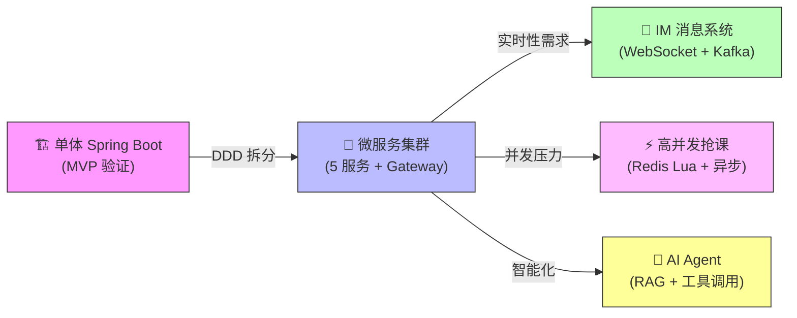

### 1.4 核心用户角色


| 角色 | `role` 值 | 核心权限 |
|------|----------|---------|
| 学生 | `0` | 浏览社团、申请加入、报名活动、IM 聊天、上传文件 |
| 社长 | `1` | 继承学生权限 + 创建/编辑活动、审批入团申请、管理社团成员、发布公告 |
| 管理员 | `2` | 继承社长权限 + 审核社团创建申请、全局用户管理、系统配置、数据统计 |

---

## 2. 微服务架构设计

### 2.1 整体架构图

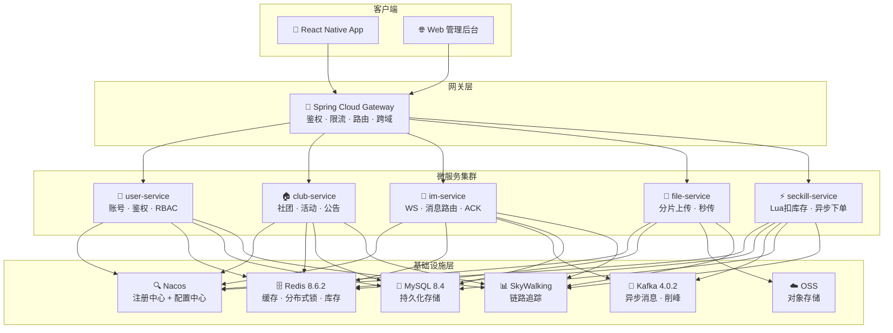

### 2.2 服务路由与职责矩阵

基于领域驱动设计（DDD），系统拆分为 **5 个核心业务微服务 + 1 个网关 + 2 个公共模块**。网关统一负责鉴权、限流、跨域。

| 服务路由前缀 | 服务名 | 核心职责 | 对外端口 | 依赖中间件 | 是否有状态 |
|---|---|---|---|---|---|
| `/user/**` | `user-service` | 账号注册/登录、JWT 签发/刷新、RBAC 权限校验、用户画像 | 8081 | Redis, MySQL | 无状态 |
| `/club/**` | `club-service` | 社团 CRUD、成员管理、活动 CRUD、公告发布、审批流 | 8082 | Redis, MySQL | 无状态 |
| `/im/**` | `im-service` | WebSocket 长连接保持、消息路由分发、ACK 机制、离线消息同步、已读回执 | 8083 | Redis, Kafka, MySQL | **有状态**（WS 连接） |
| `/file/**` | `file-service` | 分片上传初始化、断点续传、MD5 秒传校验、合并完成回调 | 8084 | Redis, OSS | 无状态 |
| `/seckill/**` | `seckill-service` | 活动库存预热、Lua 原子扣减、防刷限流、Kafka 异步下单、订单结果查询 | 8085 | Redis, Kafka, MySQL | 无状态 |
| — | `campus-gateway` | 统一入口、JWT 鉴权过滤、Sentinel 限流、路由转发、跨域处理 | 9000 | Redis, Nacos | 无状态 |

### 2.3 公共模块职责

| 模块名 | 职责 | 包含内容 |
|--------|------|---------|
| `campus-common` | 全局公共基础层 | 统一异常定义、统一响应包装 `Result<T>`、JWT 工具类、雪花算法 ID 生成器、分页 DTO、公共枚举 |
| `campus-api` | 服务间通信契约 | Feign Client 接口定义、跨服务 DTO/VO 定义、API 版本常量 |

### 2.4 关键技术选型与版本

## 2.4 关键技术选型与版本 (2026-04 更新)

> 所有版本基于 **2026 年 4 月**最新稳定/LTS 发行版选取，优先选择已充分验证的生产级版本。

| 组件 | 版本 | 选型理由 |
|---|---|---|---| |
| **JDK** | **21 LTS** | 虚拟线程（Virtual Threads）正式 GA，结构化并发预览可选；自 2023.09 发布以来已历经 2.5 年生产验证，生态工具链全面支持 |
| **Spring Boot** | **3.5.3** | 最新稳定 3.x 分支，内置 Virtual Threads 一等公民支持 (`spring.threads.virtual.enabled=true`)；GraalVM Native Image 成熟度更高 |
| **Spring Cloud** | **2024.0.2** | 与 Boot 3.5.x 兼容矩阵对齐；OpenFeign / Gateway / CircuitBreaker 均为最新稳定版 |
| **Spring Cloud Alibaba** | **2025.1.0.0** | 适配 Spring Cloud 2024.0.x 与 Spring Boot 3.5.x；Nacos 2.5 / Sentinel 2.0 / Seata 2.x 全线升级 |
| **MyBatis-Plus** | **3.5.10** | 修复多项分页与多租户插件 Bug；优化 Lambda 查询性能 |
| **Redisson** | **3.41.0** | 完善 JDK 21 Virtual Threads 协作；新增 Redis Function 支持 |
| **Kafka** | **4.0.1** ⭐ | **KRaft 模式正式取代 ZooKeeper**，部署架构大幅简化（无需独立 ZK 集群）；新版 Consumer 协议减少 Rebalance 延迟 |
| **MySQL** | **8.4 LTS** | Oracle 官方长期支持分支（2024.04 发布），相比 8.0 Innovation 系列拥有更长维护周期；性能优化器改进显著 |
| **Redis** | **7.4.x** | RedisJSON / RedisSearch 模块稳定性提升；AOF 多部分重写(MP-AOF)优化持久化性能 |
| **Nacos** | **2.5.x** | 长连接 gRPC 通道 GA；配置加密存储原生支持；集群稳定性大幅改善 |
| **Sentinel** | **2.0.x** | 适配 Spring Boot 3.x / JDK 21；熔断策略增强（慢调用比例+异常比例混合策略） |
| **SkyWalking** | **10.x** | 原生 eBPF 探针支持；AI 辅助根因分析；与 OpenTelemetry Collector 深度集成 |
| **MinIO / 阿里云 OSS** | — | 对象存储，支持 S3 兼容 API + 预签名 URL 直传 |
| **React Native** | **0.79+** | New Architecture (Fabric + TurboModules) 默认启用，渲染性能提升 ~30% |

> **JDK 21 虚拟线程使用策略**
> 1. **网关层（Gateway）**：保持原生 **Reactive (WebFlux + Netty)** 模型，不开启虚拟线程，避免破坏 Reactor 事件循环。
> 2. **业务微服务（user / club / im / seckill / file）**：全面采用 **Spring WebMVC + 虚拟线程**（`spring.threads.virtual.enabled=true`），充分发挥 JDK 21 在阻塞 I/O 场景下的并发优势。
> 3. **IM 消息系统**：基于 **Spring WebSocket (Tomcat)** 实现长连接，配合虚拟线程即可满足单机 ≥ 5000 连接目标，无需引入独立 Netty 服务。
> 4. **数据库驱动**：所有服务统一升级至 **MySQL Connector/J 9.x**，并在压测阶段重点监控 **Thread Pinning**（`JVM TI` / `jcmd Thread.print`），避免同步锁耗尽 Carrier Threads。

### 2.5 服务间通信策略

| 通信方式 | 场景 | 示例 | 超时配置 |
|---------|------|------|---------|
| **Feign (HTTP 同步)** | 强一致性查询、鉴权校验 | Gateway 调用 user-service 校验 JWT | 连接 2s / 读取 5s |
| **Kafka (异步消息)** | 削峰填谷、最终一致性 | 秒杀下单、IM 消息落盘 | — |
| **Redis Pub/Sub** | 轻量级事件广播 | IM 跨节点消息推送、缓存失效通知 | — |
| **WebSocket** | 客户端实时推送 | IM 消息、秒杀结果通知 | 心跳 30s |

---

## 3. 数据库设计 (Database Design)

> **AI 编码提示**：所有表默认包含公共字段 `id` (主键/雪花算法), `create_time`, `update_time`, `is_deleted` (逻辑删除)。MyBatis-Plus 通过 `MetaObjectHandler` 自动填充这四个字段。

### 3.1 核心领域模型 (ER)

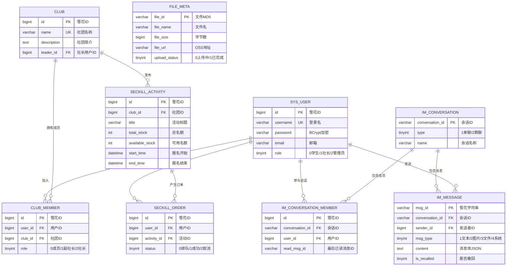

**关系总结：**
- **User ↔ Club**: 多对多（通过 `club_member` 关联表，含社团内角色）
- **Club ↔ Activity**: 一对多（一个社团可发布多个活动）
- **User ↔ Activity**: 多对多（通过 `seckill_order` 报名表，含订单状态）
- **User ↔ Conversation**: 多对多（通过 `im_conversation_member`，含已读进度）
- **Conversation ↔ Message**: 一对多（一个会话包含多条消息）

### 3.2 关键表结构定义

#### A. 用户与社团域 (`user-service` / `club-service`)

```sql
-- ============================================================
-- 用户表：user-service 管理
-- 索引策略：username 唯一索引用于登录查询；email 普通索引用于找回密码
-- ============================================================
CREATE TABLE `sys_user` (
  `id`          bigint       NOT NULL                              COMMENT '用户ID(雪花算法)',
  `username`    varchar(64)  NOT NULL                              COMMENT '登录用户名',
  `password`    varchar(128) NOT NULL                              COMMENT 'BCrypt 加密密码',
  `nickname`    varchar(64)  DEFAULT NULL                          COMMENT '显示昵称',
  `avatar_url`  varchar(512) DEFAULT NULL                          COMMENT '头像 OSS 地址',
  `email`       varchar(128) DEFAULT NULL                          COMMENT '邮箱(可选,用于找回密码)',
  `phone`       varchar(20)  DEFAULT NULL                          COMMENT '手机号(可选)',
  `role`        tinyint      NOT NULL DEFAULT '0'                  COMMENT '全局角色: 0-学生 1-社长 2-管理员',
  `status`      tinyint      NOT NULL DEFAULT '1'                  COMMENT '账号状态: 0-禁用 1-正常',
  `last_login`  datetime     DEFAULT NULL                          COMMENT '最后登录时间',
  `create_time` datetime     NOT NULL DEFAULT CURRENT_TIMESTAMP    COMMENT '创建时间',
  `update_time` datetime     NOT NULL DEFAULT CURRENT_TIMESTAMP ON UPDATE CURRENT_TIMESTAMP COMMENT '更新时间',
  `is_deleted`  tinyint      NOT NULL DEFAULT '0'                  COMMENT '逻辑删除: 0-正常 1-已删除',
  PRIMARY KEY (`id`),
  UNIQUE KEY `uk_username` (`username`),
  KEY `idx_email` (`email`),
  KEY `idx_phone` (`phone`)
) ENGINE=InnoDB DEFAULT CHARSET=utf8mb4 COLLATE=utf8mb4_unicode_ci COMMENT='系统用户表';

-- ============================================================
-- 社团表：club-service 管理
-- ============================================================
CREATE TABLE `club` (
  `id`          bigint       NOT NULL                              COMMENT '社团ID(雪花算法)',
  `name`        varchar(128) NOT NULL                              COMMENT '社团名称',
  `description` text                                               COMMENT '社团简介',
  `logo_url`    varchar(512) DEFAULT NULL                          COMMENT '社团Logo OSS地址',
  `leader_id`   bigint       NOT NULL                              COMMENT '社长用户ID',
  `category`    varchar(32)  DEFAULT NULL                          COMMENT '分类: 学术/体育/艺术/公益/其他',
  `status`      tinyint      NOT NULL DEFAULT '0'                  COMMENT '审核状态: 0-待审核 1-正常 2-已解散',
  `member_count`int          NOT NULL DEFAULT '1'                  COMMENT '成员数(冗余,异步更新)',
  `create_time` datetime     NOT NULL DEFAULT CURRENT_TIMESTAMP,
  `update_time` datetime     NOT NULL DEFAULT CURRENT_TIMESTAMP ON UPDATE CURRENT_TIMESTAMP,
  `is_deleted`  tinyint      NOT NULL DEFAULT '0',
  PRIMARY KEY (`id`),
  UNIQUE KEY `uk_name` (`name`),
  KEY `idx_leader` (`leader_id`),
  KEY `idx_category` (`category`)
) ENGINE=InnoDB DEFAULT CHARSET=utf8mb4 COLLATE=utf8mb4_unicode_ci COMMENT='社团表';

-- ============================================================
-- 社团成员关联表
-- 设计要点：user_id + club_id 建立联合唯一索引，防止重复加入
-- ============================================================
CREATE TABLE `club_member` (
  `id`          bigint       NOT NULL                              COMMENT '主键(雪花算法)',
  `user_id`     bigint       NOT NULL                              COMMENT '用户ID',
  `club_id`     bigint       NOT NULL                              COMMENT '社团ID',
  `member_role` tinyint      NOT NULL DEFAULT '0'                  COMMENT '社团内角色: 0-成员 1-副社长 2-社长',
  `join_time`   datetime     NOT NULL DEFAULT CURRENT_TIMESTAMP    COMMENT '加入时间',
  `create_time` datetime     NOT NULL DEFAULT CURRENT_TIMESTAMP,
  `update_time` datetime     NOT NULL DEFAULT CURRENT_TIMESTAMP ON UPDATE CURRENT_TIMESTAMP,
  `is_deleted`  tinyint      NOT NULL DEFAULT '0',
  PRIMARY KEY (`id`),
  UNIQUE KEY `uk_user_club` (`user_id`, `club_id`),
  KEY `idx_club_id` (`club_id`)
) ENGINE=InnoDB DEFAULT CHARSET=utf8mb4 COLLATE=utf8mb4_unicode_ci COMMENT='社团成员关联表';

-- ============================================================
-- 公告表：club-service 管理
-- ============================================================
CREATE TABLE `club_announcement` (
  `id`          bigint       NOT NULL                              COMMENT '公告ID(雪花算法)',
  `club_id`     bigint       NOT NULL                              COMMENT '所属社团ID',
  `title`       varchar(256) NOT NULL                              COMMENT '公告标题',
  `content`     text         NOT NULL                              COMMENT '公告内容(Markdown)',
  `publisher_id`bigint       NOT NULL                              COMMENT '发布者用户ID',
  `is_pinned`   tinyint      NOT NULL DEFAULT '0'                  COMMENT '是否置顶: 0-否 1-是',
  `create_time` datetime     NOT NULL DEFAULT CURRENT_TIMESTAMP,
  `update_time` datetime     NOT NULL DEFAULT CURRENT_TIMESTAMP ON UPDATE CURRENT_TIMESTAMP,
  `is_deleted`  tinyint      NOT NULL DEFAULT '0',
  PRIMARY KEY (`id`),
  KEY `idx_club_pinned` (`club_id`, `is_pinned`, `create_time` DESC)
) ENGINE=InnoDB DEFAULT CHARSET=utf8mb4 COLLATE=utf8mb4_unicode_ci COMMENT='社团公告表';
```

#### B. 秒杀/报名域 (`seckill-service`)

```sql
-- ============================================================
-- 活动库存表 (系统启动或活动创建时预热至 Redis)
-- 设计要点：
--   1. available_stock 为数据库层最终一致库存，Redis 为实时热数据
--   2. start_time / end_time 控制报名时间窗口，Gateway + 服务双重校验
-- ============================================================
CREATE TABLE `seckill_activity` (
  `id`              bigint       NOT NULL                          COMMENT '活动ID(雪花算法)',
  `club_id`         bigint       NOT NULL                          COMMENT '所属社团ID',
  `title`           varchar(128) NOT NULL                          COMMENT '活动标题',
  `description`     text                                           COMMENT '活动详情(Markdown)',
  `cover_url`       varchar(512) DEFAULT NULL                      COMMENT '活动封面图URL',
  `location`        varchar(256) DEFAULT NULL                      COMMENT '活动地点',
  `activity_time`   datetime     DEFAULT NULL                      COMMENT '活动举办时间',
  `total_stock`     int          NOT NULL                          COMMENT '总名额',
  `available_stock` int          NOT NULL                          COMMENT '可用名额(对账后最终库存)',
  `start_time`      datetime     NOT NULL                          COMMENT '报名开始时间',
  `end_time`        datetime     NOT NULL                          COMMENT '报名结束时间',
  `status`          tinyint      NOT NULL DEFAULT '0'              COMMENT '活动状态: 0-未开始 1-进行中 2-已结束 3-已取消',
  `create_time`     datetime     NOT NULL DEFAULT CURRENT_TIMESTAMP,
  `update_time`     datetime     NOT NULL DEFAULT CURRENT_TIMESTAMP ON UPDATE CURRENT_TIMESTAMP,
  `is_deleted`      tinyint      NOT NULL DEFAULT '0',
  PRIMARY KEY (`id`),
  KEY `idx_club_id` (`club_id`),
  KEY `idx_start_time` (`start_time`),
  KEY `idx_status` (`status`)
) ENGINE=InnoDB DEFAULT CHARSET=utf8mb4 COLLATE=utf8mb4_unicode_ci COMMENT='秒杀活动(库存)表';

-- ============================================================
-- 报名订单表 (Kafka 异步落盘)
-- 设计要点：
--   1. user_id + activity_id 联合唯一：数据库层面防重保底（兜底 Redis 防重失败的极端情况）
--   2. status 状态机：0-排队中 → 1-成功 / 2-已取消
--   3. 建议按 activity_id 做分表策略（当数据量达到千万级时）
-- ============================================================
CREATE TABLE `seckill_order` (
  `id`          bigint       NOT NULL                              COMMENT '订单ID(雪花算法)',
  `user_id`     bigint       NOT NULL                              COMMENT '报名用户ID',
  `activity_id` bigint       NOT NULL                              COMMENT '活动ID',
  `status`      tinyint      NOT NULL DEFAULT '0'                  COMMENT '订单状态: 0-排队中 1-成功 2-已取消',
  `cancel_reason` varchar(256) DEFAULT NULL                        COMMENT '取消原因(可选)',
  `create_time` datetime     NOT NULL DEFAULT CURRENT_TIMESTAMP,
  `update_time` datetime     NOT NULL DEFAULT CURRENT_TIMESTAMP ON UPDATE CURRENT_TIMESTAMP,
  `is_deleted`  tinyint      NOT NULL DEFAULT '0',
  PRIMARY KEY (`id`),
  UNIQUE KEY `uk_user_activity` (`user_id`, `activity_id`),
  KEY `idx_activity_status` (`activity_id`, `status`)
) ENGINE=InnoDB DEFAULT CHARSET=utf8mb4 COLLATE=utf8mb4_unicode_ci COMMENT='秒杀报名订单表';
```

#### C. IM 消息域 (`im-service`)

```sql
-- ============================================================
-- 会话表
-- 设计要点：
--   1. conversation_id 生成规则：
--      - 单聊：CONV_P_{min(uid1,uid2)}_{max(uid1,uid2)} （保证双方生成相同ID）
--      - 群聊：CONV_G_{雪花ID}
--   2. 群聊 name 为群名，单聊 name 为 null（客户端显示对方昵称）
-- ============================================================
CREATE TABLE `im_conversation` (
  `conversation_id` varchar(64)  NOT NULL                          COMMENT '会话ID(规则生成)',
  `type`            tinyint      NOT NULL                          COMMENT '会话类型: 1-单聊 2-群聊',
  `name`            varchar(128) DEFAULT NULL                      COMMENT '群聊名称(单聊为null)',
  `avatar_url`      varchar(512) DEFAULT NULL                      COMMENT '群头像URL',
  `owner_id`        bigint       DEFAULT NULL                      COMMENT '群主用户ID(群聊)',
  `max_members`     int          NOT NULL DEFAULT '200'            COMMENT '最大成员数(群聊)',
  `create_time`     datetime     NOT NULL DEFAULT CURRENT_TIMESTAMP,
  `update_time`     datetime     NOT NULL DEFAULT CURRENT_TIMESTAMP ON UPDATE CURRENT_TIMESTAMP,
  `is_deleted`      tinyint      NOT NULL DEFAULT '0',
  PRIMARY KEY (`conversation_id`)
) ENGINE=InnoDB DEFAULT CHARSET=utf8mb4 COLLATE=utf8mb4_unicode_ci COMMENT='IM会话表';

-- ============================================================
-- 会话成员表
-- 设计要点：
--   1. read_msg_id 记录用户在该会话的已读进度，用于计算未读数
--   2. muted: 是否免打扰
-- ============================================================
CREATE TABLE `im_conversation_member` (
  `id`              bigint       NOT NULL                          COMMENT '主键(雪花算法)',
  `conversation_id` varchar(64)  NOT NULL                          COMMENT '会话ID',
  `user_id`         bigint       NOT NULL                          COMMENT '用户ID',
  `read_msg_id`     varchar(64)  DEFAULT NULL                      COMMENT '最后已读消息ID',
  `muted`           tinyint      NOT NULL DEFAULT '0'              COMMENT '免打扰: 0-否 1-是',
  `member_role`     tinyint      NOT NULL DEFAULT '0'              COMMENT '0-普通 1-管理员 2-群主',
  `join_time`       datetime     NOT NULL DEFAULT CURRENT_TIMESTAMP COMMENT '加入时间',
  `create_time`     datetime     NOT NULL DEFAULT CURRENT_TIMESTAMP,
  `update_time`     datetime     NOT NULL DEFAULT CURRENT_TIMESTAMP ON UPDATE CURRENT_TIMESTAMP,
  `is_deleted`      tinyint      NOT NULL DEFAULT '0',
  PRIMARY KEY (`id`),
  UNIQUE KEY `uk_conv_user` (`conversation_id`, `user_id`),
  KEY `idx_user_id` (`user_id`)
) ENGINE=InnoDB DEFAULT CHARSET=utf8mb4 COLLATE=utf8mb4_unicode_ci COMMENT='IM会话成员表';

-- ============================================================
-- 消息持久化表
-- 设计要点：
--   1. msg_id 为全局唯一（雪花字符串），作为幂等消费的 UK
--   2. content 为 JSON 格式，支持富文本扩展：
--      - 文本: {"text": "内容"}
--      - 图片: {"url": "xxx", "width": 800, "height": 600, "thumbnail": "xxx"}
--      - 文件: {"fileId": "xxx", "fileName": "xxx", "fileSize": 1024}
--      - 系统: {"action": "JOIN", "operatorId": 123, "targetId": 456}
--   3. 索引 idx_conversation 用于离线消息拉取（按会话+时间范围查询）
--   4. 大表预估：日消息量 10w+ 时建议按 conversation_id 做分表
-- ============================================================
CREATE TABLE `im_message` (
  `msg_id`          varchar(64)  NOT NULL                          COMMENT '全局唯一消息ID(雪花字符串)',
  `conversation_id` varchar(64)  NOT NULL                          COMMENT '会话ID',
  `sender_id`       bigint       NOT NULL                          COMMENT '发送者用户ID',
  `msg_type`        tinyint      NOT NULL                          COMMENT '消息类型: 1-文本 2-图片 3-文件 4-系统通知 5-@消息',
  `content`         text         NOT NULL                          COMMENT '消息体(JSON格式)',
  `at_user_ids`     varchar(512) DEFAULT NULL                      COMMENT '@的用户ID列表(逗号分隔)',
  `reply_msg_id`    varchar(64)  DEFAULT NULL                      COMMENT '引用回复的消息ID',
  `is_recalled`     tinyint      NOT NULL DEFAULT '0'              COMMENT '是否已撤回: 0-否 1-是',
  `create_time`     datetime     NOT NULL DEFAULT CURRENT_TIMESTAMP COMMENT '发送时间',
  `update_time`     datetime     NOT NULL DEFAULT CURRENT_TIMESTAMP ON UPDATE CURRENT_TIMESTAMP,
  `is_deleted`      tinyint      NOT NULL DEFAULT '0',
  PRIMARY KEY (`msg_id`),
  KEY `idx_conversation_time` (`conversation_id`, `create_time`),
  KEY `idx_sender` (`sender_id`, `create_time`)
) ENGINE=InnoDB DEFAULT CHARSET=utf8mb4 COLLATE=utf8mb4_unicode_ci COMMENT='IM消息表';
```

#### D. 大文件域 (`file-service`)

```sql
-- ============================================================
-- 文件元数据表
-- 设计要点：
--   1. file_id 使用文件 MD5 作为主键，天然支持秒传去重
--   2. upload_status 只有两个状态；分片进度跟踪在 Redis 中
--   3. chunk_count 记录分片总数，用于合并校验
--   4. uploader_id 记录首次上传者（后续秒传不重复记录）
-- ============================================================
CREATE TABLE `file_meta` (
  `file_id`       varchar(64)  NOT NULL                            COMMENT '文件MD5(主键/秒传依据)',
  `file_name`     varchar(255) NOT NULL                            COMMENT '原始文件名',
  `file_size`     bigint       NOT NULL                            COMMENT '文件大小(字节)',
  `file_type`     varchar(64)  DEFAULT NULL                        COMMENT 'MIME类型(如 video/mp4)',
  `file_url`      varchar(512) NOT NULL                            COMMENT 'OSS 最终访问地址',
  `chunk_count`   int          NOT NULL DEFAULT '1'                COMMENT '分片总数',
  `upload_status` tinyint      NOT NULL DEFAULT '0'                COMMENT '上传状态: 0-上传中 1-已完成',
  `uploader_id`   bigint       NOT NULL                            COMMENT '上传者用户ID',
  `create_time`   datetime     NOT NULL DEFAULT CURRENT_TIMESTAMP,
  `update_time`   datetime     NOT NULL DEFAULT CURRENT_TIMESTAMP ON UPDATE CURRENT_TIMESTAMP,
  `is_deleted`    tinyint      NOT NULL DEFAULT '0',
  PRIMARY KEY (`file_id`),
  KEY `idx_uploader` (`uploader_id`),
  KEY `idx_status` (`upload_status`)
) ENGINE=InnoDB DEFAULT CHARSET=utf8mb4 COLLATE=utf8mb4_unicode_ci COMMENT='文件元数据表';

-- ============================================================
-- 文件引用表（解耦文件与业务关系）
-- 设计要点：同一个文件可被多个业务（消息/公告/社团头像）引用
-- ============================================================
CREATE TABLE `file_reference` (
  `id`          bigint       NOT NULL                              COMMENT '主键(雪花算法)',
  `file_id`     varchar(64)  NOT NULL                              COMMENT '文件ID(MD5)',
  `biz_type`    varchar(32)  NOT NULL                              COMMENT '业务类型: IM_MSG/ANNOUNCEMENT/CLUB_LOGO/USER_AVATAR',
  `biz_id`      varchar(64)  NOT NULL                              COMMENT '业务ID(消息ID/公告ID等)',
  `create_time` datetime     NOT NULL DEFAULT CURRENT_TIMESTAMP,
  `is_deleted`  tinyint      NOT NULL DEFAULT '0',
  PRIMARY KEY (`id`),
  KEY `idx_file_id` (`file_id`),
  KEY `idx_biz` (`biz_type`, `biz_id`)
) ENGINE=InnoDB DEFAULT CHARSET=utf8mb4 COLLATE=utf8mb4_unicode_ci COMMENT='文件引用关联表';
```

### 3.3 数据库分库策略 (预规划)

> 初期单库即可支撑，当数据量增长到瓶颈时按如下策略拆分：

| 服务 | 分库/分表策略 | 触发条件 |
|------|-------------|---------|
| `im_message` | 按 `conversation_id` hash 分 4 表 | 单表 > 500w 行 |
| `seckill_order` | 按 `activity_id` 范围分表 | 单表 > 200w 行 |
| 其他表 | 暂不拆分 | — |

---

## 4. 接口规范 (API Specification)

> **AI 编码提示**：所有 RESTful 接口统一响应体包装 `Result<T>`；WebSocket 采用指令化 JSON 协议；所有接口遵循 API 版本化（`/api/v1/`）。

### 4.1 全局 HTTP 响应结构

```java
/**
 * 统一响应包装类 — campus-common 模块
 */
@Data
public class Result<T> {
    private int code;        // 业务状态码
    private String msg;      // 提示信息
    private T data;          // 业务数据载荷
    private String traceId;  // SkyWalking 链路追踪ID

    public static <T> Result<T> ok(T data) { ... }
    public static <T> Result<T> fail(int code, String msg) { ... }
}
```

**响应 JSON 样例：**
```json
{
  "code": 200,
  "msg": "Success",
  "data": { "...": "..." },
  "traceId": "T-a1b2c3d4e5f6"
}
```

**全局业务状态码定义：**

| 状态码 | 常量名 | 含义 | HTTP Status |
|-------|--------|------|-------------|
| `200` | `SUCCESS` | 请求成功 | 200 |
| `400` | `BAD_REQUEST` | 参数校验失败 | 400 |
| `401` | `UNAUTHORIZED` | 未登录或 Token 过期 | 401 |
| `403` | `FORBIDDEN` | 无操作权限 | 403 |
| `404` | `NOT_FOUND` | 资源不存在 | 404 |
| `429` | `TOO_MANY_REQUESTS` | 请求频率超限 | 429 |
| `500` | `INTERNAL_ERROR` | 系统内部异常 | 500 |
| `5001` | `STOCK_EMPTY` | 库存不足(活动已满) | 200 |
| `5002` | `DUPLICATE_BOOK` | 重复报名 | 200 |
| `5003` | `ACTIVITY_NOT_START` | 活动未开始 | 200 |
| `5004` | `ACTIVITY_ENDED` | 活动已结束 | 200 |
| `5005` | `FILE_UPLOAD_FAIL` | 文件上传失败 | 200 |

### 4.2 核心 API 定义

#### A. 用户服务 API

<details>
<summary><strong>A1. 用户注册</strong> — <code>POST /user/api/v1/register</code></summary>

**Request Body:**
```json
{
  "username": "zhangsan",
  "password": "Abc@123456",
  "email": "zhangsan@campus.edu",
  "nickname": "张三"
}
```

**参数校验规则：**
| 字段 | 规则 | 说明 |
|------|------|------|
| `username` | `@NotBlank`, 4-64字符, 字母数字下划线 | 登录名 |
| `password` | `@NotBlank`, 8-128字符, 含大小写+数字+特殊字符 | 密码强度要求 |
| `email` | `@Email`, 可选 | 邮箱 |
| `nickname` | 2-64字符, 可选 | 显示昵称 |

**Response (201 Created):**
```json
{
  "code": 200,
  "msg": "注册成功",
  "data": {
    "userId": "1780001234567890",
    "username": "zhangsan"
  }
}
```
</details>

<details>
<summary><strong>A2. 用户登录</strong> — <code>POST /user/api/v1/login</code></summary>

**Request Body:**
```json
{
  "username": "zhangsan",
  "password": "Abc@123456"
}
```

**Response:**
```json
{
  "code": 200,
  "msg": "登录成功",
  "data": {
    "accessToken": "eyJhbGciOiJIUzI1Ni...",
    "refreshToken": "eyJhbGciOiJIUzI1Ni...",
    "expiresIn": 7200,
    "userInfo": {
      "userId": "1780001234567890",
      "username": "zhangsan",
      "nickname": "张三",
      "role": 0,
      "avatarUrl": "https://oss.example.com/avatar/default.png"
    }
  }
}
```

**Token 策略：**
| Token 类型 | 有效期 | 存储位置 | 说明 |
|-----------|--------|---------|------|
| `accessToken` | 2 小时 | 客户端内存 / SecureStorage | 每次请求携带 |
| `refreshToken` | 7 天 | Redis + 客户端 SecureStorage | 刷新 accessToken |

</details>

<details>
<summary><strong>A3. 刷新 Token</strong> — <code>POST /user/api/v1/token/refresh</code></summary>

**Request Body:**
```json
{
  "refreshToken": "eyJhbGciOiJIUzI1Ni..."
}
```

**Response:**
```json
{
  "code": 200,
  "data": {
    "accessToken": "eyJhbGciOiJIUzI1Ni...(new)",
    "expiresIn": 7200
  }
}
```
</details>

<details>
<summary><strong>A4. 获取当前用户信息</strong> — <code>GET /user/api/v1/me</code></summary>

**Header:** `Authorization: Bearer <accessToken>`

**Response:**
```json
{
  "code": 200,
  "data": {
    "userId": "1780001234567890",
    "username": "zhangsan",
    "nickname": "张三",
    "email": "zhangsan@campus.edu",
    "role": 0,
    "avatarUrl": "https://oss.example.com/avatar/xxx.png",
    "clubs": [
      { "clubId": "100001", "clubName": "编程社", "memberRole": 0 },
      { "clubId": "100002", "clubName": "摄影社", "memberRole": 2 }
    ]
  }
}
```
</details>

#### B. 社团服务 API

<details>
<summary><strong>B1. 创建社团</strong> — <code>POST /club/api/v1/clubs</code></summary>

**Header:** `Authorization: Bearer <JWT>` (需要管理员审核)

**Request Body:**
```json
{
  "name": "AI 技术研究社",
  "description": "探索人工智能前沿技术，定期举办技术分享会和项目实战。",
  "category": "学术",
  "logoFileId": "a1b2c3d4..."
}
```

**Response:**
```json
{
  "code": 200,
  "msg": "社团创建申请已提交，等待管理员审核",
  "data": {
    "clubId": "200001",
    "status": 0
  }
}
```
</details>

<details>
<summary><strong>B2. 社团列表</strong> — <code>GET /club/api/v1/clubs</code></summary>

**Query:** `?keyword=编程&category=学术&page=1&size=20`

**Response:**
```json
{
  "code": 200,
  "data": {
    "total": 42,
    "pages": 3,
    "current": 1,
    "records": [
      {
        "clubId": "100001",
        "name": "编程社",
        "description": "热爱代码的同学聚集地",
        "category": "学术",
        "logoUrl": "https://oss.example.com/club/logo1.png",
        "memberCount": 156,
        "leaderName": "李四"
      }
    ]
  }
}
```
</details>

<details>
<summary><strong>B3. 申请加入社团</strong> — <code>POST /club/api/v1/clubs/{clubId}/join</code></summary>

**Header:** `Authorization: Bearer <JWT>`

**Request Body:**
```json
{
  "reason": "对编程非常感兴趣，想学习更多技术"
}
```

**Response:**
```json
{
  "code": 200,
  "msg": "申请已提交，等待社长审批"
}
```
</details>

<details>
<summary><strong>B4. 发布公告</strong> — <code>POST /club/api/v1/clubs/{clubId}/announcements</code></summary>

**Header:** `Authorization: Bearer <JWT>` (需社长/副社长权限)

**Request Body:**
```json
{
  "title": "本周六下午技术分享会",
  "content": "## 主题\nSpring Cloud 微服务实战\n\n## 时间\n4月15日 14:00-16:00\n\n## 地点\n图书馆 B201",
  "isPinned": true
}
```

**Response:**
```json
{
  "code": 200,
  "data": {
    "announcementId": "300001",
    "title": "本周六下午技术分享会"
  }
}
```
</details>

#### C. 秒杀系统 API

<details>
<summary><strong>C1. 秒杀报名</strong> — <code>POST /seckill/api/v1/activities/{id}/book</code> ⚡ 核心高频</summary>

**Header:** `Authorization: Bearer <JWT>`

**处理流程：**
```
Client → Gateway(Sentinel限流) → 拦截器(防刷校验) → Redis Lua(原子扣减) → Kafka(异步发送) → 返回"排队中"
```

**Response (正常排队):**
```json
{
  "code": 200,
  "data": {
    "orderId": "987654321098765432",
    "status": "PROCESSING",
    "message": "报名请求已提交，请稍后查询结果"
  }
}
```

**Response (库存不足):**
```json
{
  "code": 5001,
  "msg": "活动名额已满",
  "data": null
}
```

**Response (重复报名):**
```json
{
  "code": 5002,
  "msg": "您已报名该活动，请勿重复操作",
  "data": null
}
```

**限流策略：**
| 层级 | 策略 | 配置 |
|------|------|------|
| Gateway | Sentinel 令牌桶 | 单接口 QPS ≤ 1000 |
| 用户维度 | 滑动窗口 | 同一用户 5 秒内 ≤ 1 次 |
| IP 维度 | 滑动窗口 | 同一 IP 1 秒内 ≤ 10 次 |

</details>

<details>
<summary><strong>C2. 查询订单结果</strong> — <code>GET /seckill/api/v1/orders/{orderId}</code></summary>

**Header:** `Authorization: Bearer <JWT>`

**Response (成功):**
```json
{
  "code": 200,
  "data": {
    "orderId": "987654321098765432",
    "activityId": "500001",
    "activityTitle": "2026校园音乐节",
    "status": "SUCCESS",
    "bookTime": "2026-04-12T15:00:01"
  }
}
```

**订单状态机：**
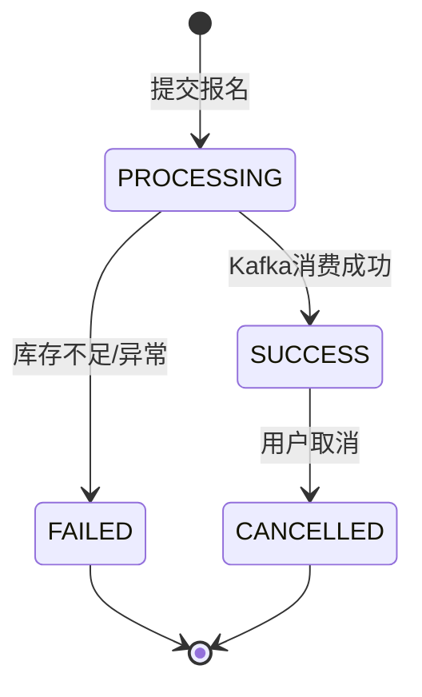
</details>

<details>
<summary><strong>C3. 活动列表</strong> — <code>GET /seckill/api/v1/activities</code></summary>

**Query:** `?clubId=100001&status=1&page=1&size=10`

**Response:**
```json
{
  "code": 200,
  "data": {
    "total": 5,
    "records": [
      {
        "activityId": "500001",
        "clubId": "100001",
        "clubName": "编程社",
        "title": "2026校园音乐节",
        "coverUrl": "https://oss.example.com/activity/music.png",
        "location": "大礼堂",
        "activityTime": "2026-04-20T19:00:00",
        "totalStock": 500,
        "availableStock": 123,
        "startTime": "2026-04-15T12:00:00",
        "endTime": "2026-04-18T23:59:59",
        "status": 1
      }
    ]
  }
}
```
</details>

#### D. 文件系统 API

<details>
<summary><strong>D1. 初始化分片上传</strong> — <code>POST /file/api/v1/upload/init</code></summary>

**Header:** `Authorization: Bearer <JWT>`

**Request Body:**
```json
{
  "fileName": "社团宣传片.mp4",
  "fileSize": 104857600,
  "md5": "a1b2c3d4e5f6a7b8c9d0e1f2a3b4c5d6",
  "chunkSize": 5242880
}
```

**参数说明：**
| 字段 | 类型 | 说明 |
|------|------|------|
| `fileName` | String | 原始文件名 |
| `fileSize` | Long | 文件总字节数 |
| `md5` | String | 文件整体 MD5（前端 SparkMD5 计算） |
| `chunkSize` | Int | 每个分片大小，默认 5MB(`5242880`) |

**Response (需要上传):**
```json
{
  "code": 200,
  "data": {
    "isFastUpload": false,
    "uploadId": "UP-556677889900",
    "chunkCount": 20,
    "chunkUrls": [
      { "partNumber": 1, "uploadUrl": "https://oss.example.com/upload/part1?sign=xxx&expire=3600" },
      { "partNumber": 2, "uploadUrl": "https://oss.example.com/upload/part2?sign=xxx&expire=3600" }
    ]
  }
}
```

**Response (秒传命中):**
```json
{
  "code": 200,
  "data": {
    "isFastUpload": true,
    "fileUrl": "https://oss.example.com/files/a1b2c3d4.mp4"
  }
}
```

**上传流程图：**
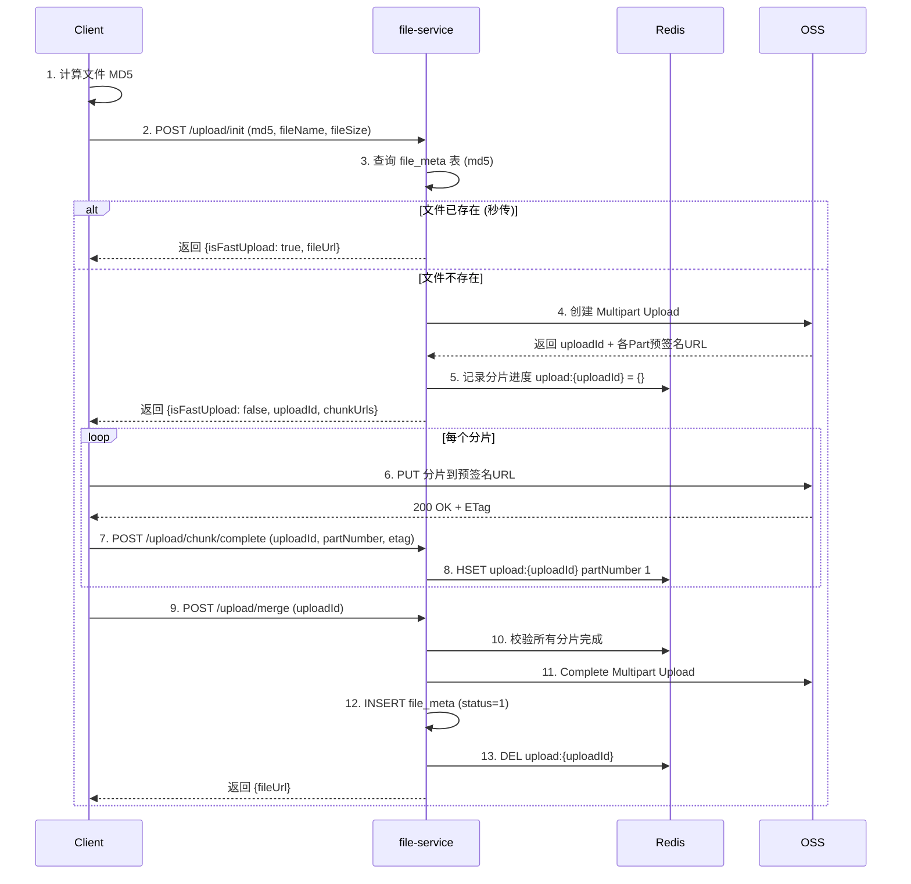
</details>

<details>
<summary><strong>D2. 上报分片完成</strong> — <code>POST /file/api/v1/upload/chunk/complete</code></summary>

**Request Body:**
```json
{
  "uploadId": "UP-556677889900",
  "partNumber": 3,
  "etag": "\"d41d8cd98f00b204e9800998ecf8427e\""
}
```

**Response:**
```json
{
  "code": 200,
  "data": {
    "completedParts": 3,
    "totalParts": 20,
    "progress": 15
  }
}
```
</details>

<details>
<summary><strong>D3. 合并文件</strong> — <code>POST /file/api/v1/upload/merge</code></summary>

**Request Body:**
```json
{
  "uploadId": "UP-556677889900"
}
```

**Response:**
```json
{
  "code": 200,
  "data": {
    "fileId": "a1b2c3d4e5f6a7b8c9d0e1f2a3b4c5d6",
    "fileUrl": "https://oss.example.com/files/a1b2c3d4.mp4",
    "fileSize": 104857600
  }
}
```
</details>

#### E. IM 系统 API

<details>
<summary><strong>E1. 离线消息拉取</strong> — <code>GET /im/api/v1/messages/sync</code></summary>

**Header:** `Authorization: Bearer <JWT>`

**Query Parameters:**
| 参数 | 类型 | 必填 | 说明 |
|------|------|------|------|
| `conversationId` | String | 是 | 会话ID |
| `lastAckMsgId` | String | 否 | 最后已确认的消息ID，首次传空 |
| `limit` | Int | 否 | 每次拉取条数，默认 50，最大 200 |
| `direction` | String | 否 | `FORWARD`(默认,新消息) / `BACKWARD`(历史消息) |

**Response:**
```json
{
  "code": 200,
  "data": {
    "hasMore": true,
    "messages": [
      {
        "msgId": "S-888889",
        "conversationId": "CONV_G_100001",
        "senderId": 1780001234567890,
        "senderName": "张三",
        "senderAvatar": "https://oss.example.com/avatar/xxx.png",
        "msgType": 1,
        "content": "{\"text\": \"明天几点集合？\"}",
        "replyMsgId": null,
        "isRecalled": false,
        "createTime": "2026-04-12T14:30:00"
      },
      {
        "msgId": "S-888890",
        "conversationId": "CONV_G_100001",
        "senderId": 1780001234567891,
        "senderName": "李四",
        "senderAvatar": "https://oss.example.com/avatar/yyy.png",
        "msgType": 2,
        "content": "{\"url\": \"https://oss.example.com/img/map.jpg\", \"width\": 800, \"height\": 600}",
        "replyMsgId": "S-888889",
        "isRecalled": false,
        "createTime": "2026-04-12T14:30:15"
      }
    ]
  }
}
```
</details>

<details>
<summary><strong>E2. 获取会话列表</strong> — <code>GET /im/api/v1/conversations</code></summary>

**Header:** `Authorization: Bearer <JWT>`

**Response:**
```json
{
  "code": 200,
  "data": [
    {
      "conversationId": "CONV_G_100001",
      "type": 2,
      "name": "编程社群聊",
      "avatarUrl": "https://oss.example.com/club/logo1.png",
      "lastMessage": {
        "msgId": "S-888890",
        "senderName": "李四",
        "content": "[图片]",
        "createTime": "2026-04-12T14:30:15"
      },
      "unreadCount": 12,
      "muted": false,
      "pinned": true
    },
    {
      "conversationId": "CONV_P_1001_1002",
      "type": 1,
      "name": null,
      "peerUser": {
        "userId": "1002",
        "nickname": "王五",
        "avatarUrl": "https://oss.example.com/avatar/zzz.png",
        "online": true
      },
      "lastMessage": {
        "msgId": "S-777777",
        "senderName": "王五",
        "content": "收到，明天见！",
        "createTime": "2026-04-12T10:00:00"
      },
      "unreadCount": 0,
      "muted": false,
      "pinned": false
    }
  ]
}
```
</details>

### 4.3 WebSocket 实时通讯协议

#### 连接建立

```
ws://gateway:9000/im/ws?token=<JWT>
```

> Gateway 在 WebSocket 握手阶段校验 JWT 合法性，合法后路由到 `im-service` 节点。

#### 指令集定义

| 指令 (`cmd`) | 方向 | 说明 | 触发时机 |
|-------------|------|------|---------|
| `CHAT_MSG` | Client → Server | 发送聊天消息 | 用户发消息 |
| `ACK` | Server → Client | 消息接收确认 | 服务端处理完成 |
| `PUSH_MSG` | Server → Client | 推送新消息 | 有新消息到达 |
| `HEARTBEAT` | 双向 | 心跳保活 | 每 30s |
| `RECALL` | Client → Server | 撤回消息 | 2分钟内可撤回 |
| `READ_REPORT` | Client → Server | 已读回执上报 | 用户阅读消息后 |
| `TYPING` | Client → Server | 正在输入 | 用户输入中 |
| `KICK_OFF` | Server → Client | 强制下线 | 其他设备登录 / 封号 |

#### 消息格式

```json
// ──────────── 客户端发送消息 (Client → Server) ────────────
{
  "cmd": "CHAT_MSG",
  "msgId": "C-12345",              // 客户端本地生成的临时ID(UUID)，用于回执匹配
  "payload": {
    "conversationId": "CONV_G_100001",
    "type": 1,                      // 1-文本 2-图片 3-文件 4-@消息
    "content": "{\"text\": \"明天几点集合？\"}",
    "atUserIds": [],                 // @的用户ID列表
    "replyMsgId": null               // 引用回复的消息ID
  }
}

// ──────────── 服务端确认回执 (Server → Client) ────────────
{
  "cmd": "ACK",
  "refMsgId": "C-12345",           // 对应客户端临时ID
  "payload": {
    "serverMsgId": "S-99999",       // 服务端雪花ID(最终ID)
    "timestamp": 1680000000000,
    "status": "OK"                   // OK / FAIL
  }
}

// ──────────── 服务端推送新消息 (Server → Client) ────────────
{
  "cmd": "PUSH_MSG",
  "payload": {
    "msgId": "S-99999",
    "conversationId": "CONV_G_100001",
    "senderId": 1780001234567890,
    "senderName": "张三",
    "senderAvatar": "https://oss.example.com/avatar/xxx.png",
    "type": 1,
    "content": "{\"text\": \"明天几点集合？\"}",
    "timestamp": 1680000000000
  }
}

// ──────────── 心跳 (双向) ────────────
{
  "cmd": "HEARTBEAT",
  "timestamp": 1680000030000
}

// ──────────── 撤回消息 (Client → Server) ────────────
{
  "cmd": "RECALL",
  "payload": {
    "conversationId": "CONV_G_100001",
    "msgId": "S-99999"
  }
}

// ──────────── 已读回执 (Client → Server) ────────────
{
  "cmd": "READ_REPORT",
  "payload": {
    "conversationId": "CONV_G_100001",
    "lastReadMsgId": "S-99999"
  }
}
```

#### WebSocket 生命周期时序图

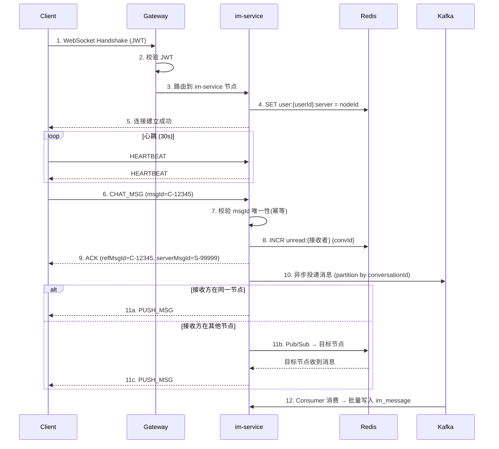

---

## 5. 核心系统底层设计

### 5.1 Redis Key 结构约定

> **命名规范**：`{服务缩写}:{业务域}:{主体ID}:{子属性}`，统一使用 `:` 分隔。

| 业务域 | Key 模板 | 数据结构 | TTL | 说明 |
|--------|---------|---------|-----|------|
| **IM** 用户在线状态 | `im:online:{userId}` | String | 与 WS 连接同生命周期 | value = `nodeId` (当前 WS 连接的服务节点) |
| **IM** 未读计数 | `im:unread:{userId}` | Hash | 永久 | field = `conversationId`, value = `count` |
| **IM** 重试队列 | `im:retry:{nodeId}` | ZSet | 永久(消费后删除) | member = `msgJson`, score = `sendTimestamp` |
| **IM** 最近会话 | `im:recent:{userId}` | ZSet | 永久 | member = `conversationId`, score = `lastMsgTimestamp` |
| **IM** 消息去重 | `im:dedup:{msgId}` | String | 5 min | value = `1`，防止客户端重发 |
| **秒杀** 实时库存 | `sk:stock:{activityId}` | String | 活动结束后清理 | value = 剩余库存数 |
| **秒杀** 已抢用户集合 | `sk:users:{activityId}` | Set | 活动结束后清理 | member = `userId`，去重 + 防重复报名 |
| **秒杀** 活动详情缓存 | `sk:detail:{activityId}` | String(JSON) | 10 min | 活动信息缓存，减少 DB 压力 |
| **文件** 分片进度 | `file:chunk:{uploadId}` | Hash | 24 h | field = `partNumber`, value = `etag` |
| **用户** Token 黑名单 | `user:blacklist:{jti}` | String | = Token 剩余有效期 | 用于注销/强制下线场景 |
| **用户** 刷新令牌 | `user:refresh:{userId}` | String | 7 天 | value = `refreshToken` hash |
| **通用** 分布式锁 | `lock:{业务}:{id}` | String | 30s(看门狗续期) | Redisson 分布式锁 |

### 5.2 IM 消息系统详细设计

#### 5.2.1 ACK 重试与消息可靠投递

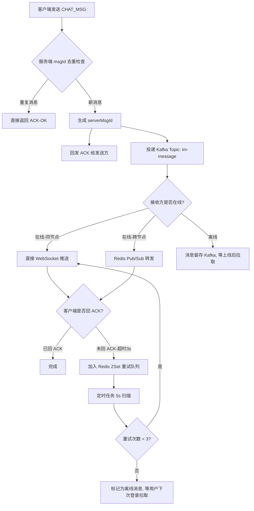

**可靠投递四层保障：**

| 层级 | 机制 | 说明 |
|------|------|------|
| L1: 客户端去重 | `msgId` (UUID) | 客户端本地生成，重发时携带相同 ID |
| L2: 服务端幂等 | Redis `im:dedup:{msgId}` | 5 分钟内同一 msgId 不重复处理 |
| L3: 推送重试 | Redis ZSet `im:retry:{nodeId}` | 3s 未收到客户端 ACK 则重试，最多 3 次 |
| L4: 离线兜底 | Kafka + DB 持久化 | 离线消息于用户上线时通过 `/messages/sync` 拉取 |

#### 5.2.2 Kafka Topic 设计

| Topic | Partition 策略 | Consumer Group | 说明 |
|-------|---------------|----------------|------|
| `im-message-persist` | 按 `conversationId` hash | `im-persist-group` | 消息持久化到 DB，会话内有序 |
| `im-message-push` | 按 `targetNodeId` hash | `im-push-group` | 跨节点消息推送（备选方案，替代 Pub/Sub） |
| `seckill-order` | 按 `activityId` hash | `seckill-order-group` | 秒杀订单异步落盘 |

#### 5.2.3 跨节点消息路由

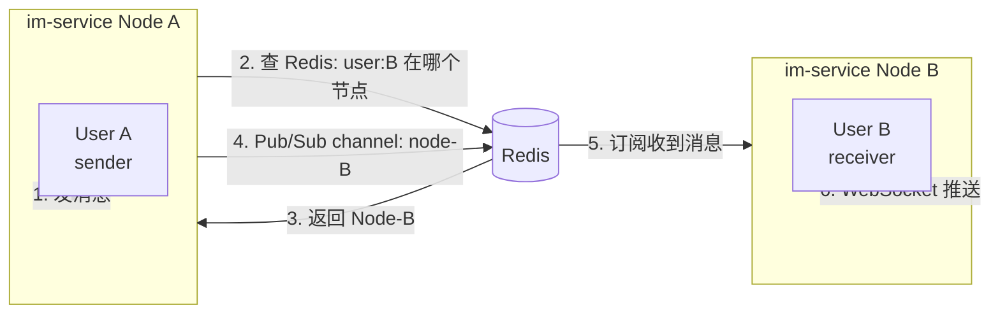

**路由逻辑伪代码：**
```java
public void routeMessage(Long targetUserId, MessageDTO msg) {
    // 1. 查询目标用户所在节点
    String targetNode = redis.get("im:online:" + targetUserId);

    if (targetNode == null) {
        // 离线用户：消息已存 Kafka，等上线拉取
        return;
    }

    if (targetNode.equals(currentNodeId)) {
        // 同节点：直接推送
        wsSessionManager.push(targetUserId, msg);
    } else {
        // 跨节点：Redis Pub/Sub 转发
        redis.publish("im:node:" + targetNode, JSON.toJSONString(msg));
    }
}
```

### 5.3 秒杀系统详细设计

#### 5.3.1 三级流量漏斗

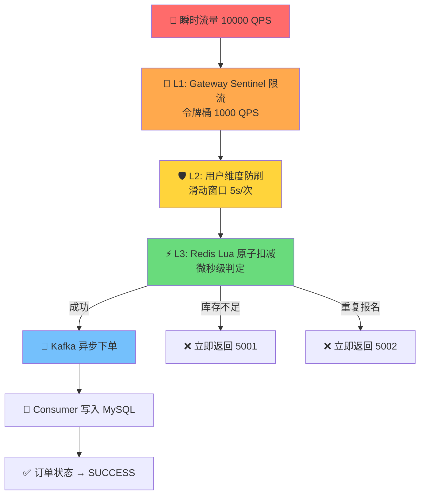

**各层性能预期：**
| 层级 | 输入 QPS | 输出 QPS | 过滤率 |
|------|---------|---------|--------|
| L1 Gateway | 10000 | 1000 | 90% |
| L2 防刷 | 1000 | ~500 | 50% |
| L3 Redis Lua | ~500 | ≤ totalStock | 看库存情况 |
| Kafka → DB | ≤ totalStock | — | 批量写入 |

#### 5.3.2 Lua 脚本详解

```lua
-- seckill_deduct.lua
-- KEYS[1] = sk:stock:{activityId}        库存 Key
-- KEYS[2] = sk:users:{activityId}        已抢用户集合 Key
-- ARGV[1] = userId                        当前用户ID
-- 返回值：>= 0 表示成功(返回剩余库存)，-1 库存不足，-2 重复报名

-- Step 1: 检查库存
local stock = redis.call('GET', KEYS[1])
if stock == false then
    return -3  -- 活动不存在
end
if tonumber(stock) <= 0 then
    return -1  -- 库存不足
end

-- Step 2: 检查是否重复报名 (SADD 原子操作：加入成功返回1，已存在返回0)
local isNew = redis.call('SADD', KEYS[2], ARGV[1])
if isNew == 0 then
    return -2  -- 重复报名
end

-- Step 3: 扣减库存
local remaining = redis.call('DECR', KEYS[1])
if remaining < 0 then
    -- 极端并发下库存变负数，回滚
    redis.call('INCR', KEYS[1])
    redis.call('SREM', KEYS[2], ARGV[1])
    return -1
end

return remaining
```

**调用方式 (Java):**
```java
@Component
public class SeckillStockService {

    @Autowired
    private RedissonClient redissonClient;

    private static final String LUA_SCRIPT = "..."; // 上述 Lua 脚本

    /**
     * 原子扣减库存
     * @return >= 0: 剩余库存; -1: 库存不足; -2: 重复报名; -3: 活动不存在
     */
    public long deductStock(Long activityId, Long userId) {
        RScript script = redissonClient.getScript(LongCodec.INSTANCE);
        return script.eval(
            RScript.Mode.READ_WRITE,
            LUA_SCRIPT,
            RScript.ReturnType.INTEGER,
            Arrays.asList(
                "sk:stock:" + activityId,
                "sk:users:" + activityId
            ),
            userId.toString()
        );
    }
}
```

#### 5.3.3 库存预热与对账

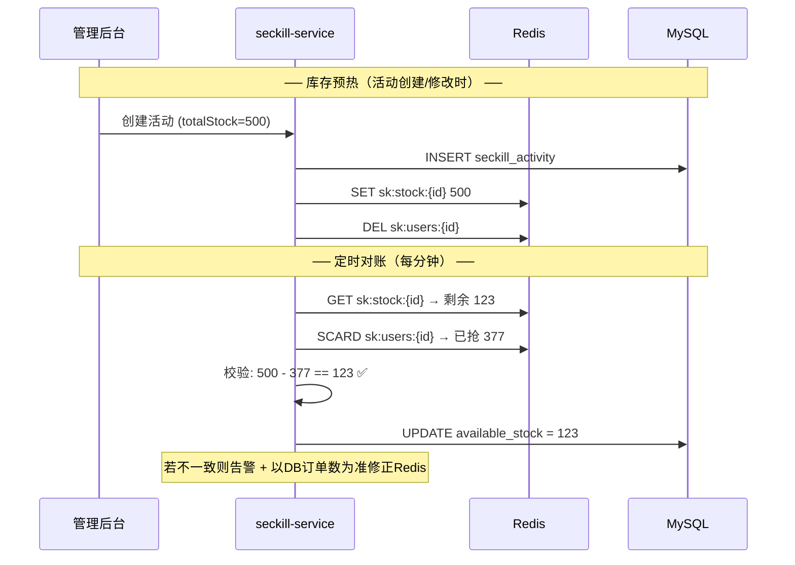

### 5.4 大文件上传详细设计

#### 5.4.1 分片上传核心流程

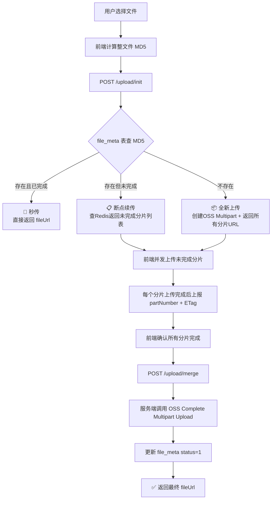

#### 5.4.2 文件上传限制

| 配置项 | 值 | 说明 |
|--------|-----|------|
| 单文件最大 | 2 GB | 超过需压缩或分卷 |
| 分片大小 | 5 MB | 弱网建议 2 MB |
| 并发分片数 | 3 | 客户端同时上传的分片数 |
| 允许类型 | 图片/视频/文档/压缩包 | MIME 白名单 |
| 分片过期时间 | 24 小时 | Redis 分片记录 + OSS upload 过期 |
| 预签名 URL 有效期 | 1 小时 | OSS 预签名安全限制 |

---

## 6. 工程脚手架与目录规范

### 6.1 项目总体结构

```text
campus-collab-platform/
├── 📁 .github/                           # GitHub Actions CI/CD 配置
│   └── 📁 workflows/
│       ├── ci.yml                        # PR 检查：编译 + 单元测试
│       └── cd.yml                        # 主干合并：构建镜像 + 部署
│
├── 📁 .vscode/                           # VSCode 工作区配置
│   ├── settings.json                     # 统一编辑器配置
│   └── extensions.json                   # 推荐扩展列表
│
├── 📁 docker/                            # 容器化编排
│   ├── docker-compose.yml                # 本地开发一键启动所有中间件
│   ├── docker-compose.prod.yml           # 生产环境编排
│   ├── 📁 mysql/
│   │   ├── Dockerfile
│   │   ├── my.cnf                        # MySQL 配置优化
│   │   └── init.sql                      # 数据库初始化（建库建表）
│   ├── 📁 redis/
│   │   └── redis.conf
│   ├── 📁 kafka/
│   │   └── server.properties
│   └── 📁 nacos/
│       └── application.properties
│
├── 📁 docs/                              # 架构与 API 文档
│   ├── architecture.md                   # 本白皮书
│   ├── api-spec.md                       # 接口详细文档
│   ├── 📁 diagrams/                      # 架构图源文件
│   └── 📁 sql/                           # 数据库脚本（版本化）
│       ├── V1.0__init_user.sql
│       ├── V1.0__init_club.sql
│       ├── V1.0__init_im.sql
│       ├── V1.0__init_seckill.sql
│       └── V1.0__init_file.sql
│
├── 📁 campus-platform-backend/           # ☕ Java 后端 Root
│   ├── pom.xml                           # Maven 父 POM（统一依赖版本管理）
│   │
│   ├── 📁 campus-common/                 # 🔧 全局公共模块
│   │   ├── pom.xml
│   │   └── 📁 src/main/java/com/campus/common/
│   │       ├── 📁 config/               # 全局配置（Jackson/CORS/Swagger）
│   │       ├── 📁 constant/             # 常量定义（RedisKey/KafkaTopic/ErrorCode）
│   │       ├── 📁 exception/            # 全局异常体系
│   │       │   ├── BizException.java     # 业务异常
│   │       │   ├── ErrorCode.java        # 错误码枚举
│   │       │   └── GlobalExceptionHandler.java  # @RestControllerAdvice
│   │       ├── 📁 result/               # 统一响应
│   │       │   └── Result.java           # Result<T> 包装类
│   │       ├── 📁 util/                  # 工具类
│   │       │   ├── JwtUtil.java          # JWT 生成/解析/刷新
│   │       │   ├── SnowflakeIdUtil.java  # 雪花算法 ID 生成
│   │       │   └── PageUtil.java         # 分页参数工具
│   │       └── 📁 model/                # 公共模型
│   │           ├── BaseEntity.java       # 公共字段基类
│   │           └── PageRequest.java      # 分页请求 DTO
│   │
│   ├── 📁 campus-api/                    # 🔗 Feign 接口 + 跨服务 DTO
│   │   ├── pom.xml
│   │   └── 📁 src/main/java/com/campus/api/
│   │       ├── 📁 user/
│   │       │   ├── UserFeignClient.java  # @FeignClient("user-service")
│   │       │   └── 📁 dto/
│   │       │       └── UserBasicDTO.java # 跨服务传输的用户精简信息
│   │       ├── 📁 club/
│   │       │   └── ClubFeignClient.java
│   │       └── 📁 file/
│   │           └── FileFeignClient.java
│   │
│   ├── 📁 campus-gateway/                # 🚪 API 网关
│   │   ├── pom.xml
│   │   └── 📁 src/main/
│   │       ├── 📁 java/com/campus/gateway/
│   │       │   ├── GatewayApplication.java
│   │       │   ├── 📁 filter/
│   │       │   │   ├── JwtAuthFilter.java         # JWT 鉴权全局过滤器
│   │       │   │   ├── RateLimitFilter.java        # 限流过滤器
│   │       │   │   └── TraceIdFilter.java          # 链路追踪ID注入
│   │       │   └── 📁 config/
│   │       │       ├── RouteConfig.java             # 路由配置
│   │       │       ├── CorsConfig.java              # 跨域配置
│   │       │       └── SentinelConfig.java          # Sentinel 限流规则
│   │       └── 📁 resources/
│   │           ├── application.yml                   # 网关配置
│   │           └── bootstrap.yml                     # Nacos 配置
│   │
│   ├── 📁 campus-user-service/            # 👤 用户域微服务
│   │   ├── pom.xml
│   │   └── 📁 src/main/java/com/campus/user/
│   │       ├── UserServiceApplication.java
│   │       ├── 📁 controller/            # REST API 层
│   │       │   ├── AuthController.java    # 注册/登录/刷新Token
│   │       │   └── UserController.java    # 用户信息 CRUD
│   │       ├── 📁 service/               # 业务逻辑层
│   │       │   ├── AuthService.java
│   │       │   └── UserService.java
│   │       ├── 📁 service/impl/
│   │       │   ├── AuthServiceImpl.java
│   │       │   └── UserServiceImpl.java
│   │       ├── 📁 mapper/                # MyBatis-Plus Mapper
│   │       │   └── UserMapper.java
│   │       ├── 📁 entity/                # 数据库实体（对应表结构）
│   │       │   └── SysUser.java
│   │       ├── 📁 dto/                   # 请求/响应 DTO
│   │       │   ├── RegisterRequest.java
│   │       │   ├── LoginRequest.java
│   │       │   └── LoginResponse.java
│   │       └── 📁 config/                # 服务内配置
│   │           └── SecurityConfig.java
│   │
│   ├── 📁 campus-club-service/            # 🏠 社团域微服务
│   │   └── (结构同 user-service)
│   │
│   ├── 📁 campus-im-service/             # 💬 IM 域微服务
│   │   ├── pom.xml
│   │   └── 📁 src/main/java/com/campus/im/
│   │       ├── ImServiceApplication.java
│   │       ├── 📁 controller/
│   │       │   └── MessageController.java     # REST: 离线消息同步、会话列表
│   │       ├── 📁 websocket/                  # WebSocket 核心
│   │       │   ├── WsServer.java              # @ServerEndpoint (基于 Tomcat + 虚拟线程)
│   │       │   ├── WsSessionManager.java      # 连接会话管理（userId → Session 映射）
│   │       │   └── WsMessageDispatcher.java   # 指令分发器（cmd → Handler）
│   │       ├── 📁 handler/                    # 各指令处理器
│   │       │   ├── ChatMsgHandler.java
│   │       │   ├── HeartbeatHandler.java
│   │       │   ├── RecallHandler.java
│   │       │   └── ReadReportHandler.java
│   │       ├── 📁 service/
│   │       │   ├── MessageService.java
│   │       │   ├── ConversationService.java
│   │       │   └── MessageRouteService.java   # 跨节点路由
│   │       ├── 📁 mq/                         # Kafka 生产者/消费者
│   │       │   ├── MessageProducer.java
│   │       │   └── MessagePersistConsumer.java
│   │       └── 📁 retry/
│   │           └── AckRetryTask.java          # 定时扫描重试任务
│   │
│   ├── 📁 campus-seckill-service/         # ⚡ 秒杀域微服务
│   │   ├── pom.xml
│   │   └── 📁 src/main/java/com/campus/seckill/
│   │       ├── SeckillServiceApplication.java
│   │       ├── 📁 controller/
│   │       │   ├── ActivityController.java    # 活动 CRUD
│   │       │   └── SeckillController.java     # 报名接口
│   │       ├── 📁 service/
│   │       │   ├── SeckillService.java        # 报名核心逻辑
│   │       │   ├── StockService.java          # Redis Lua 库存操作
│   │       │   └── StockWarmUpService.java    # 库存预热
│   │       ├── 📁 mq/
│   │       │   ├── OrderProducer.java
│   │       │   └── OrderConsumer.java         # 异步创建订单
│   │       ├── 📁 interceptor/
│   │       │   └── AntiSpamInterceptor.java   # 防刷拦截器
│   │       └── 📁 scheduler/
│   │           └── StockReconcileTask.java    # 库存对账定时任务
│   │
│   └── 📁 campus-file-service/            # 📁 文件域微服务
│       ├── pom.xml
│       └── 📁 src/main/java/com/campus/file/
│           ├── FileServiceApplication.java
│           ├── 📁 controller/
│           │   └── UploadController.java      # 分片上传全流程
│           ├── 📁 service/
│           │   ├── UploadService.java
│           │   └── OssService.java            # OSS SDK 封装
│           └── 📁 config/
│               └── OssConfig.java             # OSS 连接配置
│
├── 📁 campus-platform-frontend/           # 📱 React Native 应用
│   ├── package.json
│   ├── 📁 src/
│   │   ├── 📁 screens/                   # 页面
│   │   │   ├── 📁 auth/                  # 登录/注册
│   │   │   ├── 📁 club/                  # 社团列表/详情
│   │   │   ├── 📁 activity/              # 活动/秒杀
│   │   │   ├── 📁 im/                    # 聊天
│   │   │   └── 📁 profile/               # 个人中心
│   │   ├── 📁 components/                # 公共组件
│   │   ├── 📁 services/                  # API 请求封装
│   │   │   ├── api.ts                    # Axios 实例 + 拦截器
│   │   │   ├── userApi.ts
│   │   │   ├── clubApi.ts
│   │   │   ├── seckillApi.ts
│   │   │   └── wsClient.ts               # WebSocket 客户端
│   │   ├── 📁 store/                     # 状态管理 (Zustand/Redux)
│   │   ├── 📁 hooks/                     # 自定义 Hooks
│   │   ├── 📁 utils/                     # 工具函数
│   │   │   ├── md5Worker.ts              # Web Worker 计算 MD5
│   │   │   └── chunkUploader.ts          # 分片上传器
│   │   └── 📁 navigation/               # 路由导航
│   └── 📁 __tests__/                     # 测试文件
│
├── 📁 ai-bot/                            # 🤖 Python AI Agent 服务
│   ├── requirements.txt
│   ├── Dockerfile
│   ├── 📁 app/
│   │   ├── main.py                       # FastAPI 入口
│   │   ├── 📁 rag/                       # RAG 检索增强
│   │   │   ├── embedder.py               # 向量化
│   │   │   ├── retriever.py              # 检索器
│   │   │   └── vector_store.py           # 向量数据库
│   │   ├── 📁 agent/                     # Agent 逻辑
│   │   │   ├── tool_registry.py          # 工具注册
│   │   │   └── campus_agent.py           # 校园助手 Agent
│   │   └── 📁 tools/                     # MCP 工具
│   │       ├── club_tool.py              # 社团查询工具
│   │       ├── activity_tool.py          # 活动查询工具
│   │       └── schedule_tool.py          # 日程查询工具
│   └── 📁 tests/
│
├── Makefile                              # 一键命令入口
├── .gitignore
├── .editorconfig                         # 编辑器统一配置
└── README.md                             # 项目说明
```

### 6.2 Maven 父 POM 关键配置

```xml
<!-- campus-platform-backend/pom.xml -->
<project>
    <groupId>com.campus</groupId>
    <artifactId>campus-platform-backend</artifactId>
    <version>1.0.0-SNAPSHOT</version>
    <packaging>pom</packaging>

    <modules>
        <module>campus-common</module>
        <module>campus-api</module>
        <module>campus-gateway</module>
        <module>campus-user-service</module>
        <module>campus-club-service</module>
        <module>campus-im-service</module>
        <module>campus-seckill-service</module>
        <module>campus-file-service</module>
    </modules>

    <properties>
        <java.version>17</java.version>
        <spring-boot.version>3.2.12</spring-boot.version>
        <spring-cloud.version>2023.0.3</spring-cloud.version>
        <spring-cloud-alibaba.version>2023.0.1.2</spring-cloud-alibaba.version>
        <mybatis-plus.version>3.5.7</mybatis-plus.version>
        <redisson.version>3.37.0</redisson.version>
        <hutool.version>5.8.25</hutool.version>
        <jjwt.version>0.12.5</jjwt.version>
    </properties>

    <dependencyManagement>
        <dependencies>
            <dependency>
                <groupId>org.springframework.boot</groupId>
                <artifactId>spring-boot-dependencies</artifactId>
                <version>${spring-boot.version}</version>
                <type>pom</type>
                <scope>import</scope>
            </dependency>
            <dependency>
                <groupId>org.springframework.cloud</groupId>
                <artifactId>spring-cloud-dependencies</artifactId>
                <version>${spring-cloud.version}</version>
                <type>pom</type>
                <scope>import</scope>
            </dependency>
            <dependency>
                <groupId>com.alibaba.cloud</groupId>
                <artifactId>spring-cloud-alibaba-dependencies</artifactId>
                <version>${spring-cloud-alibaba.version}</version>
                <type>pom</type>
                <scope>import</scope>
            </dependency>
            <!-- 内部模块版本 -->
            <dependency>
                <groupId>com.campus</groupId>
                <artifactId>campus-common</artifactId>
                <version>${project.version}</version>
            </dependency>
            <dependency>
                <groupId>com.campus</groupId>
                <artifactId>campus-api</artifactId>
                <version>${project.version}</version>
            </dependency>
        </dependencies>
    </dependencyManagement>
</project>
```

### 6.3 Makefile 快捷命令

```makefile
# Makefile — 项目根目录
.PHONY: help dev stop build test clean

help:  ## 显示帮助
	@grep -E '^[a-zA-Z_-]+:.*?## .*$$' $(MAKEFILE_LIST) | awk 'BEGIN {FS = ":.*?## "}; {printf "  \033[36m%-15s\033[0m %s\n", $$1, $$2}'

dev:  ## 启动本地开发环境（中间件）
	docker compose -f docker/docker-compose.yml up -d
	@echo "✅ MySQL/Redis/Kafka/Nacos 已启动"

stop:  ## 停止本地环境
	docker compose -f docker/docker-compose.yml down

build:  ## 编译所有后端服务
	cd campus-platform-backend && mvn clean package -DskipTests

test:  ## 运行单元测试
	cd campus-platform-backend && mvn test

clean:  ## 清理构建产物
	cd campus-platform-backend && mvn clean
	@echo "✅ 构建产物已清理"
```

---

## 7. 安全体系设计

### 7.1 认证鉴权流程

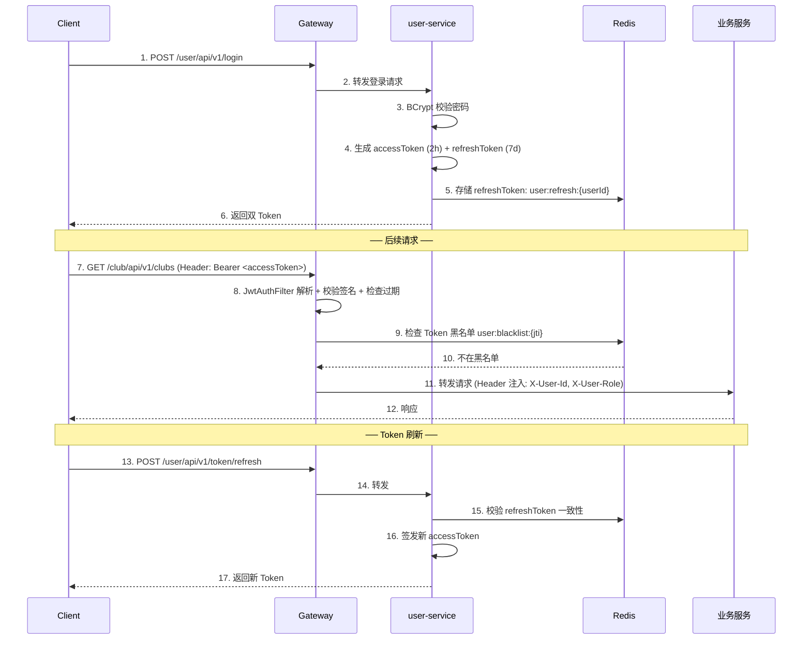

### 7.2 JWT Payload 结构

```json
{
  "sub": "1780001234567890",    // userId
  "username": "zhangsan",
  "role": 0,                     // 全局角色
  "jti": "uuid-xxxx",           // Token 唯一ID (用于黑名单)
  "iat": 1680000000,             // 签发时间
  "exp": 1680007200              // 过期时间 (2h)
}
```

### 7.3 安全策略矩阵

| 安全维度 | 策略 | 实现方式 |
|---------|------|---------|
| **密码存储** | BCrypt 加密 (cost=12) | `PasswordEncoder` |
| **传输安全** | HTTPS + WSS | Nginx SSL 终止 |
| **JWT 签名** | HMAC-SHA256 / RS256 | secret key 通过 Nacos 配置中心管理 |
| **Token 注销** | Redis 黑名单 (TTL = Token 剩余有效期) | 注销/修改密码时加入黑名单 |
| **SQL 注入** | MyBatis-Plus 参数绑定 | `#{param}` 预编译 |
| **XSS** | 输入过滤 + 输出编码 | `HtmlUtils.htmlEscape()` |
| **CSRF** | 无状态 JWT (无需 CSRF Token) | — |
| **限流防刷** | Sentinel 令牌桶 + 用户维度滑动窗口 | Gateway Filter |
| **文件安全** | MIME 类型白名单 + 文件大小限制 + 病毒扫描(可选) | file-service 校验 |
| **越权防护** | 接口级 `@PreAuthorize` + 数据级所有权校验 | Spring Security |
| **敏感日志** | 密码/Token 脱敏，不写入日志 | Logback 过滤 |

### 7.4 RBAC 接口权限配置

```java
/**
 * Gateway 白名单（无需鉴权的接口）
 */
public static final List<String> WHITE_LIST = List.of(
    "/user/api/v1/register",
    "/user/api/v1/login",
    "/user/api/v1/token/refresh",
    "/seckill/api/v1/activities",         // 活动列表（公开浏览）
    "/club/api/v1/clubs"                   // 社团列表（公开浏览）
);

/**
 * 各接口权限要求（在各服务的 Controller 层注解）
 */
// 社长+管理员可操作
@PreAuthorize("hasAnyRole('LEADER', 'ADMIN')")
@PostMapping("/clubs/{clubId}/announcements")
public Result<?> publishAnnouncement(...) { ... }

// 仅管理员
@PreAuthorize("hasRole('ADMIN')")
@PutMapping("/clubs/{clubId}/audit")
public Result<?> auditClub(...) { ... }
```

---

## 8. 部署与 DevOps

### 8.1 本地开发环境 docker-compose

```yaml
# docker/docker-compose.yml
version: '3.8'

services:
  mysql:
    image: mysql:8.0.40
    container_name: campus-mysql
    ports:
      - "3306:3306"
    environment:
      MYSQL_ROOT_PASSWORD: root123456
      MYSQL_DATABASE: campus_platform
      TZ: Asia/Shanghai
    volumes:
      - ./mysql/my.cnf:/etc/mysql/conf.d/my.cnf
      - ./mysql/init.sql:/docker-entrypoint-initdb.d/init.sql
      - mysql-data:/var/lib/mysql
    command: --mysql-native-password=ON
    healthcheck:
      test: ["CMD", "mysqladmin", "ping", "-h", "localhost"]
      interval: 10s
      timeout: 5s
      retries: 5

  redis:
    image: redis:8.6.2
    container_name: campus-redis
    ports:
      - "6379:6379"
    volumes:
      - ./redis/redis.conf:/usr/local/etc/redis/redis.conf
      - redis-data:/data
    command: redis-server /usr/local/etc/redis/redis.conf

  kafka:
    image: apache/kafka:4.0.2
    container_name: campus-kafka
    ports:
      - "9092:9092"
    environment:
      KAFKA_NODE_ID: 1
      KAFKA_PROCESS_ROLES: broker,controller
      KAFKA_LISTENERS: PLAINTEXT://:9092,CONTROLLER://:9093
      KAFKA_ADVERTISED_LISTENERS: PLAINTEXT://localhost:9092
      KAFKA_CONTROLLER_QUORUM_VOTERS: 1@localhost:9093
      KAFKA_CONTROLLER_LISTENER_NAMES: CONTROLLER
      KAFKA_LOG_DIRS: /var/lib/kafka/data
    volumes:
      - kafka-data:/var/lib/kafka/data

  nacos:
    image: nacos/nacos-server:v2.5.2
    container_name: campus-nacos
    ports:
      - "8848:8848"
      - "9848:9848"
    environment:
      MODE: standalone
      SPRING_DATASOURCE_PLATFORM: ""
      JVM_XMS: 256m
      JVM_XMX: 256m

  minio:
    image: minio/minio:latest
    container_name: campus-minio
    ports:
      - "9002:9000"
      - "9001:9001"
    environment:
      MINIO_ROOT_USER: minioadmin
      MINIO_ROOT_PASSWORD: minioadmin123
    command: server /data --console-address ":9001"
    volumes:
      - minio-data:/data

volumes:
  mysql-data:
  redis-data:
  kafka-data:
  minio-data:
```

### 8.2 生产部署架构

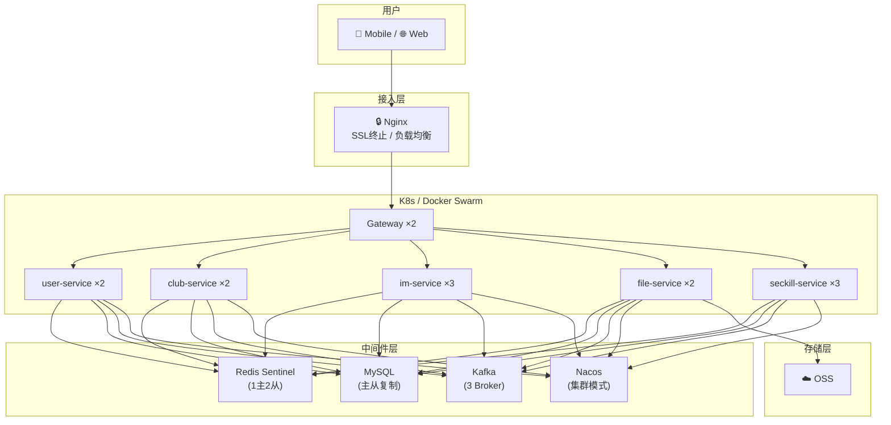

### 8.3 各服务实例数建议

| 服务 | 最少实例 | 推荐实例 | 说明 |
|------|---------|---------|------|
| `campus-gateway` | 2 | 2 | 无状态，Nginx 负载均衡 |
| `user-service` | 1 | 2 | 登录高峰可弹性扩容 |
| `club-service` | 1 | 2 | 常规 CRUD，压力较小 |
| `im-service` | 2 | 3 | **有状态**(WS连接)，需更多实例分摊连接 |
| `file-service` | 1 | 2 | I/O 密集，视上传量弹性 |
| `seckill-service` | 2 | 3 | 高并发核心，秒杀时段弹性扩容 |

---

## 9. 可观测性与监控告警

### 9.1 三大支柱

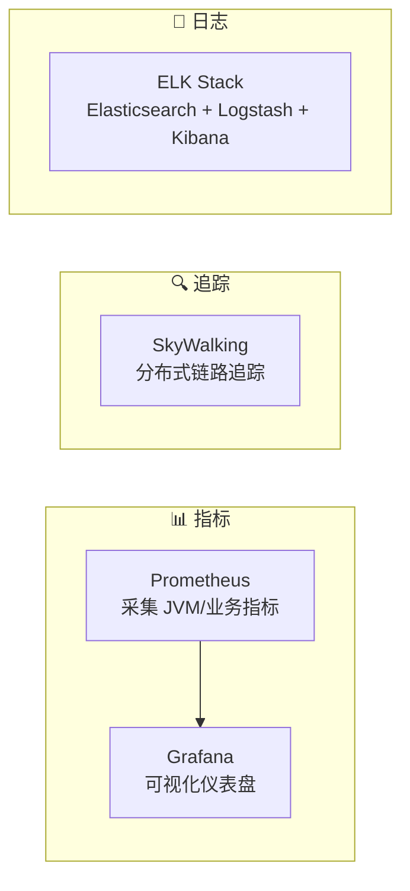

### 9.2 关键监控指标

| 分类 | 指标 | 告警阈值 | 说明 |
|------|------|---------|------|
| **JVM** | Heap 使用率 | > 85% 持续 5min | 内存泄漏预警 |
| **JVM** | GC 暂停时间 | > 500ms | Full GC 告警 |
| **HTTP** | 接口 P99 延迟 | > 2s | 性能退化 |
| **HTTP** | 5xx 错误率 | > 1% / min | 系统异常 |
| **Redis** | 连接数 | > 90% maxconn | 连接池耗尽 |
| **Redis** | 内存使用率 | > 80% | 需扩容或清理 |
| **Kafka** | Consumer Lag | > 10000 | 消费积压 |
| **MySQL** | 慢查询数 | > 10 / min | SQL 优化 |
| **MySQL** | 活跃连接数 | > 80% max_connections | 连接池调优 |
| **WebSocket** | 活跃连接数 | > 单节点 5000 | im-service 需扩容 |
| **秒杀** | QPS | 实时监控 | 流量洪峰预警 |
| **秒杀** | 库存一致性 | Redis ≠ DB | 对账异常告警 |

> **SkyWalking 10.x + 虚拟线程特别提示**
> 由于业务微服务启用了 JDK 21 虚拟线程，请求可能在多个虚拟线程间切换。传统依赖 `ThreadLocal` 的链路追踪存在 **TraceID 丢失风险**。部署 SkyWalking 10.x 时必须：
> 1. 确认 Java Agent 版本 ≥ 10.x 且支持 Virtual Threads Context Snapshot；
> 2. 监控 `traceId` 在跨线程/异步场景（Kafka Consumer、CompletableFuture）中的连续性；
> 3. 如出现链路断裂，考虑启用 SkyWalking 的 `plugin.toolkit.activation` 或手动 `ContextManager.capture()/continued()` 进行上下文传递。

### 9.3 日志规范

```java
// 日志格式：JSON 结构化，便于 ELK 检索
{
  "timestamp": "2026-04-12T15:00:01.234+08:00",
  "level": "INFO",
  "traceId": "T-a1b2c3d4e5f6",          // SkyWalking TraceId
  "service": "seckill-service",
  "class": "SeckillService",
  "method": "deductStock",
  "userId": 1780001234567890,              // 业务上下文
  "activityId": 500001,
  "message": "库存扣减成功，剩余库存: 123",
  "duration": 3                             // 耗时 ms
}
```

**日志级别规范：**
| 级别 | 使用场景 |
|------|---------|
| `ERROR` | 系统异常、需人工介入的故障 |
| `WARN` | 业务预警（库存不足、重复报名、Token 即将过期） |
| `INFO` | 关键业务节点（登录/下单/库存变动） |
| `DEBUG` | 开发调试（生产环境默认关闭） |

---

## 10. AI Agent 赋能层

### 10.1 架构设计

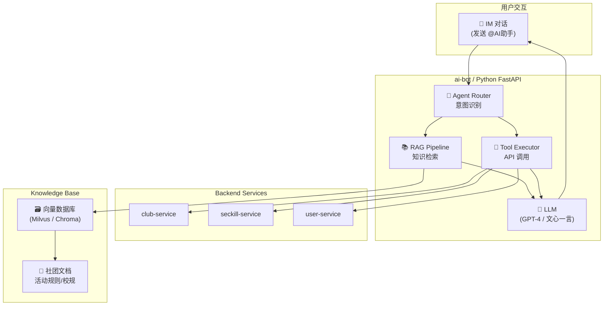

### 10.2 AI Agent 能力矩阵

| 能力 | 描述 | 实现方式 | 示例问题 |
|------|------|---------|---------|
| **智能问答** | 回答校园社团相关问题 | RAG (文档嵌入 → 向量检索 → LLM 生成) | "编程社下周有什么活动？" |
| **活动推荐** | 根据用户兴趣推荐活动 | 用户标签 + 活动标签 匹配 | "推荐我一些感兴趣的活动" |
| **自动摘要** | 自动总结群聊讨论要点 | 消息聚合 → LLM 摘要 | "总结一下今天群里讨论的内容" |
| **信息查询** | 调用后端 API 查询实时数据 | Function Calling / Tool Use | "音乐节还剩多少名额？" |
| **通知提醒** | 活动提前提醒、未读汇总 | 定时任务 + AI 生成提醒文案 | 自动推送: "您报名的音乐节明天开始" |

### 10.3 Tool 定义示例

```python
# ai-bot/app/tools/activity_tool.py

from typing import Optional
from pydantic import BaseModel, Field

class QueryActivityInput(BaseModel):
    club_name: Optional[str] = Field(None, description="社团名称")
    keyword: Optional[str] = Field(None, description="活动关键词")
    status: Optional[str] = Field("进行中", description="活动状态：未开始/进行中/已结束")

class ActivityTool:
    name = "query_activity"
    description = "查询校园社团活动信息，包括活动名称、时间、地点、剩余名额等"

    async def run(self, input: QueryActivityInput) -> str:
        """调用 seckill-service API 查询活动"""
        params = {}
        if input.club_name:
            params["keyword"] = input.club_name
        if input.status:
            status_map = {"未开始": 0, "进行中": 1, "已结束": 2}
            params["status"] = status_map.get(input.status, 1)

        response = await http_client.get(
            f"{SECKILL_SERVICE_URL}/seckill/api/v1/activities",
            params=params
        )
        activities = response.json()["data"]["records"]
        return format_activities(activities)
```

---

## 11. 性能指标与压测基准

### 11.1 性能目标 (SLA)

| 场景 | 指标 | 目标值 | 测量方法 |
|------|------|--------|---------|
| **常规接口** | P99 延迟 | ≤ 200ms | SkyWalking |
| **秒杀报名** | P99 延迟 | ≤ 500ms | 含排队返回时间 |
| **秒杀报名** | 峰值 QPS | ≥ 5000 | JMeter 压测 |
| **IM 消息** | 投递延迟 | ≤ 300ms | 端到端测量 |
| **IM 连接** | 单节点承载 | ≥ 5000 连接 | Tomcat WebSocket 长连接压测 |
| **文件上传** | 100MB 文件上传耗时 | ≤ 60s (100Mbps 网络) | 分片并发 3 |
| **系统可用性** | 年度可用率 | ≥ 99.9% | 监控统计 |

### 11.2 压测方案

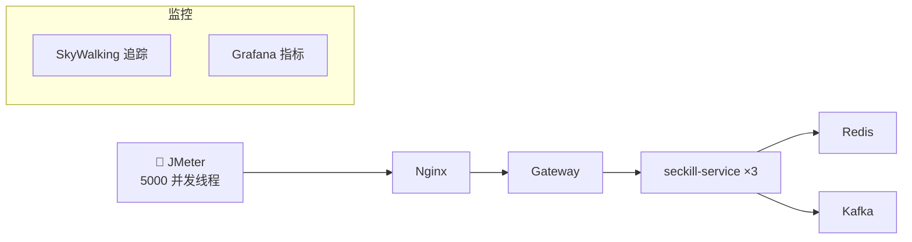

**秒杀压测脚本要点：**
1. 预创建 10000 个测试用户
2. 创建 1 个活动（库存 500）
3. 5000 并发线程同时请求 `/seckill/api/v1/activities/{id}/book`
4. 验证指标：
   - ✅ 最终成功订单数 = 500（不超卖）
   - ✅ Redis 库存 = 0
   - ✅ DB 订单数 = 500
   - ✅ P99 延迟 < 500ms
   - ✅ 无 5xx 错误

5. **JDK 21 虚拟线程专项监控**：
   - 使用 `jcmd <pid> Thread.print` 或 `-Djdk.tracePinnedThreads=full` 观察 **Thread Pinning** 频率；
   - 要求 MySQL Connector/J 9.x + HikariCP 配置下，pinning 事件 < 10 次/min；
   - 若 Carrier Threads 被耗尽（平台线程数飙升），需排查数据库驱动/连接池同步锁并回退至传统线程池。

---

## 12. 项目里程碑与分期计划

### 12.1 四期交付计划

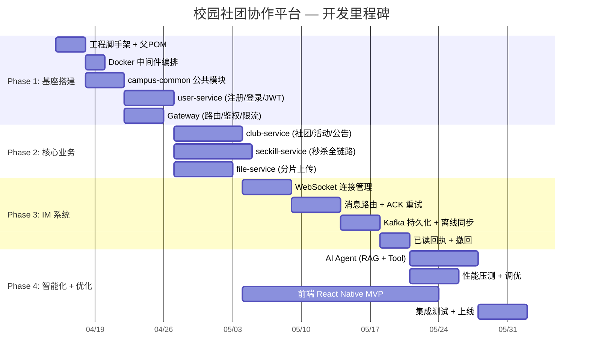

### 12.2 各阶段交付物

| 阶段 | 预计周期 | 核心交付物 | 验收标准 |
|------|---------|-----------|---------|
| **Phase 1** 基座搭建 | 2 周 | 工程骨架、公共模块、用户服务、Gateway | 可注册/登录/鉴权；中间件一键启动 |
| **Phase 2** 核心业务 | 3 周 | 社团管理、秒杀报名、文件上传 | 社团 CRUD 完整流程；秒杀不超卖；100MB 文件可断点续传 |
| **Phase 3** IM 系统 | 2.5 周 | WebSocket 收发、消息持久化、离线同步 | 两人实时聊天延迟 < 300ms；离线消息不丢失；消息可撤回 |
| **Phase 4** 智能化 | 2.5 周 | AI Agent、压测报告、前端 MVP | AI 可回答社团问题；秒杀 QPS ≥ 5000；前端核心流程走通 |

---

## 附录

### A. 全局异常码速查表

| 码段 | 范围 | 所属服务 |
|------|------|---------|
| `200` | 成功 | 全局 |
| `400-499` | 客户端错误 | 全局 |
| `500` | 系统内部错误 | 全局 |
| `5001-5010` | 秒杀业务错误 | seckill-service |
| `5011-5020` | 文件业务错误 | file-service |
| `5021-5030` | IM 业务错误 | im-service |
| `5031-5040` | 社团业务错误 | club-service |

### B. Nacos 配置命名规范

```
# 配置文件命名：{service-name}-{profile}.yml
campus-user-service-dev.yml
campus-user-service-prod.yml
campus-gateway-dev.yml
campus-gateway-prod.yml
campus-common.yml              # 公共配置（Redis/MySQL 连接等）
```

### C. Git 分支策略

| 分支 | 用途 | 保护规则 |
|------|------|---------|
| `main` | 生产分支 | 仅 MR 合入，需 1 人 Review |
| `develop` | 开发集成分支 | 日常开发合入点 |
| `feature/{module}-{desc}` | 功能分支 | 如 `feature/seckill-lua-stock` |
| `hotfix/{desc}` | 紧急修复 | 从 main 拉出，修复后合回 main + develop |

### D. 编码规范要点

| 规范 | 要求 |
|------|------|
| 包命名 | `com.campus.{服务名}.{层名}` |
| 类命名 | UpperCamelCase，Service 层用 `Interface + Impl` |
| 方法命名 | lowerCamelCase，CRUD 统一 `create/get/update/delete` |
| REST 路径 | 全小写，复数名词，`/api/v1/resources/{id}` |
| 数据库字段 | snake_case |
| 常量 | `UPPER_SNAKE_CASE` |
| 返回值 | 统一使用 `Result<T>` 包装，禁止直接返回裸对象 |

---

> **文档说明**：本白皮书为项目架构设计的完整参考文档。开发过程中如遇技术细节调整（如中间件版本升级、分表策略变化），请以实际代码实现为准并同步更新本文档。