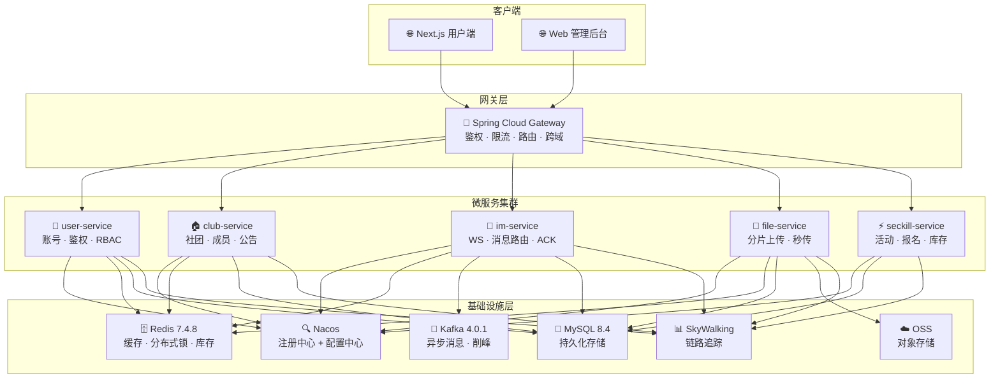
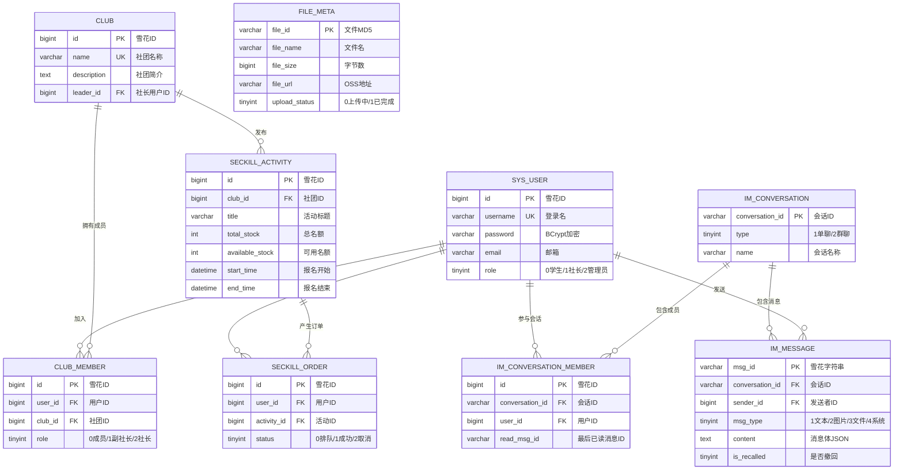
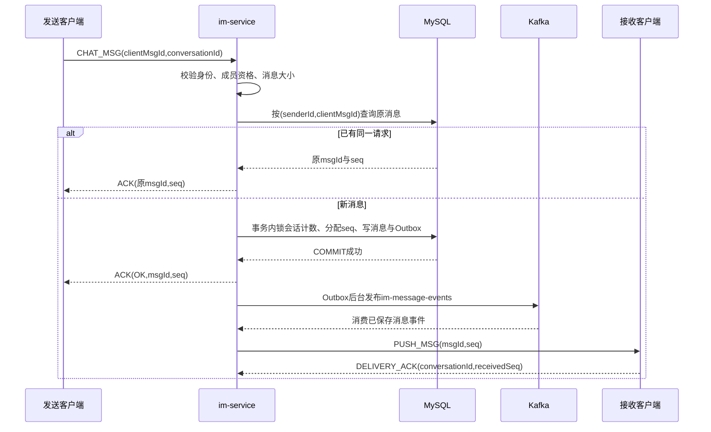
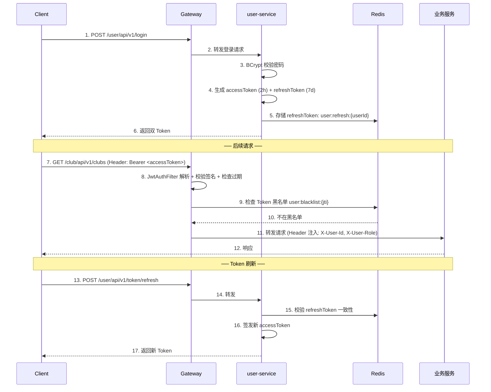
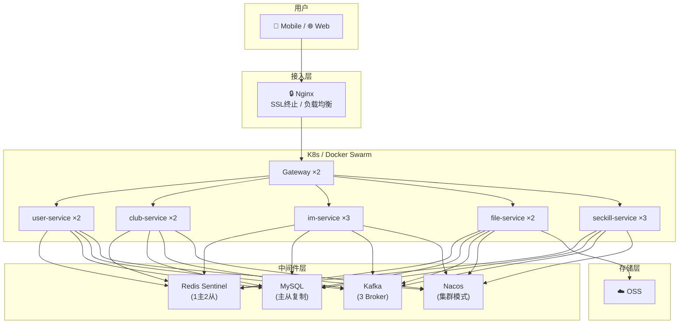
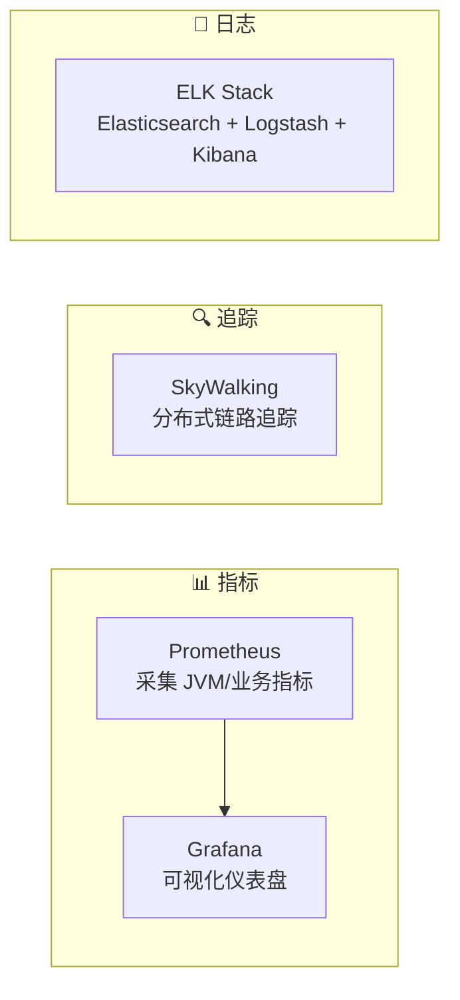

# 校园社团协作平台 —— 技术架构与项目白皮书 (AI-Ready)

> **文档版本**：v2.2 | **修订日期**：2026-09-05 | **状态**：当前基线与有门槛的演进设计
> 当前实现和完成证据见 [tasks.md](../tasks.md)，接口现状与后续扩展见 [API.md](API.md)。后端单测与前端构建已通过；真实基础设施、故障恢复和性能尚未验收。

---

## 目录

1. [项目定位与核心升级](#1-项目定位与核心升级)
2. [微服务架构设计](#2-微服务架构设计)
3. [数据库设计](#3-数据库设计-database-design)
4. [接口规范](#4-接口规范-api-specification)
5. [核心系统底层设计](#5-核心系统底层设计)
6. [工程脚手架与目录规范](#6-工程脚手架与目录规范)
7. [安全体系设计](#7-安全体系设计)
8. [部署与 DevOps](#8-部署与-devops)
9. [可观测性与监控告警](#9-可观测性与监控告警)
10. [AI Agent 赋能层](#10-ai-agent-赋能层)
11. [性能指标与压测基准](#11-性能指标与压测基准)
12. [项目里程碑与分期计划](#12-项目里程碑与分期计划)

---

## 1. 项目定位与核心升级

### 1.1 项目愿景

构建一个面向高校场景的 **一站式社团数字化协作平台**，覆盖从社团组织管理、实时即时通讯、热门活动抢报到大文件协作共享的全链路需求，最终通过 AI Agent 实现智能化运营辅助。

### 1.2 解决痛点

| # | 痛点 | 现状问题描述 | 本平台解决方案 | 技术关键词 |
|---|------|-------------|---------------|-----------|
| 1 | **沟通分散** | 微信/QQ 群消息无结构化归属，通知易被刷屏淹没，历史记录搜索困难 | 以**社团 → 会话**为组织单位，消息归属明确；支持消息类型分类（通知/讨论/文件）；全文检索 | WebSocket, Kafka, Elasticsearch |
| 2 | **活动超卖** | 热门活动抢报时，重复请求与并发扣减可能导致库存不一致 | 首期用 MySQL 条件扣减与唯一订单同事务保证正确；只有容量不足被实测后才评估异步削峰 | MySQL 事务, 唯一约束, Sentinel |
| 3 | **大文件传输脆弱** | 校园 Wi-Fi 不稳定，视频/设计稿上传动辄中断需重传；无去重机制导致存储浪费 | 分片直传 + 独立上传任务 + 授权秒传；服务端验证内容摘要 | 分片上传, OSS 预签名 URL |
| 4 | **权限混乱** | 社团管理依赖人工统计 Excel，角色权限模糊 | 平台权限与社团内角色分层校验，记录操作审计 | Spring Security, JWT |
| 5 | **信息孤岛** | 活动通知发了多个群，仍有人漏看 | AI Agent 自动推送摘要，未读提醒聚合 | RAG, LLM |

### 1.3 当前基座与推进顺序

当前仓库已有五个业务服务、Gateway、Next.js 前端骨架和 AI 工具查询。修订后的推进顺序为：核心事务与恢复 → 社团完整用户流程 → 容量验证 → AI 增强，具体交付见 §12。

### 1.4 用户身份与权限

| 范围 | 身份/角色 | 权限 |
|---|---|---|
| 平台 | 普通用户 | 登录、浏览公开资源、提交入社申请，在有效业务权限内操作 |
| 平台 | ADMIN | 审核社团、管理账号与全局配置，管理操作保留审计 |
| 社团 | MEMBER | 读取所在社团资源、参加活动和群聊 |
| 社团 | DEPUTY / LEADER | 管理本社团成员、公告和活动；具体管理动作检查社团内角色 |

当前 `sys_user.role` 保留 0/1/2 编码，v2 将社团管理权限统一从已批准 `club_member` 关系读取。平台管理员与社团成员角色的数值编码分别定义，避免混用。

---

## 2. 微服务架构设计

### 2.1 整体架构图



### 2.2 服务路由与职责矩阵

基于领域驱动设计（DDD），系统拆分为 **5 个核心业务微服务 + 1 个网关 + 2 个公共模块**。网关统一负责鉴权、限流、跨域。

| 服务路由前缀 | 服务名 | 核心职责 | 对外端口 | 依赖中间件 | 是否有状态 |
|---|---|---|---|---|---|
| `/user/**` | `user-service` | 账号注册/登录、JWT 签发/刷新、RBAC 权限校验、用户画像 | 8081 | Redis, MySQL | 无状态 |
| `/club/**` | `club-service` | 社团 CRUD、成员管理、公告发布、审批流 | 8082 | Redis, MySQL | 无状态 |
| `/im/**` | `im-service` | WebSocket 长连接保持、消息路由分发、ACK 机制、离线消息同步、已读回执 | 8083 | Redis, Kafka, MySQL | **有状态**（WS 连接） |
| `/file/**` | `file-service` | 独立上传任务、断点续传、授权秒传、校验与下载授权 | 8084 | MySQL, Redis, OSS | 无状态 |
| `/seckill/**` | `seckill-service` | 活动查询、MySQL 条件扣库存、同步报名终态、订单查询；活动管理待补 | 8085 | MySQL | 无状态 |
| — | `campus-gateway` | 统一入口、JWT 鉴权过滤、Sentinel 限流、路由转发、跨域处理 | 9000 | Redis, Nacos | 无状态 |

### 2.3 公共模块职责

| 模块名 | 职责 | 包含内容 |
|--------|------|---------|
| `campus-common` | 全局公共基础层 | 统一异常定义、统一响应包装 `Result<T>`、JWT 工具类、雪花算法 ID 生成器、分页 DTO、公共枚举 |
| `campus-api` | 服务间通信契约 | Feign Client 接口定义、跨服务 DTO/VO 定义、API 版本常量 |

### 2.4 关键技术选型与版本

| 组件 | 当前仓库声明 | 依据 |
|---|---|---|
| JDK | 21 | 后端父 POM |
| Spring Boot / Cloud / Alibaba | 3.3.13 / 2023.0.3 / 2023.0.3.4 | 后端父 POM |
| MyBatis-Plus / Redisson | 3.5.12 / 3.41.0 | 后端父 POM |
| MySQL / Redis / Kafka | 8.4 / 7.4.8 / 4.0.1 | Docker Compose 镜像声明 |
| Nacos | 2.5.2 | Docker Compose 镜像声明 |
| MinIO | 当前使用 `latest`，待锁定版本或 digest | Docker Compose 镜像声明 |
| 前端 | Next.js 16.2.5 / React 19.2.6 | 前端 package.json |
| AI 服务 | Python + FastAPI + Anthropic SDK | ai-bot 源码与 requirements.txt |

版本表描述仓库配置，运行兼容性须由构建和集成测试确认。Spring Cloud 官方矩阵将 2023.0.x 对应 Boot 3.2/3.3、2024.0.x 对应 Boot 3.4、2025.0.x 对应 Boot 3.5；依赖升级应整体校验 BOM，并检查当前手动固定的 `spring-cloud-starter-bootstrap:4.2.2` 是否偏离所选 release train。[官方兼容矩阵](https://spring.io/projects/spring-cloud/)

业务服务当前配置了 `spring.threads.virtual.enabled=true`；Gateway 使用 WebFlux。并发承载需同时测量连接池、队列等待、线程 pinning 和内存，开启虚拟线程本身不能作为容量验收依据。

### 2.5 服务间通信策略

| 通信方式 | 场景 | 示例 | 超时配置 |
|---------|------|------|---------|
| **Feign (HTTP 同步)** | 业务查询、鉴权校验 | 业务服务查询社团成员资格；Gateway 本地验签 | 连接 2s / 读取 5s |
| **Kafka (异步消息)** | 后续跨服务事件与投影 | 当前报名不依赖 Kafka；已提交 IM/成员事件仍是待实施能力 | — |
| **Redis Pub/Sub** | 轻量级事件广播 | IM 跨节点消息推送、缓存失效通知 | — |
| **WebSocket** | 客户端实时推送 | IM 消息、秒杀结果通知 | 心跳 30s |

---

### 2.6 领域归属与跨服务协作（目标设计，待实现）

| 数据或操作 | 唯一负责服务 | 协作规则 |
|---|---|---|
| 账号、平台管理员身份 | user-service | 全局管理员权限与社团内角色分别判断 |
| 社团、入社审批、社团角色、公告 | club-service | 社长/副社长权限绑定 `clubId + userId`，以已通过审批的成员关系为准 |
| 活动信息、名额、报名时间、报名订单 | seckill-service | 保留现有服务名；活动 CRUD 与报名状态统一由本服务维护，club-service 只提供社团资格查询 |
| 社团群聊、消息、已读进度 | im-service | 首期每个社团一个主会话，`im_conversation.club_id` 唯一；普通单聊该字段为空 |
| 上传任务、物理对象、业务文件引用 | file-service | 根据业务所属社团、会话或用户校验访问资格，文件摘要用于内容校验和去重 |

社团创建通过、成员审批通过、成员移除、社团解散分别产生带 `eventId` 和成员关系版本的事件；club-service 在业务事务内写 Outbox，提交后可靠发布。im-service 按事件 ID 去重并按版本应用，失败重试，定时对比成员投影与社团权威数据。

主会话通过唯一 `club_id` 幂等创建。入社通过后加入主会话，首期允许有效成员查看该社团既有历史；退社或被移除后撤销群聊与内部文件访问，社团解散后会话只供平台管理员审计。成员同步期间，IM 发消息、拉历史和内部文件签名接口仍向 club-service 校验当前有效成员资格，查询失败时返回可重试错误；后续若做鉴权缓存，需先约定撤权延迟上限。

活动草稿、发布与取消接口仍待实现。当前报名只在活动 `status=1` 且时间窗口有效时执行同步事务；首期一人一次报名，成功订单保留唯一记录。取消报名和重新报名作为后续独立状态转换设计。

---

## 3. 数据库设计 (Database Design)

> 建库基线见 §3.2，目标模型增量见 §3.4。业务主键按表定义，创建/更新时间由配置填充；逻辑删除表需同时设计唯一键复用与历史保留规则。

### 3.1 核心领域模型 (ER)

> 本图对应建库基线，目标新增字段与实体关联见 §3.4。



**关系总结：**
- **User ↔ Club**: 多对多（通过 `club_member` 关联表，含社团内角色）
- **Club ↔ Activity**: 一对多（一个社团可发布多个活动）
- **User ↔ Activity**: 多对多（通过 `seckill_order` 报名表，含订单状态）
- **User ↔ Conversation**: 多对多（通过 `im_conversation_member`，含已读进度）
- **Conversation ↔ Message**: 一对多（一个会话包含多条消息）

### 3.2 关键表结构定义

> 建库基线示例；目标新增字段、主键迁移和约束见 §3.4，实施需编写版本化迁移。

#### A. 用户与社团域 (`user-service` / `club-service`)

```sql
-- ============================================================
-- 用户表：user-service 管理
-- 索引策略：username 唯一索引用于登录查询；email 普通索引用于找回密码
-- ============================================================
CREATE TABLE `sys_user` (
  `id`          bigint       NOT NULL                              COMMENT '用户ID(雪花算法)',
  `username`    varchar(64)  NOT NULL                              COMMENT '登录用户名',
  `password`    varchar(128) NOT NULL                              COMMENT 'BCrypt 加密密码',
  `nickname`    varchar(64)  DEFAULT NULL                          COMMENT '显示昵称',
  `avatar_url`  varchar(512) DEFAULT NULL                          COMMENT '头像 OSS 地址',
  `email`       varchar(128) DEFAULT NULL                          COMMENT '邮箱(可选,用于找回密码)',
  `phone`       varchar(20)  DEFAULT NULL                          COMMENT '手机号(可选)',
  `role`        tinyint      NOT NULL DEFAULT '0'                  COMMENT '全局角色: 0-学生 1-社长 2-管理员',
  `status`      tinyint      NOT NULL DEFAULT '1'                  COMMENT '账号状态: 0-禁用 1-正常',
  `last_login`  datetime     DEFAULT NULL                          COMMENT '最后登录时间',
  `create_time` datetime     NOT NULL DEFAULT CURRENT_TIMESTAMP    COMMENT '创建时间',
  `update_time` datetime     NOT NULL DEFAULT CURRENT_TIMESTAMP ON UPDATE CURRENT_TIMESTAMP COMMENT '更新时间',
  `is_deleted`  tinyint      NOT NULL DEFAULT '0'                  COMMENT '逻辑删除: 0-正常 1-已删除',
  PRIMARY KEY (`id`),
  UNIQUE KEY `uk_username` (`username`),
  KEY `idx_email` (`email`),
  KEY `idx_phone` (`phone`)
) ENGINE=InnoDB DEFAULT CHARSET=utf8mb4 COLLATE=utf8mb4_unicode_ci COMMENT='系统用户表';

-- ============================================================
-- 社团表：club-service 管理
-- ============================================================
CREATE TABLE `club` (
  `id`          bigint       NOT NULL                              COMMENT '社团ID(雪花算法)',
  `name`        varchar(128) NOT NULL                              COMMENT '社团名称',
  `description` text                                               COMMENT '社团简介',
  `logo_url`    varchar(512) DEFAULT NULL                          COMMENT '社团Logo OSS地址',
  `leader_id`   bigint       NOT NULL                              COMMENT '社长用户ID',
  `category`    varchar(32)  DEFAULT NULL                          COMMENT '分类: 学术/体育/艺术/公益/其他',
  `status`      tinyint      NOT NULL DEFAULT '0'                  COMMENT '审核状态: 0-待审核 1-正常 2-已解散',
  `member_count`int          NOT NULL DEFAULT '1'                  COMMENT '成员数(冗余,异步更新)',
  `create_time` datetime     NOT NULL DEFAULT CURRENT_TIMESTAMP,
  `update_time` datetime     NOT NULL DEFAULT CURRENT_TIMESTAMP ON UPDATE CURRENT_TIMESTAMP,
  `is_deleted`  tinyint      NOT NULL DEFAULT '0',
  PRIMARY KEY (`id`),
  UNIQUE KEY `uk_name` (`name`),
  KEY `idx_leader` (`leader_id`),
  KEY `idx_category` (`category`)
) ENGINE=InnoDB DEFAULT CHARSET=utf8mb4 COLLATE=utf8mb4_unicode_ci COMMENT='社团表';

-- ============================================================
-- 社团成员关联表
-- 设计要点：user_id + club_id 建立联合唯一索引，防止重复加入
-- ============================================================
CREATE TABLE `club_member` (
  `id`          bigint       NOT NULL                              COMMENT '主键(雪花算法)',
  `user_id`     bigint       NOT NULL                              COMMENT '用户ID',
  `club_id`     bigint       NOT NULL                              COMMENT '社团ID',
  `member_role` tinyint      NOT NULL DEFAULT '0'                  COMMENT '社团内角色: 0-成员 1-副社长 2-社长',
  `join_time`   datetime     NOT NULL DEFAULT CURRENT_TIMESTAMP    COMMENT '加入时间',
  `create_time` datetime     NOT NULL DEFAULT CURRENT_TIMESTAMP,
  `update_time` datetime     NOT NULL DEFAULT CURRENT_TIMESTAMP ON UPDATE CURRENT_TIMESTAMP,
  `is_deleted`  tinyint      NOT NULL DEFAULT '0',
  PRIMARY KEY (`id`),
  UNIQUE KEY `uk_user_club` (`user_id`, `club_id`),
  KEY `idx_club_id` (`club_id`)
) ENGINE=InnoDB DEFAULT CHARSET=utf8mb4 COLLATE=utf8mb4_unicode_ci COMMENT='社团成员关联表';

-- ============================================================
-- 公告表：club-service 管理
-- ============================================================
CREATE TABLE `club_announcement` (
  `id`          bigint       NOT NULL                              COMMENT '公告ID(雪花算法)',
  `club_id`     bigint       NOT NULL                              COMMENT '所属社团ID',
  `title`       varchar(256) NOT NULL                              COMMENT '公告标题',
  `content`     text         NOT NULL                              COMMENT '公告内容(Markdown)',
  `publisher_id`bigint       NOT NULL                              COMMENT '发布者用户ID',
  `is_pinned`   tinyint      NOT NULL DEFAULT '0'                  COMMENT '是否置顶: 0-否 1-是',
  `create_time` datetime     NOT NULL DEFAULT CURRENT_TIMESTAMP,
  `update_time` datetime     NOT NULL DEFAULT CURRENT_TIMESTAMP ON UPDATE CURRENT_TIMESTAMP,
  `is_deleted`  tinyint      NOT NULL DEFAULT '0',
  PRIMARY KEY (`id`),
  KEY `idx_club_pinned` (`club_id`, `is_pinned`, `create_time` DESC)
) ENGINE=InnoDB DEFAULT CHARSET=utf8mb4 COLLATE=utf8mb4_unicode_ci COMMENT='社团公告表';
```

#### B. 秒杀/报名域 (`seckill-service`)

```sql
-- ============================================================
-- 活动库存表（当前 MySQL 权威库存）
-- 设计要点：
--   1. available_stock 通过 available_stock > 0 条件 UPDATE 原子扣减
--   2. start_time / end_time 控制报名时间窗口，Gateway + 服务双重校验
-- ============================================================
CREATE TABLE `seckill_activity` (
  `id`              bigint       NOT NULL                          COMMENT '活动ID(雪花算法)',
  `club_id`         bigint       NOT NULL                          COMMENT '所属社团ID',
  `title`           varchar(128) NOT NULL                          COMMENT '活动标题',
  `description`     text                                           COMMENT '活动详情(Markdown)',
  `cover_url`       varchar(512) DEFAULT NULL                      COMMENT '活动封面图URL',
  `location`        varchar(256) DEFAULT NULL                      COMMENT '活动地点',
  `activity_time`   datetime     DEFAULT NULL                      COMMENT '活动举办时间',
  `total_stock`     int          NOT NULL                          COMMENT '总名额',
  `available_stock` int          NOT NULL                          COMMENT '可用名额(对账后最终库存)',
  `start_time`      datetime     NOT NULL                          COMMENT '报名开始时间',
  `end_time`        datetime     NOT NULL                          COMMENT '报名结束时间',
  `status`          tinyint      NOT NULL DEFAULT '0'              COMMENT '活动状态: 0-未开始 1-进行中 2-已结束 3-已取消',
  `create_time`     datetime     NOT NULL DEFAULT CURRENT_TIMESTAMP,
  `update_time`     datetime     NOT NULL DEFAULT CURRENT_TIMESTAMP ON UPDATE CURRENT_TIMESTAMP,
  `is_deleted`      tinyint      NOT NULL DEFAULT '0',
  PRIMARY KEY (`id`),
  KEY `idx_club_id` (`club_id`),
  KEY `idx_start_time` (`start_time`),
  KEY `idx_status` (`status`)
) ENGINE=InnoDB DEFAULT CHARSET=utf8mb4 COLLATE=utf8mb4_unicode_ci COMMENT='秒杀活动(库存)表';

-- ============================================================
-- 报名订单表（与库存扣减同一 MySQL 事务写入）
-- 设计要点：
--   1. user_id + activity_id 联合唯一：数据库层面防止重复报名
--   2. 当前新订单直接写 1-成功；0 为历史兼容值，取消流程尚未实现
--   3. 只有数据量与查询证据达到阈值后才评估分区或分表
-- ============================================================
CREATE TABLE `seckill_order` (
  `id`          bigint       NOT NULL                              COMMENT '订单ID(雪花算法)',
  `user_id`     bigint       NOT NULL                              COMMENT '报名用户ID',
  `activity_id` bigint       NOT NULL                              COMMENT '活动ID',
  `status`      tinyint      NOT NULL DEFAULT '0'                  COMMENT '订单状态: 0-排队中 1-成功 2-已取消',
  `cancel_reason` varchar(256) DEFAULT NULL                        COMMENT '取消原因(可选)',
  `create_time` datetime     NOT NULL DEFAULT CURRENT_TIMESTAMP,
  `update_time` datetime     NOT NULL DEFAULT CURRENT_TIMESTAMP ON UPDATE CURRENT_TIMESTAMP,
  `is_deleted`  tinyint      NOT NULL DEFAULT '0',
  PRIMARY KEY (`id`),
  UNIQUE KEY `uk_user_activity` (`user_id`, `activity_id`),
  KEY `idx_activity_status` (`activity_id`, `status`)
) ENGINE=InnoDB DEFAULT CHARSET=utf8mb4 COLLATE=utf8mb4_unicode_ci COMMENT='秒杀报名订单表';
```

#### C. IM 消息域 (`im-service`)

```sql
-- ============================================================
-- 会话表
-- 设计要点：
--   1. conversation_id 生成规则：
--      - 单聊：CONV_P_{min(uid1,uid2)}_{max(uid1,uid2)} （保证双方生成相同ID）
--      - 群聊：CONV_G_{雪花ID}
--   2. 群聊 name 为群名，单聊 name 为 null（客户端显示对方昵称）
-- ============================================================
CREATE TABLE `im_conversation` (
  `conversation_id` varchar(64)  NOT NULL                          COMMENT '会话ID(规则生成)',
  `type`            tinyint      NOT NULL                          COMMENT '会话类型: 1-单聊 2-群聊',
  `name`            varchar(128) DEFAULT NULL                      COMMENT '群聊名称(单聊为null)',
  `avatar_url`      varchar(512) DEFAULT NULL                      COMMENT '群头像URL',
  `owner_id`        bigint       DEFAULT NULL                      COMMENT '群主用户ID(群聊)',
  `max_members`     int          NOT NULL DEFAULT '200'            COMMENT '最大成员数(群聊)',
  `create_time`     datetime     NOT NULL DEFAULT CURRENT_TIMESTAMP,
  `update_time`     datetime     NOT NULL DEFAULT CURRENT_TIMESTAMP ON UPDATE CURRENT_TIMESTAMP,
  `is_deleted`      tinyint      NOT NULL DEFAULT '0',
  PRIMARY KEY (`conversation_id`)
) ENGINE=InnoDB DEFAULT CHARSET=utf8mb4 COLLATE=utf8mb4_unicode_ci COMMENT='IM会话表';

-- ============================================================
-- 会话成员表
-- 设计要点：
--   1. read_msg_id 记录用户在该会话的已读进度，用于计算未读数
--   2. muted: 是否免打扰
-- ============================================================
CREATE TABLE `im_conversation_member` (
  `id`              bigint       NOT NULL                          COMMENT '主键(雪花算法)',
  `conversation_id` varchar(64)  NOT NULL                          COMMENT '会话ID',
  `user_id`         bigint       NOT NULL                          COMMENT '用户ID',
  `read_msg_id`     varchar(64)  DEFAULT NULL                      COMMENT '最后已读消息ID',
  `muted`           tinyint      NOT NULL DEFAULT '0'              COMMENT '免打扰: 0-否 1-是',
  `member_role`     tinyint      NOT NULL DEFAULT '0'              COMMENT '0-普通 1-管理员 2-群主',
  `join_time`       datetime     NOT NULL DEFAULT CURRENT_TIMESTAMP COMMENT '加入时间',
  `create_time`     datetime     NOT NULL DEFAULT CURRENT_TIMESTAMP,
  `update_time`     datetime     NOT NULL DEFAULT CURRENT_TIMESTAMP ON UPDATE CURRENT_TIMESTAMP,
  `is_deleted`      tinyint      NOT NULL DEFAULT '0',
  PRIMARY KEY (`id`),
  UNIQUE KEY `uk_conv_user` (`conversation_id`, `user_id`),
  KEY `idx_user_id` (`user_id`)
) ENGINE=InnoDB DEFAULT CHARSET=utf8mb4 COLLATE=utf8mb4_unicode_ci COMMENT='IM会话成员表';

-- ============================================================
-- 消息持久化表
-- 设计要点：
--   1. msg_id 为全局唯一（雪花字符串），作为幂等消费的 UK
--   2. content 为 JSON 格式，支持富文本扩展：
--      - 文本: {"text": "内容"}
--      - 图片: {"url": "xxx", "width": 800, "height": 600, "thumbnail": "xxx"}
--      - 文件: {"fileId": "xxx", "fileName": "xxx", "fileSize": 1024}
--      - 系统: {"action": "JOIN", "operatorId": 123, "targetId": 456}
--   3. 索引 idx_conversation 用于离线消息拉取（按会话+时间范围查询）
--   4. 大表预估：日消息量 10w+ 时建议按 conversation_id 做分表
-- ============================================================
CREATE TABLE `im_message` (
  `msg_id`          varchar(64)  NOT NULL                          COMMENT '全局唯一消息ID(雪花字符串)',
  `conversation_id` varchar(64)  NOT NULL                          COMMENT '会话ID',
  `sender_id`       bigint       NOT NULL                          COMMENT '发送者用户ID',
  `msg_type`        tinyint      NOT NULL                          COMMENT '消息类型: 1-文本 2-图片 3-文件 4-系统通知 5-@消息',
  `content`         text         NOT NULL                          COMMENT '消息体(JSON格式)',
  `at_user_ids`     varchar(512) DEFAULT NULL                      COMMENT '@的用户ID列表(逗号分隔)',
  `reply_msg_id`    varchar(64)  DEFAULT NULL                      COMMENT '引用回复的消息ID',
  `is_recalled`     tinyint      NOT NULL DEFAULT '0'              COMMENT '是否已撤回: 0-否 1-是',
  `create_time`     datetime     NOT NULL DEFAULT CURRENT_TIMESTAMP COMMENT '发送时间',
  `update_time`     datetime     NOT NULL DEFAULT CURRENT_TIMESTAMP ON UPDATE CURRENT_TIMESTAMP,
  `is_deleted`      tinyint      NOT NULL DEFAULT '0',
  PRIMARY KEY (`msg_id`),
  KEY `idx_conversation_time` (`conversation_id`, `create_time`),
  KEY `idx_sender` (`sender_id`, `create_time`)
) ENGINE=InnoDB DEFAULT CHARSET=utf8mb4 COLLATE=utf8mb4_unicode_ci COMMENT='IM消息表';
```

#### D. 大文件域 (`file-service`)

```sql
-- ============================================================
-- 文件元数据表
-- 设计要点：
--   1. file_id 使用文件 MD5 作为主键，天然支持秒传去重
--   2. upload_status 只有两个状态；分片进度跟踪在 Redis 中
--   3. chunk_count 记录分片总数，用于合并校验
--   4. uploader_id 记录首次上传者（后续秒传不重复记录）
-- ============================================================
CREATE TABLE `file_meta` (
  `file_id`       varchar(64)  NOT NULL                            COMMENT '文件MD5(主键/秒传依据)',
  `file_name`     varchar(255) NOT NULL                            COMMENT '原始文件名',
  `file_size`     bigint       NOT NULL                            COMMENT '文件大小(字节)',
  `file_type`     varchar(64)  DEFAULT NULL                        COMMENT 'MIME类型(如 video/mp4)',
  `file_url`      varchar(512) NOT NULL                            COMMENT 'OSS 最终访问地址',
  `chunk_count`   int          NOT NULL DEFAULT '1'                COMMENT '分片总数',
  `upload_status` tinyint      NOT NULL DEFAULT '0'                COMMENT '上传状态: 0-上传中 1-已完成',
  `uploader_id`   bigint       NOT NULL                            COMMENT '上传者用户ID',
  `create_time`   datetime     NOT NULL DEFAULT CURRENT_TIMESTAMP,
  `update_time`   datetime     NOT NULL DEFAULT CURRENT_TIMESTAMP ON UPDATE CURRENT_TIMESTAMP,
  `is_deleted`    tinyint      NOT NULL DEFAULT '0',
  PRIMARY KEY (`file_id`),
  KEY `idx_uploader` (`uploader_id`),
  KEY `idx_status` (`upload_status`)
) ENGINE=InnoDB DEFAULT CHARSET=utf8mb4 COLLATE=utf8mb4_unicode_ci COMMENT='文件元数据表';

-- ============================================================
-- 文件引用表（解耦文件与业务关系）
-- 设计要点：同一个文件可被多个业务（消息/公告/社团头像）引用
-- ============================================================
CREATE TABLE `file_reference` (
  `id`          bigint       NOT NULL                              COMMENT '主键(雪花算法)',
  `file_id`     varchar(64)  NOT NULL                              COMMENT '文件ID(MD5)',
  `biz_type`    varchar(32)  NOT NULL                              COMMENT '业务类型: IM_MSG/ANNOUNCEMENT/CLUB_LOGO/USER_AVATAR',
  `biz_id`      varchar(64)  NOT NULL                              COMMENT '业务ID(消息ID/公告ID等)',
  `create_time` datetime     NOT NULL DEFAULT CURRENT_TIMESTAMP,
  `is_deleted`  tinyint      NOT NULL DEFAULT '0',
  PRIMARY KEY (`id`),
  KEY `idx_file_id` (`file_id`),
  KEY `idx_biz` (`biz_type`, `biz_id`)
) ENGINE=InnoDB DEFAULT CHARSET=utf8mb4 COLLATE=utf8mb4_unicode_ci COMMENT='文件引用关联表';
```

### 3.3 数据增长与索引

初期使用单库并按服务维护表归属。消息同步使用 `(conversation_id,seq)` 索引，报名使用用户/活动唯一约束与活动状态索引，Outbox 使用待发送状态和重试时间索引。

分表前根据真实数据量记录查询扫描行数、锁等待、存储增长、备份与恢复时间，先完成索引、归档和查询优化。容量确需拆分时评估 conversationId 分片对全用户会话查询、activityId 分片对热点活动写入的影响，并设计迁移及回滚方案。

---

### 3.4 目标数据模型增量（待迁移）

§3.2 的 DDL 保留为建库基线示例；实际建库文件为 `docs/sql/V1.0__init.sql` 和 `docker/mysql/init.sql`，二者须在实施时对齐。本节是后续版本迁移要求，本轮文档修订尚未变更 SQL 或 Entity。

| 对象 | 目标字段与约束 | 用途 |
|---|---|---|
| `club_member` | `status`、关系版本；唯一 `(club_id,user_id)` | 审批、角色与撤权；重复申请更新已有关系并单独保留审批记录 |
| `im_conversation` | 可空且唯一 `club_id`、`last_seq BIGINT`、`last_event_seq BIGINT` | 社团主会话映射；在事务内串行分配会话序号 |
| `im_message` | `client_msg_id`、`seq BIGINT`；唯一 `(sender_id,client_msg_id)` 与 `(conversation_id,seq)` | 重发返回原消息；同步和显示使用同一顺序 |
| `im_conversation_event` | `conversation_id`、`event_seq`、type、payload；唯一 `(conversation_id,event_seq)` | 持久保存消息与撤回等变更，事件 cursor 即 event_seq |
| `im_conversation_member` | `read_seq BIGINT` | 按 `MAX(old,new)` 单调推进；已读进度与设备接收进度分别存储 |
| `seckill_activity` | 当前 `available_stock` 为权威剩余额度；活动管理字段按 P5 增量补充 | 报名事务执行 `available_stock > 0` 条件扣减 |
| `seckill_order` | 当前稳定 order_id 与唯一 `(user_id,activity_id)`；requestId/version 仅在未来异步方案确有需要时增加 | 当前与库存扣减同事务写 SUCCESS；重复报名返回业务错误 |
| `upload_session` | 随机 `upload_id`、uploader、object_key、provider_upload_id、声明摘要/大小、part_size/count、state、expires_at、file_id | 每次上传拥有独立任务；先持久保存 INITIATING，存储初始化成功后转 UPLOADING |
| `file_meta` | 随机 `file_id`、服务端验证的 SHA-256、size、object_key、校验状态 | 记录已验证的物理内容；去重唯一键为 `(sha256,size)`，从旧 MD5 主键迁移时保留引用映射 |
| `file_reference` | `reference_id`、file_id、biz_type、biz_id、display_name、created_by；唯一 `(file_id,biz_type,biz_id)` | 业务范围、显示文件名与访问检查；逻辑删除按业务生命周期处理 |
| 各服务 `event_outbox` | event_id、aggregate_id、event_type、payload、status、attempts、next_retry_at | 与业务数据同事务提交；后台投递成功后标记，重投由消费端幂等吸收 |

上传中的临时对象由 `upload_session` 管理，校验成功才进入 `file_meta` 并绑定业务引用。上传到尚未发布的消息时，使用已有会话作为 `CONVERSATION_ASSET` 暂存引用，消息提交后校验附件归属并创建 IM_MSG 引用，超期未绑定附件进入清理。同一摘要的并发上传分别进行，完成校验后按唯一键复用物理对象；清理多余对象前先确认引用归属。文件权限从业务引用推导，首次上传者字段只作审计。

当前新报名只产生 `SUCCESS=1`；`PROCESSING=0` 仅作为历史兼容值，`CANCELLED=2` 的取消流程尚未实现。未来若 O04 容量证据要求异步受理，必须另立迁移方案后再引入 PROCESSING/FAILED，而不是把它当作当前既定状态机。

---

## 4. 接口规范 (API Specification)

接口路径、请求字段、响应格式与 WebSocket 指令统一维护在 [API.md](API.md)。§1–7 描述当前接口及限制，§8 定义 Plan 1 尚未完成的扩展；不兼容变更使用版本化接口或显式协议协商。

当前报名在 MySQL 事务提交后返回 HTTP 200 与 orderId。IM 当前在单条消息插入完成后 ACK，稳定 seq/cursor 仍待实现；文件目标是返回可恢复任务和授权下载 URL。所有 64 位 ID、未来 seq 与游标在 JSON 中使用字符串，避免前端精度损失。

---

## 5. 核心系统底层设计

> 本章为修订后的目标设计，实施缺口与验收见 [tasks.md](../tasks.md)。当前接口行为与目标接口分别记录在 [API.md](API.md)。

### 5.1 Redis Key 与数据生命周期

| 场景 | Key | 数据与生命周期 |
|---|---|---|
| 在线会话 | `im:online:{userId}` | `{nodeId,sessionId}` 租约，心跳续期；关闭旧连接时比较 sessionId 后删除，节点异常靠 TTL 清理 |
| 消息去重加速 | `im:dedup:{senderId}:{clientMsgId}` | 缓存原 serverMsgId；数据库唯一约束与消息记录提供长期幂等 |
| 设备投递重试 | `im:retry:{nodeId}` | ZSet，成员含 sessionId、conversationId、seq；到期重推后更新次数 |
| 活动热数据（O04 候选） | `sk:{activityId}:detail` | 当前未使用；只有容量基线触发 O04 后才确定版本与失效规则 |
| 名额预占与命令（O04 候选） | 尚未确定 | 当前报名不依赖 Redis；预占、Stream 和恢复键需在独立异步方案中重新设计 |
| 分片缓存 | `file:chunk:{uploadId}` | partNumber → ETag，TTL 24h；恢复以数据库上传任务与存储端 ListParts 为准 |
| Token 黑名单 | `user:blacklist:{jti}` | TTL 等于 Token 剩余有效期 |
| 刷新令牌 | `user:refresh:{userId}` | 当前单会话模型，TTL 7 天；多设备登录另行扩展会话维度 |

当前报名以 MySQL 为唯一成功边界，不预热 Redis 库存。若 O04 后续采用 Redis Cluster/Lua/Stream，必须在独立方案中重新定义 key、同槽约束、恢复窗口和数据库对账，不能直接恢复已删除的旧 Lua 路径。

### 5.2 IM：消息保存、投递与同步

#### 5.2.1 成功 ACK 与事务边界

首期使用 MySQL 事务保存消息，事务提交后返回成功 ACK。单节点 5000 长连接是连接数目标，消息写入吞吐独立测量；数据库写入压力达到瓶颈时再评估改为 Kafka 先持久化。



会话计数、消息/变更记录与 Outbox 同事务提交；事件记录首期与会话历史一起保留，Outbox 投递清理与历史事件保留分别管理。数据库唯一键处理并发重发，重复 clientMsgId 携带不同会话或内容时返回幂等冲突。事务失败时客户端保留原 clientMsgId 重试；提交后连接断开时重试可得到原 ACK。Outbox 发送结果不确定时继续重投，消费者按 eventId 幂等处理；数据库异常需抛出给重试机制，隔离失败记录并提供重放入口。

撤回记录与撤回事件在同一事务中保存；客户端离线期间的撤回通过会话事件游标同步，不能只依赖实时广播。事件游标与消息 seq 分开：消息 seq 标识消息位置，事件游标覆盖新消息、撤回和成员变更，按会话事务分配并按序分页。

#### 5.2.2 投递、已读与顺序

| 机制 | 约定 |
|---|---|
| `ACK` | 服务端向发送者确认数据库提交成功，包含稳定 msgId 与 seq |
| `DELIVERY_ACK` | 接收设备确认连续收到的 receivedSeq；每个 session 独立记录 |
| `READ_REPORT` | 用户确认已阅读到 readSeq，校验上限且单调推进 |
| 重试 | 推送后 3s 未确认进入重试，最多 3 次；慢客户端使用有界发送队列，超过上限关闭连接并触发重连补拉 |
| 补拉 | 按 conversationId 与 afterSeq 分页；返回 nextSeq、hasMore，排序与游标均使用 seq |
| 乱序 | Kafka 按 conversationId 分区；Outbox 重投和跨节点推送仍可能乱序，客户端按 seq 合并，发现缺口补拉 |
| 最近会话 | 从已提交消息更新投影；未读数依据 readSeq 后的可见消息计算，排除本人发送与已撤回消息 |

首期每用户一个有效实时会话，sessionId 标识每次连接；在线节点租约使用 90s TTL、30s 心跳。重连、节点崩溃和 Pub/Sub 丢失时从已提交消息补拉；在线期间定期核对会话 lastSeq，补齐最后一条推送丢失且没有后续消息触发缺口检测的情况。取得补拉快照后接入实时消息，按 seq 去重合并。

#### 5.2.3 Kafka Topic 与路由

| Topic | Key | 消費职责 |
|---|---|---|
| `im-message-events`（目标新增） | conversationId | 已提交消息/撤回的路由通知、未读投影与后续摘要 |
| `club-membership-events`（目标新增） | clubId | 主会话与成员投影同步 |
| 报名命令/结果 Topic（O04 候选） | activityId | 当前报名无生产者/消费者；只有同步容量不足被实测后才定义职责 |

消息由目标用户的 nodeId 路由到节点专属 Redis Pub/Sub channel，同节点直接写 WebSocket。Kafka 消费分配与 WebSocket 所在节点分别处理；Pub/Sub 负责及时投递，数据库历史与事件补拉负责恢复。

### 5.3 报名：当前同步事务与 O04 异步候选

> 当前工作区已经删除报名 Redis/Lua/Kafka Consumer 与相关依赖。`book` 在一个 MySQL 事务中执行 `available_stock > 0` 条件扣减并插入唯一 SUCCESS 订单，提交后返回 HTTP 200。下述异步预占设计仅是 O04 容量门槛触发后的候选，不是 Plan 1 当前或既定近期实现。

#### 5.3.1 受理和最终结果

若同步单库在固定资源下被证明无法满足真实峰值需求，可评估 Redis 预占与 Kafka 削峰。候选方案需重新定义 requestId、命令持久化和恢复边界；多实例 ID 必须显式唯一配置。

1. Gateway 校验身份并按活动、用户和路由限流；服务读取带版本的活动缓存并检查受理阶段。
2. Lua 在同一活动槽内检查去重和名额，扣减 Redis 库存、保存预占记录并 XADD 报名命令。重复请求返回已有 orderId。预占表示请求正在准备受理。
3. 投递器将命令发送 Kafka，处理异步 Future 的成功或失败；只有收到符合配置的 Broker 确认后，接口返回 HTTP 202 与 `PROCESSING`。发送超时返回 HTTP 503、orderId 与 `retryable=true`，客户端按原请求查询或重试，结果保持待核对。
4. 投递器 Kafka 确认后才 XACK；崩溃遗留的 pending 项由其他实例认领后重投。仅在 Kafka 保留期和故障恢复窗口满足要求且命令可追踪时裁剪 Stream，积压接近容量上限时暂停受理。
5. Consumer 以 orderId/用户活动唯一键幂等处理，在一个 MySQL 事务中创建订单、校验活动版本、条件扣减 `available_stock`、写 SUCCESS 或明确业务失败终态并写 Outbox。数据库事务提交后再提交消费位点。
6. Outbox 结果事件驱动预占转 CONFIRMED 或 RELEASED；状态检查与回补在 Lua 中完成，重复结果事件只处理一次。通知失败不改变已提交订单状态。

生产可靠性配置需验证 Kafka `acks=all`、3 副本、`min.insync.replicas=2`，消费者持久化完成后提交位点，并覆盖 Broker 故障；本地单 Broker 环境只用于开发。Redis 的 AOF 与主从切换存在数据丢失窗口，已返回 202 的请求以 Kafka 持久命令及数据库终态恢复，数据库条件扣减始终兜底名额上限。

#### 5.3.2 库存约束与故障处理

```text
totalStock = successfulOrders + dbAvailableStock
dbAvailableStock = redisAvailableStock + unresolvedReservations  （处理停止后的对账快照）
```

`unresolvedReservations` 为尚无数据库终态的有效预占；消费者已提交但 Redis 尚未确认的记录需先按订单核销后再代入公式。库存不足、重复请求在预占前拒绝；技术故障保持可恢复状态，确定业务失败才落 FAILED 并释放预占。

| 故障或操作 | 处理与恢复 |
|---|---|
| Redis 预占后进程退出、尚未发送 Kafka | Stream 中保留命令，投递器认领重投；客户端按已返回 orderId 查询或使用原 requestId 重试 |
| Kafka 已保存但 HTTP 响应丢失 | 原 requestId/orderId 重试；重复命令由数据库唯一约束处理 |
| MySQL 暂时失败 | 保留消费进度并重试；超过重试预算进入可重放隔离队列并告警，订单仍待核对 |
| DB 提交后 Consumer 退出 | 重投查到终态直接确认，Outbox 保留结果事件并继续发布 |
| DB 已提交但 Redis 更新失败 | 结果事件重试，按订单核销预占；多次回补由状态转换防重 |
| 长时间 PROCESSING | 查 Kafka 投递记录、隔离队列和 DB 终态；只有持久化 FAILED 后才释放。取消/失败与迟到成功争用同一订单唯一键与行锁 |
| Redis 重启或故障切换 | 将活动转 DRAINING；停止新受理，推进已持久命令及隔离消息到终态，从 DB 终态和已持久命令重建用户→原 orderId 索引，核对库存后切换版本 |
| 修改活动或结束报名 | 先停止受理；受理窗口内已确认的命令仍按其版本完成，所有在途结果明确后关闭活动 |

活动版本表应保留受理窗口和生效状态供消费者校验。恢复时存在无法确定的在途记录则继续保持 DRAINING，交由重放或人工核对；数据库已有终态是最终判据。所有预占和消息保留时长覆盖最长恢复窗口，归档前核对终态。

Redis Stream 的认领与 pending 管理参考 [XAUTOCLAIM](https://redis.io/docs/latest/commands/xautoclaim/)。Spring Kafka 发送 API 使用 Future 回调确认投递结果，参见[发送消息](https://docs.spring.io/spring-kafka/docs/3.1.10/reference/kafka/sending-messages.html)。

### 5.4 文件：任务恢复、校验与访问

#### 5.4.1 上传流程与状态

```text
INITIATING → UPLOADING → COMPLETING → VERIFYING → COMPLETED
INITIATING / UPLOADING → EXPIRED 或 ABORTED
VERIFYING → FAILED（大小、类型或内容校验失败）
```

初始化前校验上传者对目标业务的写权限和配额，创建随机 uploadId 与独立临时 objectKey。数据库保存任务后调用 Multipart 初始化并保存 providerUploadId；初始化异常由任务恢复器重试，可能产生的孤立 Multipart 由存储生命周期规则清理。

断点续传必须提交原 uploadId 并校验任务所有者；服务端查询存储 ListParts，返回已完成分片和缺失分片的新签名 URL。Redis 只缓存上报进度，刷新页面、Redis 数据过期或 URL 过期均可由持久任务恢复。另一用户上传同内容获得独立任务。

合并以任务状态条件更新取得执行权；校验实际分片序号、ETag、每片大小与总大小，按 partNumber 排序后完成 Multipart。存储已完成而 DB 更新失败时，以任务独占 objectKey 的 HeadObject/校验结果恢复；重复合并返回同一任务状态与结果。校验完成前对象保持私有，校验摘要和真实类型后才建立可访问的业务引用。

#### 5.4.2 秒传与下载授权

已完成文件的摘要由服务端读取对象计算 SHA-256 或通过可验证的存储校验机制确认，客户端摘要仅用于预检查。秒传需要当前用户对原业务引用具有读取权限，同时对目标业务具有写权限；不满足时走独立上传，校验完成后再做物理去重。

下载按 referenceId 检查消息/公告/社团权限，通过后签发 5 分钟有效的 GET URL。对象存储桶保持私有，数据库保存 objectKey；头像等公开资源通过显式公开业务规则提供。退社后新的下载签名请求立即失效，已签发 URL 的残余访问窗口最多为其剩余有效期；要求即时撤权的内容使用服务端鉴权代理。

业务删除先移除引用，无有效引用且经过宽限期的对象由回收任务删除；活跃上传、待校验对象与待完成引用应列入保护范围。

#### 5.4.3 上传参数与协议约束

| 配置 | 首期值或规则 |
|---|---|
| 单文件大小 | ≤ 2 GiB，并同时限制用户/社团总配额及并行任务数 |
| 分片 | 默认 8 MiB；S3/MinIO 非末片至少 5 MiB，最多 10000 片；实际数量由服务端按大小计算 |
| 客户端并行数 | 默认 3，失败指数退避并加抖动，可根据网络情况下调 |
| PUT 签名 URL | 1 小时；任务有效时可重新签发缺失分片 |
| 任务有效期 | 24 小时；活动任务可续期，DB expires_at 为准 |
| 合并验证 | 存储端分片列表、长度、摘要及类型；Multipart ETag 仅作分片协议标识 |

工作区已将 `uploadId`、`partNumber` 纳入预签名计算并通过单测；Multipart 初始化/完成仍使用反射调用，真实 PUT、ListParts、Complete、GET 尚待验证。验证失败时应改用 SDK 支持的公共接口。[S3 预签名请求要求](https://docs.aws.amazon.com/AmazonS3/latest/userguide/using-presigned-url.html)、[Multipart 限制](https://docs.aws.amazon.com/AmazonS3/latest/userguide/qfacts.html)。

---

## 6. 工程脚手架与目录规范

| 路径 | 职责 |
|---|---|
| `campus-platform-backend/pom.xml` | 后端模块、BOM 和依赖版本 |
| `campus-platform-backend/campus-{user,club,im,seckill,file}-service/` | 五个业务服务，按领域拥有各自表和事务 |
| `campus-platform-backend/campus-gateway/` | 路由、认证、限流和 traceId |
| `campus-platform-backend/campus-common/`、`campus-api/` | 公共基础与跨服务契约 |
| `campus-platform-frontend/` | Next.js Web 用户端与管理端，Phase A 页面已存在 |
| `ai-bot/` | FastAPI、模型调用和只读业务工具 |
| `docs/sql/`、`docker/mysql/` | 数据库迁移与初始化脚本，需验证一致性 |
| `tests/bruno/`、各服务 `src/test/` | HTTP 与单元测试；恢复场景需补真实中间件验证 |

构建命令以根目录 [Makefile](../Makefile) 为准：`make dev` 启动中间件、`make build` 编译、`make test` 执行单测。测试结果附环境和执行记录，文档中的用例数量以最近一次报告为准。

---

## 7. 安全体系设计

### 7.1 认证鉴权流程



### 7.2 JWT Payload 结构

```json
{
  "sub": "1780001234567890",    // userId
  "username": "zhangsan",
  "role": 0,                     // 全局角色
  "jti": "uuid-xxxx",           // Token 唯一ID (用于黑名单)
  "iat": 1680000000,             // 签发时间
  "exp": 1680007200              // 过期时间 (2h)
}
```

### 7.3 安全策略矩阵

| 安全维度 | 策略 | 实现方式 |
|---------|------|---------|
| **密码存储** | BCrypt 加密 (cost=12) | `PasswordEncoder` |
| **传输安全** | HTTPS + WSS | Nginx SSL 终止 |
| **JWT 签名** | HMAC-SHA256 / RS256 | 密钥通过受控配置注入，并规划密钥轮换 |
| **Token 注销** | Redis 黑名单 (TTL = Token 剩余有效期) | 注销/修改密码时加入黑名单 |
| **SQL 注入** | MyBatis-Plus 参数绑定 | `#{param}` 预编译 |
| **XSS** | 输入过滤 + 输出编码 | `HtmlUtils.htmlEscape()` |
| **CSRF** | 无状态 JWT (无需 CSRF Token) | — |
| **限流防刷** | Sentinel 令牌桶 + 用户维度滑动窗口 | Gateway Filter |
| **文件安全** | MIME 类型白名单 + 文件大小限制 + 病毒扫描(可选) | file-service 校验 |
| **越权防护** | 平台权限 + 当前社团成员角色 + 资源归属校验 | Spring Security |
| **敏感日志** | 密码/Token 脱敏，不写入日志 | Logback 过滤 |

### 7.4 权限边界（目标设计）

| 入口 | 权限规则 |
|---|---|
| Gateway 白名单 | 方法与路径同时匹配，公开 GET 与写操作分别配置 |
| 用户身份头 | 清理外部 X-User-* 后注入可信身份；业务服务只接受受控内部入口，内部身份传播需可验证 |
| 社团管理 | 在具体 clubId 下检查已批准成员角色；平台审核单独检查 ADMIN |
| 订单 | 仅本人或具有明确审计权限的管理员查询 |
| 会话 | 握手认证与每次业务资源授权分别执行；封禁/撤权驱动连接与成员投影更新 |
| 文件 | 上传任务所有者校验、业务引用权限和私有存储配合 |
| 前端管理页 | Cookie 和页面跳转仅提供导航体验，后端重新校验真实身份和权限 |
| AI 查询 | 使用用户上下文访问业务接口，工具参数中的 userId/clubId 仍由后端授权 |

生产使用 HTTPS/WSS，日志对 Token、签名 URL 与敏感内容脱敏。后续可用短效单次 WS ticket 避免长期 Token 出现在握手 URL；刷新令牌轮换与多设备会话应作为完整登录策略一起实施。

---

## 8. 部署与 DevOps

### 8.1 本地开发环境 docker-compose

实际配置见 [docker/docker-compose.yml](../docker/docker-compose.yml)。镜像版本以 §2.4 所列仓库配置为准，数据库、Redis、对象存储使用持久卷；密码由本地环境注入。

单机多进程环境用于功能联调。多副本、Kafka 副本与 ISR、Redis 故障切换以及 MySQL 恢复需在独立故障测试环境验证。部署前锁定 MinIO 镜像，备份数据并演练恢复；生产拓扑为后续部署方案。

### 8.2 生产部署架构

下图为后续高可用部署参考。首期先完成单机资源预算与备份恢复，副本数由压测和故障目标决定。



### 8.3 各服务实例数建议

| 服务 | 最少实例 | 推荐实例 | 说明 |
|------|---------|---------|------|
| `campus-gateway` | 2 | 2 | 无状态，Nginx 负载均衡 |
| `user-service` | 1 | 2 | 登录高峰可弹性扩容 |
| `club-service` | 1 | 2 | 常规 CRUD，压力较小 |
| `im-service` | 2 | 3 | **有状态**(WS连接)，需更多实例分摊连接 |
| `file-service` | 1 | 2 | I/O 密集，视上传量弹性 |
| `seckill-service` | 2 | 3 | 高并发核心，秒杀时段弹性扩容 |

---

## 9. 可观测性与监控告警

### 9.1 三大支柱

当前已有日志关联 ID 与 Prometheus 配置；下图中的完整追踪和 ELK 为后续选项，按实际排障与容量需求实施。



### 9.2 关键监控指标

| 分类 | 指标 | 告警阈值 | 说明 |
|------|------|---------|------|
| **JVM** | Heap 使用率 | > 85% 持续 5min | 内存泄漏预警 |
| **JVM** | GC 暂停时间 | > 500ms | Full GC 告警 |
| **HTTP** | 接口 P99 延迟 | > 2s | 性能退化 |
| **HTTP** | 5xx 错误率 | > 1% / min | 系统异常 |
| **Redis** | 连接数 | > 90% maxconn | 连接池耗尽 |
| **Redis** | 内存使用率 | > 80% | 需扩容或清理 |
| **Kafka** | Consumer Lag | > 10000 | 消费积压 |
| **MySQL** | 慢查询数 | > 10 / min | SQL 优化 |
| **MySQL** | 活跃连接数 | > 80% max_connections | 连接池调优 |
| **WebSocket** | 活跃连接数 | > 单节点 5000 | im-service 需扩容 |
| **秒杀** | QPS | 实时监控 | 流量洪峰预警 |
| **秒杀** | 库存一致性与最老预占时长 | §5.3 静止快照核对异常 / 待核销超阈值 | 先识别消费延迟与已提交未确认记录，再告警恢复 |

追踪集成先验证 HTTP、Kafka、Outbox 和异步任务的上下文传播，记录实际使用的 Agent/SDK 版本及兼容性。ThreadLocal 与虚拟线程的行为应按运行环境验证，重点核对跨任务边界的 traceId 是否连续。

### 9.3 日志规范

```java
// 日志格式：JSON 结构化，便于 ELK 检索
{
  "timestamp": "2026-04-12T15:00:01.234+08:00",
  "level": "INFO",
  "traceId": "T-a1b2c3d4e5f6",          // SkyWalking TraceId
  "service": "seckill-service",
  "class": "SeckillService",
  "method": "deductStock",
  "userId": 1780001234567890,              // 业务上下文
  "activityId": 500001,
  "message": "库存扣减成功，剩余库存: 123",
  "duration": 3                             // 耗时 ms
}
```

**日志级别规范：**
| 级别 | 使用场景 |
|------|---------|
| `ERROR` | 系统异常、需人工介入的故障 |
| `WARN` | 业务预警（库存不足、重复报名、Token 即将过期） |
| `INFO` | 关键业务节点（登录/下单/库存变动） |
| `DEBUG` | 开发调试（生产环境默认关闭） |

---

## 10. AI Agent 赋能层

当前 ai-bot 包含 FastAPI `/api/v1/chat`、最多 5 轮 Tool Use 及活动/社团/个人信息三个只读工具，模型通过环境变量配置。请求中的 conversation_id 尚未关联持久化历史，RAG、推荐和自动摘要仍待实现。

### 10.1 近期目标

| 能力 | 数据来源与边界 | 验收 |
|---|---|---|
| 活动/名额查询 | 实时业务 API；带数据时间与报名状态 | 与相同用户直接查询接口的结果一致 |
| 社团规则问答 | 有版本和业务范围的文档检索 | 返回原文出处，检索前按社团资格过滤 |
| 群聊摘要 | 用户有权读取的会话消息、明确起止 seq | 每项可定位消息来源，记录摘要覆盖范围 |
| 对话历史 | 按用户和会话持久化 | 请求其他用户 conversation_id 时拒绝访问 |

先补端点身份校验、用户并发限额、总耗时/token 预算和工具结果大小上限。当前接口与业务 Gateway 的连接方式应统一：若 ai-bot 经 Gateway 转发，需要受控用户上下文或委托凭证，确保工具访问后端时身份仍可验证。

### 10.2 可测量的增强

整理 30–50 条真实查询作为评估集，分别统计数据正确率、引用可追溯率、工具失败率、P95 延迟和单请求 token 成本。httpx 客户端按应用生命周期复用，独立只读工具可设置并发上限后并行调用；摘要按已覆盖 seq 增量更新，缓存键包含权限范围与数据版本。

检索文档和群聊文本作为待处理数据，工具权限由服务端执行。后续增加报名或管理类写工具时，先展示操作对象与参数并取得用户确认，再携带幂等键执行。

---

## 11. 性能指标与压测基准

### 11.1 目标与测量口径

以下数字均为待验证目标，发布结果时附 commit、硬件、实例数、中间件配置、数据规模、持续时长、错误比例和压测脚本。

| 场景 | 指标 | 初始目标与说明 |
|---|---|---|
| 常规接口 | P99 | ≤ 200ms，分别测冷缓存与热缓存 |
| 报名同步事务 | 请求至 MySQL 提交并返回 HTTP 200 的 P99 | 初始待测目标 ≤ 500ms；成功、售罄与重复拒绝分别统计 |
| 报名异步候选 | HTTP 202 受理与终态延迟 | 当前不适用；只有 O04 启动后才设目标 |
| 报名入口 | 请求 QPS | 5000 为压力目标，受理率、429、售罄和业务拒绝分别统计 |
| 报名数据库 | 每秒成功提交数、锁与连接池等待 | 根据真实库存与 DB 容量报告，有限库存压测与持续吞吐压测分开 |
| IM | 发送至成功 ACK、发送至接收设备确认 | 分别报告 P50/P95/P99；在线端到端 P99 目标 ≤ 300ms |
| IM 连接 | 单节点活跃连接 | 5000，同时固定发信速率、群规模和慢客户端比例 |
| 文件上传 | 100 MiB 用时、恢复后重传字节 | 100 Mbps 网络目标 ≤ 60s；另测断网、刷新页面和签名过期 |
| 可用性 | 实际观测窗口内成功服务比例 | 上线后持续统计，年度 99.9% 作为长期目标 |

### 11.2 限流与压测配置

当前 `SentinelGatewayConfig` 为每条服务路由 100 请求/s、秒杀路由同 IP 20 请求/s、用户路由同 IP 30 请求/s，均按网关实例配置。登录 API 分组、用户维度规则和多实例全局限额仍待实现。校园共享出口下 IP 仅用于辅助防滥用，应结合用户和活动维度校准。

压测先验证默认限流返回 429，再在专用测试配置中按目标容量提高限额，记录网关实例数和规则作用域。5000 并发连接或线程与 5000 请求/s 分别测量；售罄后的快速拒绝能力和库存充足时的持续受理能力分别出报告。

### 11.3 验收场景

| 类型 | 操作 | 必须核验 |
|---|---|---|
| 热点抢报 | 10000 用户竞争 500 名额，包含同用户重试 | DB 成功数 ≤ 500；健康充分供给时恰为 500；唯一报名、库存非负且对账一致 |
| 报名回滚 | 在条件扣减后制造插入/提交失败 | 库存与订单同事务回滚；失败请求不宣称成功 |
| Redis 故障 | 报名时 Redis 不可用 | 当前报名正确性不依赖 Redis；鉴权等其他 Redis 依赖单独观测 |
| IM 幂等 | ACK 前后断开、重复 clientMsgId、跨节点发送 | 一条业务消息、一致 msgId/seq；成功 ACK 的消息能够补拉 |
| IM 补拉 | 丢最后一条推送、制造分页积压、离线撤回 | 连续 seq 可恢复，撤回事件可同步，readSeq 单调推进 |
| 文件恢复 | 真实 PUT 后刷新页面、签名过期、Complete 后中断 | 仅重传缺失分片，重复合并结果一致，最终字节与摘要一致 |
| 文件权限 | 另一账号提交摘要、退社后请求下载、跨任务合并 | 未授权请求被拒绝，业务引用与上传任务归属有效 |
| 业务串联 | 创建并审核社团→审批成员→进入群聊→发布报名→分享文件→移除成员 | 身份、成员关系、会话、活动与文件权限共同生效 |

---

## 12. 项目里程碑与分期计划

当前执行顺序为先修复一致性并验收，再制定后续方案，具体工作与状态由 [tasks.md](../tasks.md) 维护。

| 阶段 | 交付物 | 验收门槛 |
|---|---|---|
| P0 | 运行基线和差异 ID | 环境、命令、失败与阻塞可复现 |
| P1–P4 | 入口/连接、报名、IM、文件垂直修复 | 每包代码、迁移、调用方、文档和对应故障证据闭合 |
| P5–P6 | 最小业务闭环和总体验收 | 三账号流程、撤权、干净建库、升级与回滚通过 |
| 后续 Plan 2/3/4 | 性能、多实例、AI 候选 | 分别满足容量证据、SLO/预算、评估集等启动门槛 |

完整业务流程、Gateway/缓存/IM/上传性能、工程维护、AI 与多实例部署的优化候选统一记录在 [优化与演进](优化与演进.md)。第一阶段已完成的机制在后续方案中按证据核销，其余候选根据实际缺口与瓶颈确定依赖和顺序。

---

## 附录

### A. 全局异常码速查表

当前错误码以 `campus-common/exception/ErrorCode.java` 与 [API.md](API.md) 为准；目标新增错误先登记再实现，HTTP 状态与业务码分别定义。

### B. Nacos 配置命名规范

```
# 配置文件命名：{service-name}-{profile}.yml
campus-user-service-dev.yml
campus-user-service-prod.yml
campus-gateway-dev.yml
campus-gateway-prod.yml
campus-common.yml              # 公共配置（Redis/MySQL 连接等）
```

### C. Git 分支策略

| 分支 | 用途 | 保护规则 |
|------|------|---------|
| `main` | 生产分支 | 仅 MR 合入，需 1 人 Review |
| `develop` | 开发集成分支 | 日常开发合入点 |
| `feature/{module}-{desc}` | 功能分支 | 如 `feature/seckill-lua-stock` |
| `hotfix/{desc}` | 紧急修复 | 从 main 拉出，修复后合回 main + develop |

### D. 编码规范要点

| 规范 | 要求 |
|------|------|
| 包命名 | `com.campus.{服务名}.{层名}` |
| 类命名 | UpperCamelCase，Service 层用 `Interface + Impl` |
| 方法命名 | lowerCamelCase，CRUD 统一 `create/get/update/delete` |
| REST 路径 | 全小写，复数名词，`/api/v1/resources/{id}` |
| 数据库字段 | snake_case |
| 常量 | `UPPER_SNAKE_CASE` |
| 返回值 | 统一使用 `Result<T>` 包装，禁止直接返回裸对象 |

---

> **文档说明**：本白皮书为项目架构设计的完整参考文档。开发过程中如遇技术细节调整（如中间件版本升级、分表策略变化），请以实际代码实现为准并同步更新本文档。
